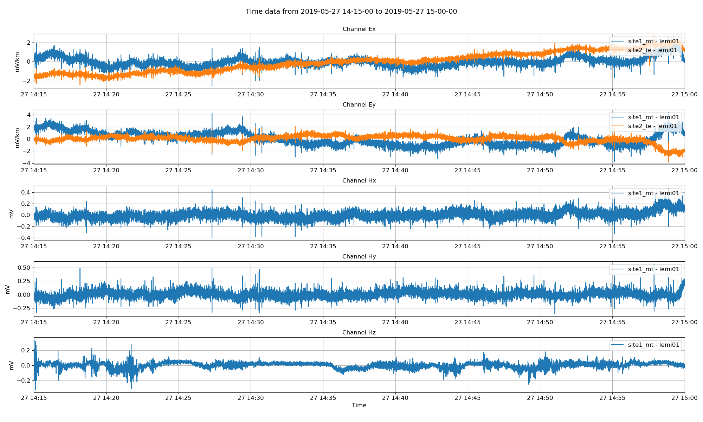
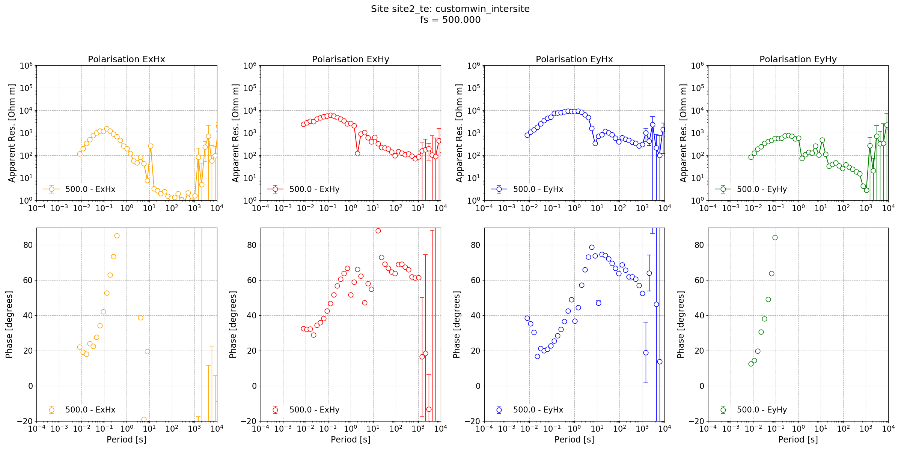

.. role:: python(code)
   :language: python

.. |Ex| replace:: E\ :sub:`x`
.. |Ey| replace:: E\ :sub:`y`
.. |Hx| replace:: H\ :sub:`x`
.. |Hy| replace:: H\ :sub:`y`
.. |Hz| replace:: H\ :sub:`z`
.. |Zxy| replace:: Z\ :sub:`xy`
.. |Zxx| replace:: Z\ :sub:`xx`
.. |Zyx| replace:: Z\ :sub:`yx`
.. |Zyy| replace:: Z\ :sub:`yy`
.. |fs| replace:: f\ :sub:`s`

Intersite transfer functions
----------------------------

Intesite transfer functions use input channels from one site and output channels from another. In magnetotellurics, the input sites are usually magnetic and the output electric. In field surveys intended for intersite transfer functions, there are often many sites that record electric channels only.

In the following example, the data used will be:

- Data from a Lemi B423 MT station. This data is used in the :doc:`../cookbook/processing-lemi-b423` example. 
- Data from a Lemi B423 telluric station recording only electric channels. 

And from the perspective of the magnetotelluric transfer function:

- The telluric site is the output site as the electric channels are the output of the standard magnetotelluric impedance tensor formulation.
- The magnetotelluric site is the input site as the magnetic channels are the input of the standard magnetotelluric impedance tensor formulation.

.. note::

    It is recommend to read the :doc:`../cookbook/processing-lemi-b423` example in the cookbook before following this tutorial to understand more about Lemi B423 data.

The steps that will be followed are:

#. Create the project and organise the data (magnetotelluric, telluric and calibration)
#. Create the Lemi B423 headers and B423E headers
#. Define the configuration to use (based on the results in :doc:`../cookbook/processing-lemi-b423`)
#. Calculate spectra (and statistics for the MT site)
#. Process to estimate the intersite impedance tensor

Begin by creating the project,

.. literalinclude:: ../../../examples/advanced/intersiteCreate.py
    :linenos:
    :language: python

Copy the data in there to give this structure:

.. code-block:: text

    usingLemi
    ├── calData 
    │   ├── lemi120_IC_710.txt
    │   ├── lemi120_IC_712.txt
    │   └── lemi120_IC_714.txt     
    ├── timeData   
    │   ├── site1_mt
    │   │   └── lemi01 
    │   │       ├── 1558950203.B423
    │   │       ├── 1558961007.B423
    │   │       ├── 1558971807.B423
    │   │       ├── 1558982607.B423
    │   │       ├── 1558993407.B423
    │   │       ├── 1559004207.B423
    │   │       ├── 1559015007.B423
    │   │       └── 1559025807.B423
    │   └── site2_te
    │       └── lemi01 
    │           ├── 1558948829.B423
    │           ├── 1558959633.B423
    │           ├── 1558970433.B423
    │           ├── 1558981233.B423
    │           ├── 1558992033.B423
    │           ├── 1559002833.B423
    │           ├── 1559013633.B423
    │           ├── 1559024433.B423
    │           ├── 1559035233.B423
    │           ├── 1559046033.B423
    │           ├── 1559056833.B423
    │           ├── 1559067633.B423
    │           ├── 1559078433.B423
    │           └── 1559089233.B423                 
    ├── specData
    ├── statData
    ├── maskData   
    ├── transFuncData 
    ├── images
    └── mtProj.prj

The next stage is to create the headers for both the magnetotelluric and telluric data.

.. literalinclude:: ../../../examples/advanced/intersiteRun.py
    :linenos:
    :language: python
    :lines: 1-23
    :lineno-start: 1

After running this section, the project now looks like:

.. code-block:: text

    usingLemi
    ├── calData 
    │   ├── lemi120_IC_710.txt
    │   ├── lemi120_IC_712.txt
    │   └── lemi120_IC_714.txt     
    ├── timeData   
    │   ├── site1_mt
    │   │   └── lemi01 
    │   │       ├── 1558950203.B423
    │   │       ├── 1558961007.B423
    │   │       ├── 1558971807.B423
    │   │       ├── 1558982607.B423
    │   │       ├── 1558993407.B423
    │   │       ├── 1559004207.B423
    │   │       ├── 1559015007.B423
    │   │       ├── 1559025807.B423
    │   │       ├── chan_00.h423
    │   │       ├── chan_01.h423
    │   │       ├── chan_02.h423
    │   │       ├── chan_03.h423
    │   │       ├── chan_04.h423
    │   │       └── global.h423 
    │   └── site2_te
    │       └── lemi01 
    │           ├── 1558948829.B423
    │           ├── 1558959633.B423
    │           ├── 1558970433.B423
    │           ├── 1558981233.B423
    │           ├── 1558992033.B423
    │           ├── 1559002833.B423
    │           ├── 1559013633.B423
    │           ├── 1559024433.B423
    │           ├── 1559035233.B423
    │           ├── 1559046033.B423
    │           ├── 1559056833.B423
    │           ├── 1559067633.B423
    │           ├── 1559078433.B423
    │           ├── 1559089233.B423
    │           ├── chan_00.h423
    │           ├── chan_01.h423
    │           ├── chan_02.h423
    │           ├── chan_03.h423
    │           └── global.h423                     
    ├── specData
    ├── statData
    ├── maskData   
    ├── transFuncData 
    ├── images
    └── mtProj.prj

The headers for the magnetotellruic and telluric data have been generated and the project can be loaded and the project timeline plotted.

.. literalinclude:: ../../../examples/advanced/intersiteRun.py
    :linenos:
    :language: python
    :lines: 25-29
    :lineno-start: 29

.. figure:: ../../../examples/advanced/intersiteImages/timeline.png
    :align: center
    :alt: alternate text
    :figclass: align-center

    Project timeline

The configuration that will be used is the same that was used in the :doc:`../cookbook/processing-lemi-b423` example, which has more information about why that configuration was chosen. The configuration parameters are shown below.

.. literalinclude:: ../../../examples/advanced/customconfig.ini
    :linenos:
    :language: text

Time data can be viewed in the usual way with the :meth:`~resistics.project.projectTime.viewTime` method.

.. literalinclude:: ../../../examples/advanced/intersiteRun.py
    :linenos:
    :language: python
    :lines: 31-42
    :lineno-start: 31

    Viewing time series data. It appears as though the |Ey| for the telluric data needs to be reversed.

From looking at the time series plot, the |Ey| channel of the telluric station needs a polarity reversal (multiply by -1). This can be done when calculating out spectra as shown below.

.. literalinclude:: ../../../examples/advanced/intersiteRun.py
    :linenos:
    :language: python
    :lines: 44-51
    :lineno-start: 44

Now, statistics can be calculated for the magnetotelluric site.

.. note::
    
    There are no useful statistics at this moment for telluric sites nor are there intersite statistics.

.. literalinclude:: ../../../examples/advanced/intersiteRun.py
    :linenos:
    :language: python
    :lines: 53-56
    :lineno-start: 53

With the statistics calculated, the intersite processing can be performed, initially without any statistic based masking.  

.. literalinclude:: ../../../examples/advanced/intersiteRun.py
    :linenos:
    :language: python
    :lines: 58-84
    :lineno-start: 58

The important call in this section of code is the call to :meth:`~resistics.project.projectTransferFunction.processSite`. In this call, we have set the output site as "site2_te" or the telluric site. The optional input of inputsite has been set to the magnetotellruic site, site1_mt. The result of this is:

- electric channel data will be taken from site2_te or the telluric site
- magnetic channel data will be take from site1_mt or the magnetotelluric site

The resultant intersite transfer function is shown below.

    Intersite transfer function.

In the :doc:`../cookbook/processing-lemi-b423` example, a significantly better result was achieved using a varying coherence mask. The same can be done here, but the mask will only be based on the quality of the data at the magnetotelluric site as no statistics were calculated for the telluric site. 

.. literalinclude:: ../../../examples/advanced/intersiteRun.py
    :linenos:
    :language: python
    :lines: 86-133
    :lineno-start: 86

.. figure:: ../../../examples/advanced/intersiteImages/intersiteTransferFunctionMask.png
    :align: center
    :alt: alternate text
    :figclass: align-center

    The intersite transfer function with variable masking

There is still problems with the output at long periods, most noticeably in the phase. This is likely to be synchronisation issue between the two sites. 

Complete example scripts
~~~~~~~~~~~~~~~~~~~~~~~~
For the purposes of clarity, the complete example scripts is provided below.

Creating the project.

.. literalinclude:: ../../../examples/advanced/intersiteCreate.py
    :linenos:
    :language: python

Processing intersite transfer function.

.. literalinclude:: ../../../examples/advanced/intersiteRun.py
    :linenos:
    :language: python