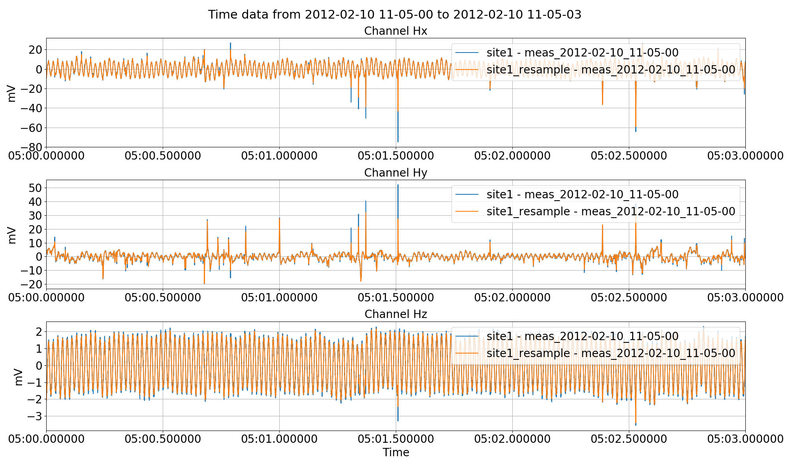
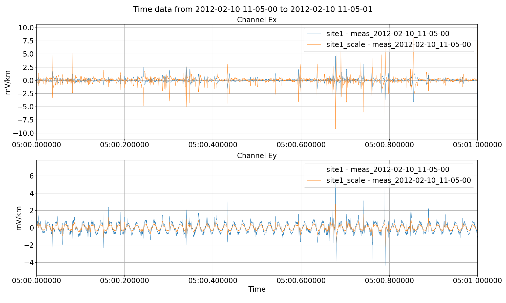
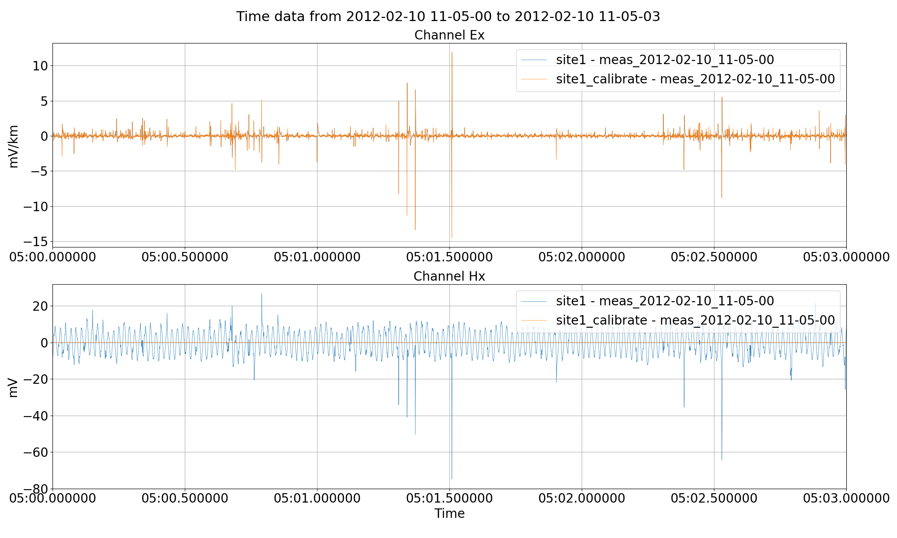
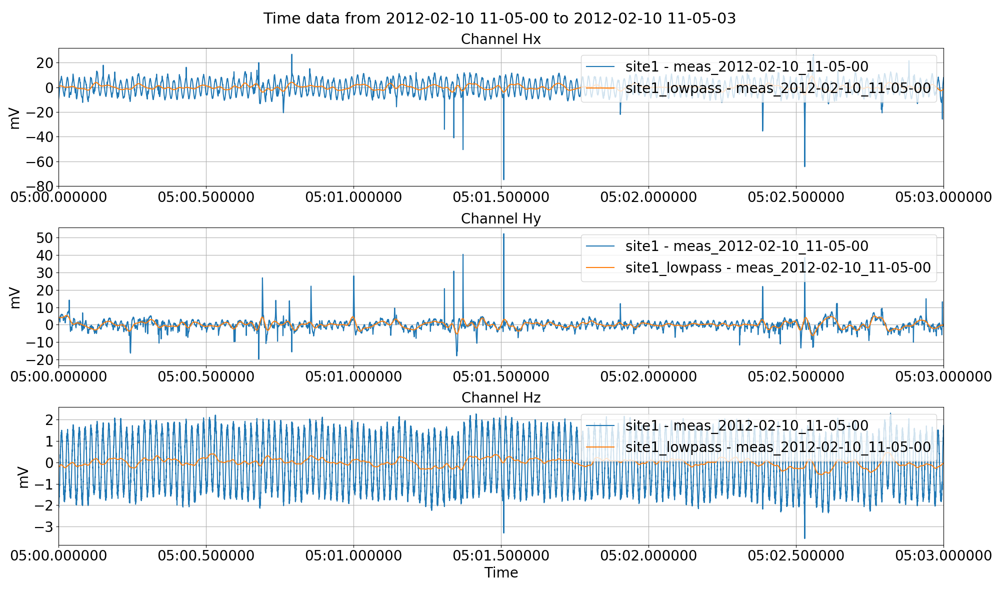
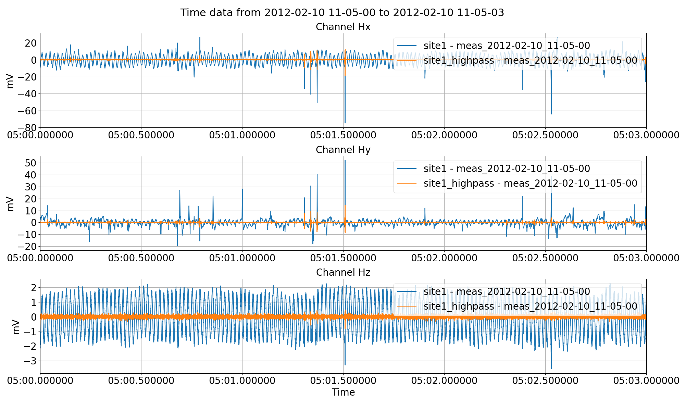
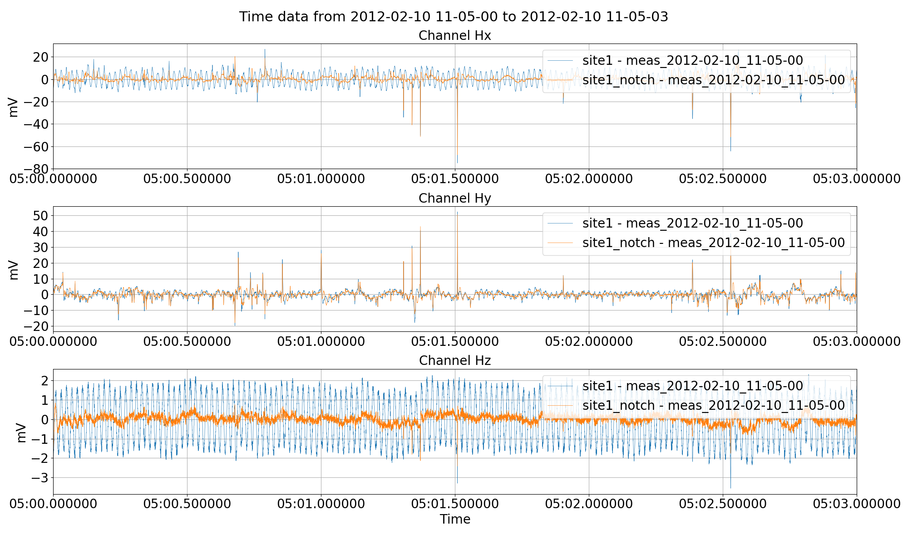
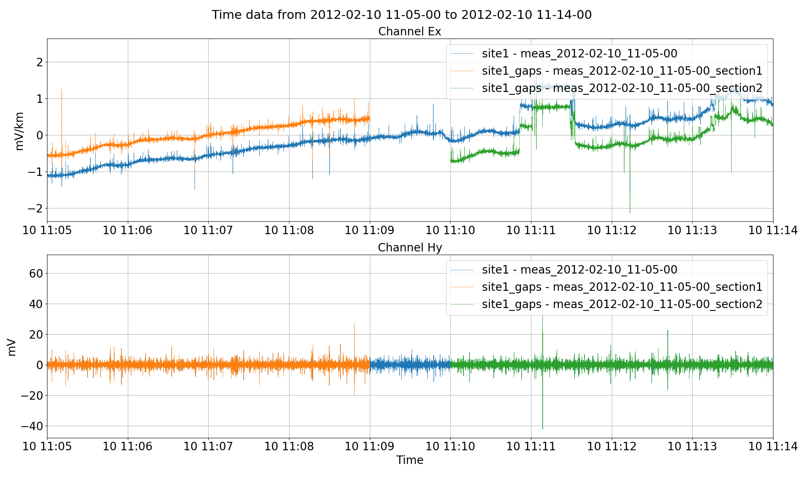
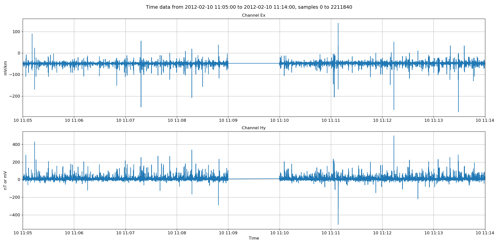
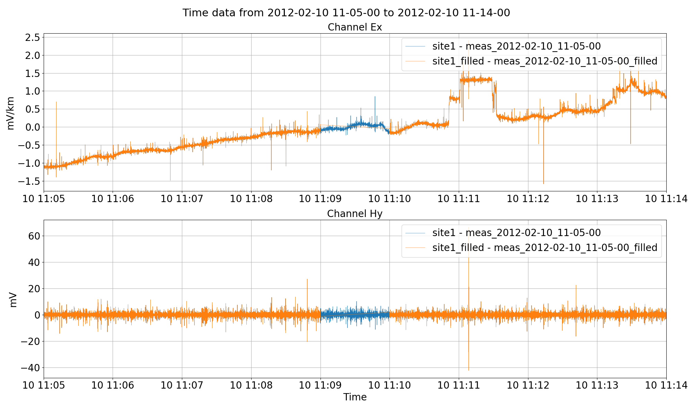

.. role:: python(code)
   :language: python

.. |Ex| replace:: E\ :sub:`x`
.. |Ey| replace:: E\ :sub:`y`
.. |Hx| replace:: H\ :sub:`x`
.. |Hy| replace:: H\ :sub:`y`
.. |Hz| replace:: H\ :sub:`z`
.. |Zxy| replace:: Z\ :sub:`xy`
.. |Zxx| replace:: Z\ :sub:`xx`
.. |Zyx| replace:: Z\ :sub:`yx`
.. |Zyy| replace:: Z\ :sub:`yy`
.. |fs| replace:: f\ :sub:`s`

Pre-processing timeseries data
------------------------------

There are scenarios in which time series data must be pre-processed and saved before transfer function calculation. Pre-processing is predominantly performed in the project environment using the :meth:`~resistics.project.projectTime.preProcess` method. There are several pre-processing options available in :meth:`~resistics.project.projectTime.preProcess` method, including:

    - :ref:`advanced/pre-process:Data resampling`
    - :ref:`advanced/pre-process:Polarity reversal`
    - :ref:`advanced/pre-process:Scaling`
    - :ref:`advanced/pre-process:Calibration` 
    - :ref:`advanced/pre-process:Low, band and high pass filtering`
    - :ref:`advanced/pre-process:Notch filter`
    - :ref:`advanced/pre-process:Data normalisation`
    - :ref:`advanced/pre-process:Interpolation to second`

Another preprocessing method of use, but not available within the :meth:`~resistics.project.projectTime.preProcess` method is gap filling. This can help increase the number of windows at long periods. 

    - :ref:`advanced/pre-process:Gap filling` 

In addition, there are lower levels APIs for performing these actions for advanced users. Please see the :doc:`API doc <../api>` for more information or check the :doc:`Cookbook <../cookbook>`.

The preprocessing options are explained in more detail below. The data is the same 4096 Hz data from the tutorial and is saved in "site1". A project has already been setup following the instructions in :doc:`Project environment <../tutorial/project-environment>`. In all the following, the project has already been loaded as shown below.

.. literalinclude:: ../../../examples/advanced/preprocessResample.py
    :linenos:
    :language: python
    :lines: 1-5
    :lineno-start: 1

For plotting the time data, different plot options are used to give larger fonts. Plot fonts have been defined as follows:

.. literalinclude:: ../../../examples/advanced/preprocessResample.py
    :linenos:
    :language: python
    :lines: 7-8
    :lineno-start: 7

Data resampling
~~~~~~~~~~~~~~~
Resampling time series data might be required to ensure matching sampling rates between different datasets, for example a local site and a reference site. This can be achieved through the resampling option in :meth:`~resistics.project.projectTime.preProcess` method which can save the data either to the same site or to a new site altogether.

Below is an exampling of downsampling a 4096 Hz dataset to 1024 Hz. The output will be saved to a new site named "site1_resample". If the site does not already exist, it will be created. The name of the measurement in the new site will be:

.. note::

    prepend + meas_[start_time] + postpend
    give an example

As the measurement is being written out to a new site, prepend is being set "" (an empty string). By default, postpend is an empty string.

.. literalinclude:: ../../../examples/advanced/preprocessResample.py
    :linenos:
    :language: python
    :lines: 10-31
    :lineno-start: 10

These produce the following plots:

    Resampling data from 4096 Hz to 1024 Hz example using the :meth:`~resistics.project.projectTime.preProcess` method.

Polarity reversal
~~~~~~~~~~~~~~~~~
This simply multiples the requested channels by -1. This is particularly useful when electric channels have been connected in the opposite way. An example is shown below of the polarity reversal of an electric channel. 

.. literalinclude:: ../../../examples/advanced/preprocessMath.py
    :linenos:
    :language: python
    :lines: 10-32
    :lineno-start: 10

The results of this can be seen in the following figure.

.. figure:: ../../../examples/advanced/preprocessImages/viewTimePolarityReversal.png
    :align: center
    :alt: alternate text
    :figclass: align-center

    Polarity reversal for channel |Ey| using the :meth:`~resistics.project.projectTime.preProcess` method.

Scaling
~~~~~~~
If more arbitrary scaling control is required than simply multiplying by -1, the scale option of :meth:`~resistics.project.projectTime.preProcess` can be used. 

.. literalinclude:: ../../../examples/advanced/preprocessMath.py
    :linenos:
    :language: python
    :lines: 34-53
    :lineno-start: 34

This will scale the |Ex| channel by -2 and the |Ey| channel by 0.5.

    Scaling channel |Ex| by -2 and |Ey| by 0.5 using the scale option of the :meth:`~resistics.project.projectTime.preProcess` method.

Calibration
~~~~~~~~~~~
The data can be pre-calibrated in a situation where calibrated time series data is required for viewing, exporting or other purposes. For example, data can be calibrated in resistics and then further processing can be done using other tools as required. To perform calibration, the calibration files need to be present in the calData folder of the project. For more information on calibration files, please see the :doc:`Calibration <../formats/calibration>` information in the :doc:`Data formats <../formats>` section.

Below is an example of calibrating time series:

.. literalinclude:: ../../../examples/advanced/preprocessFilter.py
    :linenos:
    :language: python
    :lines: 83-98
    :lineno-start: 83

This will calibrate the magnetic channels in the data, converting them from mV to nT.

    Calibrating the magnetic channels of the data using the calibration option of the :meth:`~resistics.project.projectTime.preProcess` method.

Low, band and high pass filtering
~~~~~~~~~~~~~~~~~~~~~~~~~~~~~~~~~
Time series data can be low, band and high pass filtered as required. This normally useful for viewing but can be useful for exporting or other purposes. Filter options can be specified in Hz using the *filter* keyword to the :meth:`~resistics.project.projectTime.preProcess` method. The keyword expects a dictionary with various filter options such as:

- lpfilt : low pass filtering
- hpfilt : high pass filtering
- bpfilt : band pass filtering

Examples of each are provided below.

Low pass filtering using the lpfilt option to filter 4096 Hz to 32 Hz (without impacting the sampling rate).

.. literalinclude:: ../../../examples/advanced/preprocessFilter.py
    :linenos:
    :language: python
    :lines: 10-28
    :lineno-start: 10

    Low pass filtering the time series data and saving it out to another site using the *filter* keyword to the :meth:`~resistics.project.projectTime.preProcess` method.

Highpass filtering can be specified in a similar way.

.. literalinclude:: ../../../examples/advanced/preprocessFilter.py
    :linenos:
    :language: python
    :lines: 30-45
    :lineno-start: 30

    High pass filtering the time series data and saving it out to another site using the *filter* keyword to the :meth:`~resistics.project.projectTime.preProcess` method.

Band pass filtering can performed as follows:

.. literalinclude:: ../../../examples/advanced/preprocessFilter.py
    :linenos:
    :language: python
    :lines: 47-66
    :lineno-start: 47

.. figure:: ../../../examples/advanced/preprocessImages/viewTimeBandpass.png
    :align: center
    :alt: alternate text
    :figclass: align-center

    Band pass filtering the time series data and saving it out to another site using the *filter* keyword to the :meth:`~resistics.project.projectTime.preProcess` method. Unlike high pass or low pass filtering, two frequencies need to provided, one defining the low cut and the other, the high cut.

Notch filter
~~~~~~~~~~~~
Notch filters are useful ways to remove unwanted signal in data. The most common frequency domain noise spikes which may need filtering are powerline noise or railway noise at 50 Hz and 16.6 Hz respectively. Notching frequencies are specified in Hz using the *notch* keyword to the :meth:`~resistics.project.projectTime.preProcess` method. This is expected to be a list of frequencies to notch in Hz.

An example is given below of removing 50 Hz from time series data.

.. literalinclude:: ../../../examples/advanced/preprocessFilter.py
    :linenos:
    :language: python
    :lines: 68-81
    :lineno-start: 68

    Notch filtering the time series data and saving it out to another site using the *notch* keyword to the :meth:`~resistics.project.projectTime.preProcess` method. 

Data normalisation
~~~~~~~~~~~~~~~~~~
Data normalisation normalises the data by diving by the norm of the data as calculated by numpy norm. There are few practical uses for this, though it may be of interest for other analytics based on the time series data. 

.. literalinclude:: ../../../examples/advanced/preprocessMath.py
    :linenos:
    :language: python
    :lines: 55-75
    :lineno-start: 55

.. figure:: ../../../examples/advanced/preprocessImages/viewTimeNorm.png
    :align: center
    :alt: alternate text
    :figclass: align-center

    Normalising the time series data and saving it out to another site using the *normalise* keyword to the :meth:`~resistics.project.projectTime.preProcess` method.

Interpolation to second
~~~~~~~~~~~~~~~~~~~~~~~

Resistics assumes that data is sampled on the second. For more information on this, please see :doc:`time series formats <../formats/timeseries>` and :doc:`interpolation to second <../formats/timeseries/interpolation-to-second>`. 

Gap filling
~~~~~~~~~~~
In some situations, it is beneficial to stitch together two separate time series to increase the number of windows at long periods. This can be done through gap filling. However, resistics gap filling is external to the :meth:`~resistics.project.projectTime.preProcess` method and has to be specified using other APIs.

To see an example, begin by saving smaller pieces of data from site1. Here, two smaller subsets are being saved to the same site, "site1_gaps". To understand more about data readers in resistics, please see :doc:`time series formats <../formats/timeseries>`. 

.. literalinclude:: ../../../examples/advanced/preprocessGapFill.py
    :linenos:
    :language: python
    :lines: 12-55
    :lineno-start: 12

    Splitting up site1 data into two smaller measurements in a new site named "site1_gaps". Note, for the electric channel, the data does not sit on top of each other because the mean is being removed from all the measurements independently for visualisation. 

It is important at this stage not to remove the mean when getting the time data. Removing the mean will remove separate means for the independent sub time series as can be seen in the above figure. Mean is removed automatically for visualisation when using the :meth:`resistics.project.projectTime.viewTime` method. However, by specifying when getting the time data that :python:`remaverage=False`, the underlying data will still have the original average when written out. 

The next stage is to read the separate data in as :class:`~resistics.dataObjects.timeData.TimeData` objects by using the :class:`~resistics.ioHandlers.dataReaderInternal.DataReaderInternal` class.

.. literalinclude:: ../../../examples/advanced/preprocessGapFill.py
    :linenos:
    :language: python
    :lines: 57-70
    :lineno-start: 57

The two separate datasets can be stitched together using the :meth:`resistics.utilities.utilsInterp.fillGap` method of module :mod:`resistics.utilities.utilsInterp`.

.. literalinclude:: ../../../examples/advanced/preprocessGapFill.py
    :linenos:
    :language: python
    :lines: 72-78
    :lineno-start: 68

The filled time data can be viewed using the :meth:`~resistics.dataObjects.timeData.TimeData.view` method of the :class:`~resistics.dataObjects.timeData.TimeData` class. 

    The filled time data. The missing points have now been filled in linearly between the two datasets. Note, this data is not low pass filtered like in the previous plot.

Now the data can be written out using the :class:`~resistics.ioHandlers.dataWriterInternal.DataWriterInternal` class.

.. literalinclude:: ../../../examples/advanced/preprocessGapFill.py
    :linenos:
    :language: python
    :lines: 80-91
    :lineno-start: 80

Finally, view the new site with filled time data compared to the original.

.. literalinclude:: ../../../examples/advanced/preprocessGapFill.py
    :linenos:
    :language: python
    :lines: 93-104
    :lineno-start: 93

    The filled time data in the new site "site1_filled". By not removing the average throughout all the steps, the sticthed together data faithfully represents the original.

For a better understanding of the processing sequence, it is possible to look at the comments file (dataset history) of the sticthed data.

.. literalinclude:: ../_text/commentsAdvancedGapfill.txt
    :linenos:
    :language: text