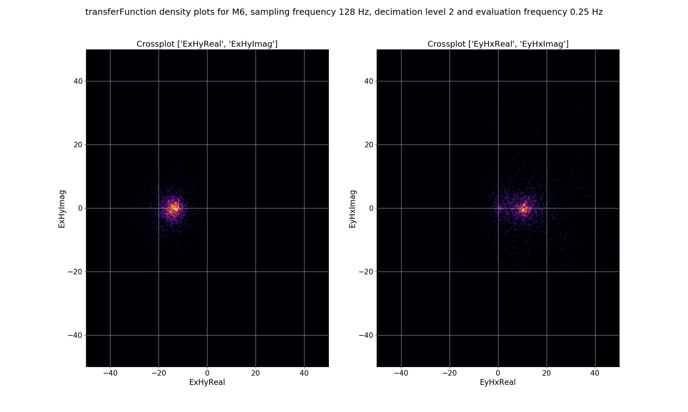
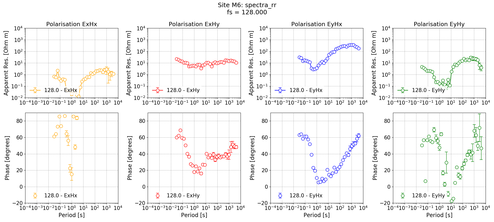
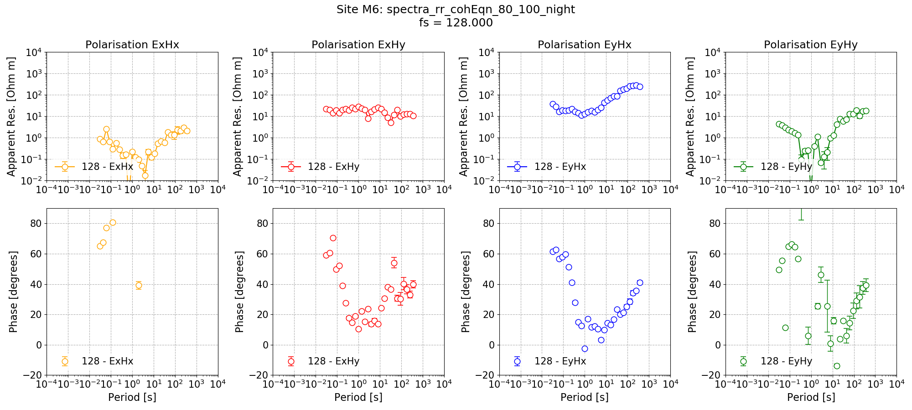

.. role:: python(code)
   :language: python

.. |Ex| replace:: E\ :sub:`x`
.. |Ey| replace:: E\ :sub:`y`
.. |Hx| replace:: H\ :sub:`x`
.. |Hy| replace:: H\ :sub:`y`
.. |Hz| replace:: H\ :sub:`z`
.. |Zxy| replace:: Z\ :sub:`xy`
.. |Zxx| replace:: Z\ :sub:`xx`
.. |Zyx| replace:: Z\ :sub:`yx`
.. |Zyy| replace:: Z\ :sub:`yy`
.. |fs| replace:: f\ :sub:`s`

Remote reference statistics
---------------------------

Remote reference statistics are a means of understanding how adding a remote reference site to the processing of magnetotelluric data is changing the solution. There are currently five remote reference statistics. 

- "RR_coherence"
- "RR_coherenceEqn"
- "RR_absvalEqn"
- "RR_transferFunction"
- "RR_resPhase"

More information on each of these is given in :doc:`remote reference statistics <../features/remote-statistics>`. 

.. important::
    
    Remote reference statistics are always saved with the local site. 

Calculating and viewing remote reference statistics
~~~~~~~~~~~~~~~~~~~~~~~~~~~~~~~~~~~~~~~~~~~~~~~~~~~
Begin by loading the project and calculate the remote statistics using the :meth:`~resistics.project.statistics.calculateRemoteStatistics` of module :mod:`~resistics.project.statistics`. The :meth:`~resistics.project.statistics.calculateRemoteStatistics` method will calculate the remote reference statistics for :python:`sites=["M6"]` and at sampling frequencies :python:`sampleFreqs=[128]` using the remote site "Remote". In this instance, all the remote statistics are being calculated.

.. literalinclude:: ../../../examples/advanced/remoteStatistics.py
    :linenos:
    :language: python
    :lines: 1-28
    :lineno-start: 1

To get an idea how the remote reference is changing the impedance tensor values, the impedance tensor estimates for each window for the single site and remote reference processing can now be plotted. To do this, the :meth:`~resistics.project.statistics.viewStatisticDensityplot` of module :mod:`~resistics.project.statistics` is used. This method plots 2-D histograms of statistic data cross pairs. In the following code snippet, density plots are being saved for the first evaluation frequency of decimation levels 0, 1, 2 and 3. Limits for x and y axes are also being set explicitly.

.. literalinclude:: ../../../examples/advanced/remoteStatistics.py
    :linenos:
    :language: python
    :lines: 30-57
    :lineno-start: 30

For single site statistics, the window-by-window impedance tensor estimates are calculated in the "transferFunction" statistic. This has components: ExHxReal, ExHxImag, ExHyReal, ExHyImag, EyHxReal, EyHxImag, EyHyReal, EyHyImag. For the density plot, the cross pairs ExHyReal vs. ExHyImag and EyHxReal vs. EyHxImag are plotted. This is essentially the |Ex|-|Hy| and |Ey|-|Hx| polarisations of the single site impedance tensor estimates plotted in the complex plane.

.. figure:: ../_static/examples/advanced/remote/densityPlot_singleSite_0.png
    :align: center
    :alt: alternate text
    :figclass: align-center

    Density plot of single site, window-by-window, impedance tensor |Ex|-|Hy| and |Ey|-|Hx| estimates for decimation level 0, evaluation frequency 32 Hz or period 0.03125 seconds.

For remote reference statistics, the window-by-window impedance tensor estimates are calculated in the "RR_transferFunction" statistic. This has components: ExHxRealRR, ExHxImagRR, ExHyRealRR, ExHyImagRR, EyHxRealRR, EyHxImagRR, EyHyRealRR, EyHyImagRR. For the density plot, the cross pairs ExHyRealRR vs. ExHyImagRR and EyHxRealRR vs. EyHxImagRR are plotted. This is essentially the |Ex|-|Hy| and |Ey|-|Hx| polarisations of the remote reference impedance tensor estimates plotted in the complex plane.

.. figure:: ../_static/examples/advanced/remote/densityPlot_remoteRef_0.png
    :align: center
    :alt: alternate text
    :figclass: align-center

    Density plot of remote reference, window-by-window, impedance tensor |Ex|-|Hy| and |Ey|-|Hx| estimates for decimation level 0, evaluation frequency 32 Hz or period 0.03125 seconds.

The same plots for decimation level 2 are shown below.

    Density plot of single site, window-by-window, impedance tensor |Ex|-|Hy| and |Ey|-|Hx| estimates for decimation level 2, evaluation frequency 0.25 Hz or period 4 seconds.

.. figure:: ../_static/examples/advanced/remote/densityPlot_remoteRef_2.png
    :align: center
    :alt: alternate text
    :figclass: align-center

    Density plot of remote reference, window-by-window, impedance tensor |Ex|-|Hy| and |Ey|-|Hx| estimates for decimation level 2, evaluation frequency 0.25 Hz or period 4 seconds.

The plots demonstrate how adding a remote reference is having an impact on the impedance tensor estimates. Particularly the plots for decimation level 2 (period 4 seconds) in the dead band show that by adding the remote reference, not only are the impedance tensor estimates changing, but the spread is becoming larger. Below are the single site impedance tensor estimates for Site M6 and the standard remote reference imepdance tensor estimate for Site M6. Visible in the impedance tensor plots is that the single site phase is smooth (though probably biased) in the dead band, whilst for the same periods, the remote reference estimates show significantly more noise. This is due to the greater spread in window-by-window impedance tensor estimates apparent in the remote reference processing. 

.. figure:: ../_static/examples/advanced/remote/singleSiteM6_128.png
    :align: center
    :alt: alternate text
    :figclass: align-center

    Single site impedance tensor estimates for Site M6 at 128 Hz

    Standard remote reference impedance tensor estimate for Site M6.

Masking with remote reference statistics
~~~~~~~~~~~~~~~~~~~~~~~~~~~~~~~~~~~~~~~~
Now, the remote reference statistics can be used to generate a mask. The easiest one to use is the remote reference equivalent of coherence. The statistic for this is "RR_coherenceEqn". Below, a mask is generated for "RR_coherenceEqn" requiring a minimum coherence of 0.8 for the pairs "ExHyR-HyHyR" and "EyHxR-HxHxR".

.. literalinclude:: ../../../examples/advanced/remoteStatistics.py
    :linenos:
    :language: python
    :lines: 59-69
    :lineno-start: 59

.. important::
    
    Because remote reference statistics are always associated with the local site, any masks generated from them are also saved to the local site. 

Now, the Site M6 can be remote reference processed using the new mask and the impedance tensor estimate plotted.

.. literalinclude:: ../../../examples/advanced/remoteStatistics.py
    :linenos:
    :language: python
    :lines: 71-94
    :lineno-start: 71

.. figure:: ../_static/examples/advanced/remote/remoteReferenceM6_128_RR_coh.png
    :align: center
    :alt: alternate text
    :figclass: align-center

    Remote reference impedance tensor estimate for Site M6 using a mask created from remote reference statistics.

It is also possible to see how the mask has affected the density plot by providing a mask into the :meth:`~resistics.project.statistics.viewStatisticDensityplot` of module :mod:`~resistics.project.statistics`. An example is shown below.

.. literalinclude:: ../../../examples/advanced/remoteStatistics.py
    :linenos:
    :language: python
    :lines: 96-112
    :lineno-start: 96

.. figure:: ../_static/examples/advanced/remote/densityPlot_remoteRef_2_mask.png
    :align: center
    :alt: alternate text
    :figclass: align-center

    The effect of masking on the density plot for remote reference impedance tensor estimates for Site M6 and decimation level 2, evaluation frequency 0.25 Hz and period 4 seconds. 

Masks and date or time constraints
~~~~~~~~~~~~~~~~~~~~~~~~~~~~~~~~~~
Recall, however, that masks can be combined with other masks as well as with datetime constraints. In the following example, the remote reference processing is performed again, but with the addition of a datetime constraint which includes only data recorded during the night. 

.. literalinclude:: ../../../examples/advanced/remoteStatistics.py
    :linenos:
    :language: python
    :lines: 114-135
    :lineno-start: 114

    Remote reference impedance tensor estimate for Site M6 using a mask created from remote reference statistics and with additional time constraints.

The new impedance tensor esimate appears better at the low decimation levels where there are plently of windows and worse at the high decimation levels where it is reducing the number of windows which can be included in the processing. The remote reference processing can be performed again, but this time applying the time constraints only to decimation levels 0 and 1.

.. literalinclude:: ../../../examples/advanced/remoteStatistics.py
    :linenos:
    :language: python
    :lines: 137-160
    :lineno-start: 137

.. figure:: ../_static/examples/advanced/remote/remoteReferenceM6_128_RR_coh_datetime_01.png
    :align: center
    :alt: alternate text
    :figclass: align-center

    Remote reference impedance tensor estimate for Site M6 using a mask created from remote reference statistics and with additional time constraints only applied to decimation levels 0 and 1.

Complete example script
~~~~~~~~~~~~~~~~~~~~~~~
For the purposes of clarity, the complete example script is provided below.

.. literalinclude:: ../../../examples/advanced/remoteStatistics.py
    :linenos:
    :language: python