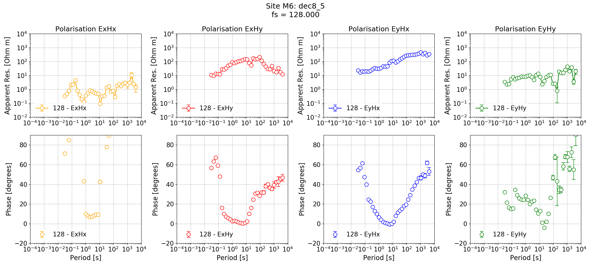
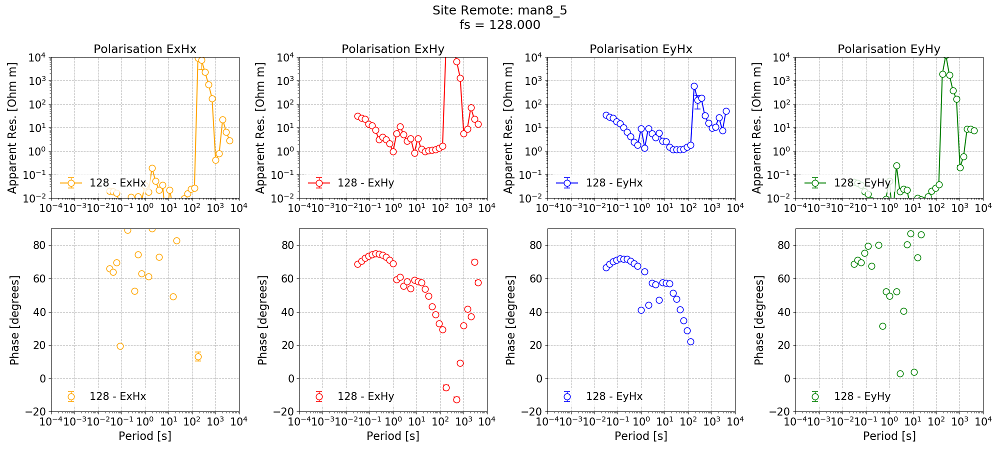
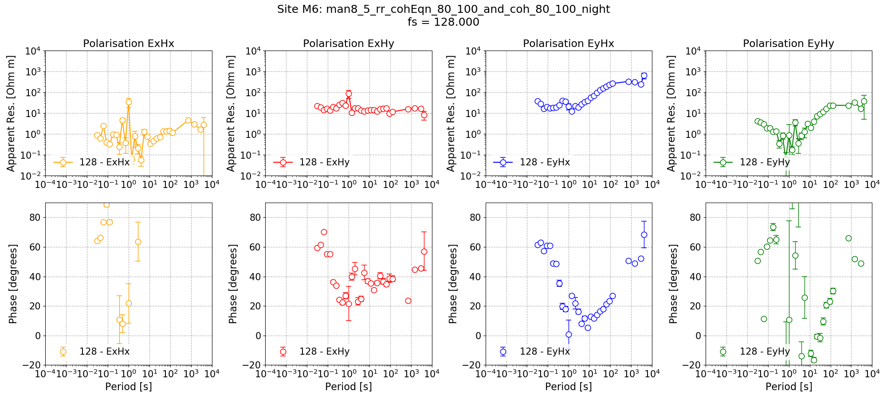

.. role:: python(code)
   :language: python

.. |Ex| replace:: E\ :sub:`x`
.. |Ey| replace:: E\ :sub:`y`
.. |Hx| replace:: H\ :sub:`x`
.. |Hy| replace:: H\ :sub:`y`
.. |Hz| replace:: H\ :sub:`z`
.. |Zxy| replace:: Z\ :sub:`xy`
.. |Zxx| replace:: Z\ :sub:`xx`
.. |Zyx| replace:: Z\ :sub:`yx`
.. |Zyy| replace:: Z\ :sub:`yy`
.. |fs| replace:: f\ :sub:`s`

Remote reference with configuration
-----------------------------------

Slowly, the remote reference result of Site M6 has been improving, but there are still some issues:

- The long period
- The dead band

The dead band is a challenging issue in magnetotellurics due to the poor signal-to-noise ratio. However, one thing that can be done to improve the long period is to change the minimum window size so there are more windows at high decimation levels (long periods).

Simple configuration
~~~~~~~~~~~~~~~~~~~~
Configuration files provide an easy way to define processing parameters. They are described in more detail :doc:`here <../features/configuration>` and :doc:`here <../tutorial/configuration-files>`.

The below configuration file changes the decimation scheme to 8 decimation levels with 5 evaluation frequencies per level and the minimum window size. In addition, the remote statistics to calculate have been explicitly defined so they do not need to be specifed in the call to :meth:`~resistics.project.statistics.calculateRemoteStatistics`.

.. literalinclude:: ../_static/examples/advanced/remote/remoteConfig.ini
    :linenos:
    :language: text

As the decimation parameters have changed, the spectra need to be recalculated. The specdir option has also been changed, meaning that the spectra will be saved in a different directory and avoiding any future issues. 

.. important::

    It is important to understand the specdir (spectra directory) options in resistics to avoid future problems. For more information, please read :doc:`Multiple Spectra <../tutorial/multiple-spectra>`.

The following recalculates the spectra, the single site impedance tensors, the remote reference statistics, the mask and the remote reference impedance tensor. 

.. literalinclude:: ../../../examples/advanced/remoteWithConfig.py
    :linenos:
    :language: python

The single site impedance tensor estimates are shown below.

    Single site impedance tensor estimates for Site M6 at 128 Hz using 8 decimation levels and 5 evaluation frequencies per level with a minimum window size of 256 points.

.. figure:: ../_static/examples/advanced/remote/singleSiteRemote_128_dec8_5.png
    :align: center
    :alt: alternate text
    :figclass: align-center

    Single site impedance tensor estimates for the Remote site at 128 Hz using 8 decimation levels and 5 evaluation frequencies per level with a minimum window size of 256 points.

The long periods have now improved, particularly for the Remote site. However, the dead band remains an issue for Remote and Site M6. 

The remote reference processing result for Site M6 is shown below. The long periods are noticeably better in both phase and apparent resistivity than the results with the standard processing scheme. As stated earlier, the dead band shows no discernible improvement. 

.. figure:: ../_static/examples/advanced/remote/remoteReferenceM6_128_RR_dec8_5_coh_datetime_01.png
    :align: center
    :alt: alternate text
    :figclass: align-center

    Remote reference impedance tensor estimates for Site M6 at 128 Hz using 8 decimation levels and 5 evaluation frequencies per level with a minimum window size of 256 points. Masks and time constraints are applied.

.. figure:: ../_static/examples/advanced/remote/remoteReferenceM6_128_RR_coh_datetime_01.png
    :align: center
    :alt: alternate text
    :figclass: align-center

    Remote reference impedance tensor estimates for Site M6 at 128 Hz using the standard decimation and evaluation scheme. The same masks and time constraints are applied.

Customised windowing
~~~~~~~~~~~~~~~~~~~~
Resistics gives fine grained control over windowing and overlaps. In the below configuration file, the same decimation scheme is used, with 8 decimation levels and 5 evaluation frequencies per level. However, the windowing has been defined explicitly for each decimation level. In addition and similar to the dec8_5 configuration file, the statistics and remote statistics to calculate have been explicitly defined so they do not need to be specifed in calls to :meth:`~resistics.project.statistics.calculateStatistics` and :meth:`~resistics.project.statistics.calculateRemoteStatistics`.

.. literalinclude:: ../_static/examples/advanced/remote/manualWindowsConfig.ini
    :linenos:
    :language: text

Like with the dec8_5 configuration file, begin with single site processing.

.. literalinclude:: ../../../examples/advanced/remoteManualWindows.py
    :linenos:
    :language: python
    :lines: 1-63
    :lineno-start: 1

.. figure:: ../_static/examples/advanced/remote/singleSiteM6_128_man8_5.png
    :align: center
    :alt: alternate text
    :figclass: align-center

    Single site impedance tensor estimates for Site M6 at 128 Hz using 8 decimation levels and 5 evaluation frequencies per level with a custom window size per decimation level.

    Single site impedance tensor estimates for the Remote site at 128 Hz using 8 decimation levels and 5 evaluation frequencies per level with a custom window size per decimation level.

In addition to single site processing, Remote is processed with a coherence mask giving the below impedance tensor estimate. 

.. figure:: ../_static/examples/advanced/remote/singleSiteRemote_128_man8_5_coh80.png
    :align: center
    :alt: alternate text
    :figclass: align-center

    Single site impedance tensor estimates for the Remote site at 128 Hz using 8 decimation levels and 5 evaluation frequencies per level with a custom window size per decimation level. A coherence mask of 0.8 has applied to discard noisy windows.

Applying the coherence mask has significantly improved the single site impedance tensor estimates for Remote in the dead band. However, in some cases, it has left no windows at the long periods (this is clear from the missing markers for some evaluation frequencies).

Next, the same remote reference processing is repeated with matching parameters to the dec8_5 processing as shown below.

.. literalinclude:: ../../../examples/advanced/remoteManualWindows.py
    :linenos:
    :language: python
    :lines: 65-98
    :lineno-start: 65

The resultant remote reference impedance tensor estimate for Site M6 is shown below. 

.. figure:: ../_static/examples/advanced/remote/remoteReferenceM6_128_RR_man8_5_coh_datetime_01.png
    :align: center
    :alt: alternate text
    :figclass: align-center

    Remote reference impedance tensor estimates for Site M6 at 128 Hz using 8 decimation levels and 5 evaluation frequencies per level with a custom window size per decimation level. Masks and time constraints are applied.

In general, the results are comparable with the other decimation/windowing schemes and are better in some places such as the long periods, and similar in others.

As an additional test, another mask is applied, which is the single site mask for Remote excluding Remote windows with coherence |Ex|-|Hy| or |Ey|-|Hx| below 0.8.

.. literalinclude:: ../../../examples/advanced/remoteManualWindows.py
    :linenos:
    :language: python
    :lines: 100-123
    :lineno-start: 100

    Remote reference impedance tensor estimates for Site M6 at 128 Hz using 8 decimation levels and 5 evaluation frequencies per level with a custom window size per decimation level. Masks and time constraints are applied. An additional mask is applied for Remote excluding Remote windows with coherence |Ex|-|Hy| or |Ey|-|Hx| below 0.8.

The result here is not so good, but it has reduced the biasing in the dead band where previously phases were reaching 0. With extra work and configuration testing, this may be promising.

For a last try, variable single site coherence thresholds could be used to limit the Remote data using the :meth:`~resistics.mask.data.MaskData.addConstraintLevel` method of :class:`~resistics.mask.data.MaskData`. An example and the result are provided below.

.. literalinclude:: ../../../examples/advanced/remoteManualWindows.py
    :linenos:
    :language: python
    :lines: 125-159
    :lineno-start: 125

.. figure:: ../_static/examples/advanced/remote/remoteReferenceM6_128_RR_man8_5_cohvar_datetime_01.png
    :align: center
    :alt: alternate text
    :figclass: align-center

    Remote reference impedance tensor estimates for Site M6 at 128 Hz using 8 decimation levels and 5 evaluation frequencies per level with a custom window size per decimation level. Masks and time constraints are applied. An additional mask is applied for Remote excluding Remote windows with coherence |Ex|-|Hy| or |Ey|-|Hx| below thresholds which are specified individually for each decimation level.

.. note::

    The data for this example has come from a field survey of northern Switzerland in 2016. This data is explored in more detail in a :doc:`case study <../case-studies/switzerland-2016>`.

Complete example scripts
~~~~~~~~~~~~~~~~~~~~~~~~
For the purposes of clarity, the complete example scripts are provided below.

Configuration dec8_5:

.. literalinclude:: ../../../examples/advanced/remoteWithConfig.py
    :linenos:
    :language: python

Configuration man8_5:

.. literalinclude:: ../../../examples/advanced/remoteManualWindows.py
    :linenos:
    :language: python

