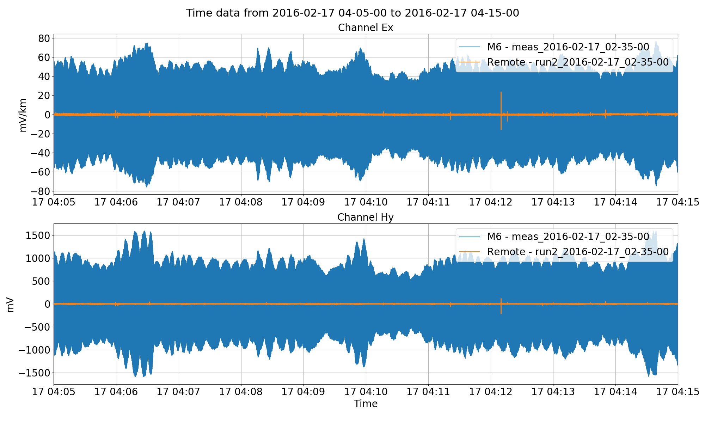
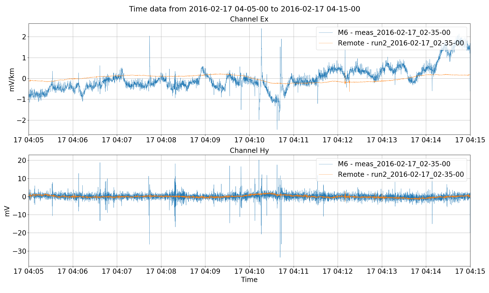
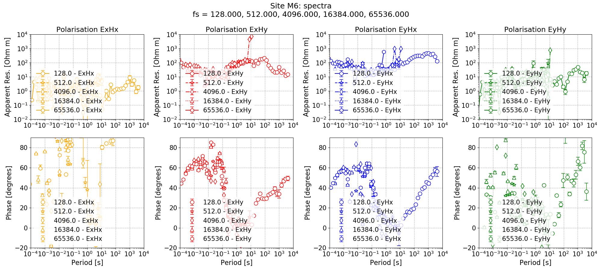
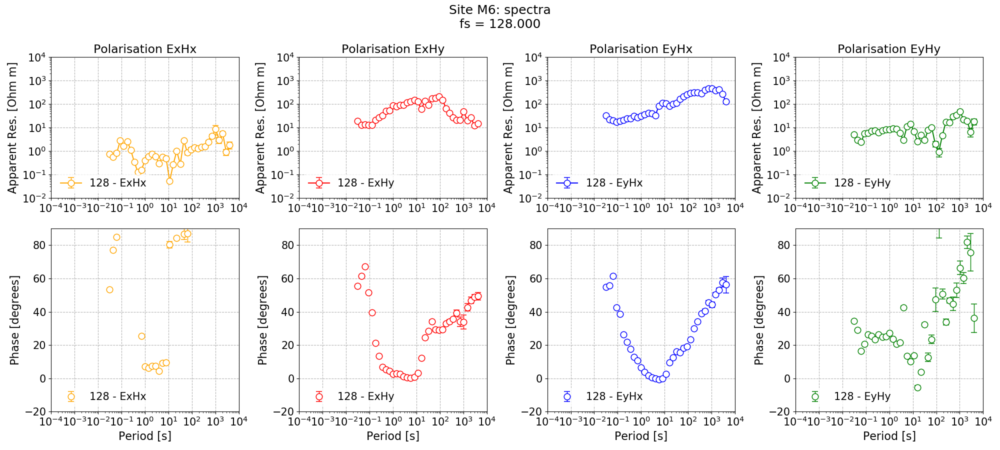
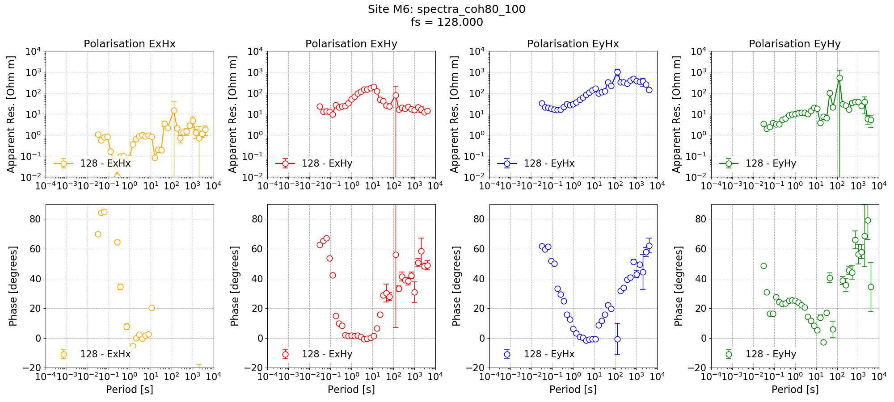
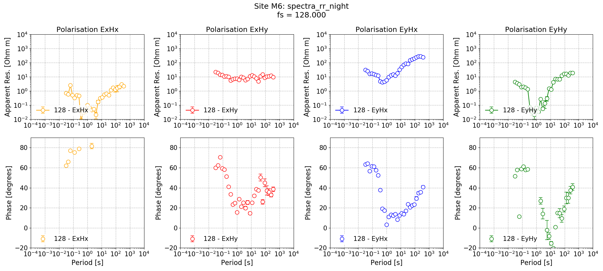

.. role:: python(code)
   :language: python

.. |Ex| replace:: E\ :sub:`x`
.. |Ey| replace:: E\ :sub:`y`
.. |Hx| replace:: H\ :sub:`x`
.. |Hy| replace:: H\ :sub:`y`
.. |Hz| replace:: H\ :sub:`z`
.. |Zxy| replace:: Z\ :sub:`xy`
.. |Zxx| replace:: Z\ :sub:`xx`
.. |Zyx| replace:: Z\ :sub:`yx`
.. |Zyy| replace:: Z\ :sub:`yy`
.. |fs| replace:: f\ :sub:`s`

Remote reference processing
---------------------------

Remote reference processing can help achieve notably better transfer functions in the presence of electromagnetic (EM) noise or when the signal to noise ratio within the magnetotelluric deadband is poor. To be able to perform remote reference processing, the following is required:

- The local site and the remote site must be at the same sampling frequency
- The local site and remote site must have a period of time with concurrent recording

The example here will deal with following:

- A local site recorded in northern Switzerland in 2016 and named M6. The sampling frequencys recorded at M6 include 65536, 16384, 4096, 512 and 128 Hz. The sampling frequency of interest for remote reference processing is 128 Hz and the format is ATS.
- A remote site permanently stationed in Germany. The sampling frequency of this data is 250 Hz and the format is SPAM. The site for the remote reference SPAM data will be called RemoteSPAM.  

Magnetotelluric data from northern Switzerland is noisy, particularly in the dead band due to the poor signal to noise ratio when accouting for the environmental noise, but at other evaluation frequencies too. Further, there is biasing and coherent sources of eletromagnetic noise. The hope is to use remote reference processing to help improve the impedance tensor estimates.

Setting up the project
~~~~~~~~~~~~~~~~~~~~~~
Begin as usual by creating our project and two sites to put our data in.

.. literalinclude:: ../../../examples/advanced/remoteCreate.py
    :linenos:
    :language: python
    :lines: 1-11
    :lineno-start: 1

After placing the data in the relevant folders, the project looks like this:

.. code-block:: text

    exampleProject
    ├── calData 
    ├── timeData   
    │   |── M6
    |   |   |── meas_2016-02-15_15-00-03
    │   |   |── meas_2016-02-15_15-02-03
    |   |   |── meas_2016-02-15_15-04-03     
    |   |   |── meas_2016-02-15_15-08-03    
    |   |   |── meas_2016-02-15_15-08-03    
    |   |   |── meas_2016-02-15_15-08-03
    |   |   |── meas_2016-02-15_15-08-03
    |   |   |── meas_2016-02-15_15-28-06
    |   |   |── meas_2016-02-16_02-00-00
    |   |   |── meas_2016-02-16_02-35-00
    |   |   |── meas_2016-02-17_02-00-00               
    |   |   |── meas_2016-02-17_02-35-00
    |   |   |── meas_2016-02-18_02-00-00
    |   |   |── meas_2016-02-18_02-35-00
    |   |   |── meas_2016-02-19_02-00-00
    |   |   |── meas_2016-02-19_02-35-00
    |   |   |── meas_2016-02-20_02-00-00               
    |   |   |── meas_2016-02-20_02-35-00
    |   |   |── meas_2016-02-21_02-00-00
    |   |   └── meas_2016-02-21_02-35-00        
    │   └── RemoteSPAM
    |       └── run2            
    ├── specData     
    ├── statData
    ├── maskData   
    ├── transFuncData 
    ├── images
    └── mtProj.prj

And printing out the project information and site information for the  using shows the following result:

.. literalinclude:: ../_text/printRemoteReference_1.txt
    :linenos:
    :language: text

Pre-processing
~~~~~~~~~~~~~~
As stated earlier, the project consists of:

- local site M6 with several sampling frequencies
- remote site RemoteSPAM with a single sampling frequency of 250 Hz

Recall, the remote data will be used as a remote reference for the 128 Hz data at local site M6. Therefore, the first step is to pre-process the remote data (for more information about pre-processing in resistics, see :doc:`Pre-processing timeseries data <pre-process>`). For SPAM data, this means:

- Interpolation on to the second
- Resampling to 128 Hz

As usual, the project is loaded in. Information is printed out about each site and then the remote reference data is pre-processed using the :meth:`~resistics.project.projectTime.preprocess` method.

.. literalinclude:: ../../../examples/advanced/remotePreprocess.py
    :linenos:
    :language: python
    :lines: 1-34
    :lineno-start: 1

Of particular interest is this part of the of the process:

.. literalinclude:: ../../../examples/advanced/remotePreprocess.py
    :linenos:
    :language: python
    :lines: 14-34
    :lineno-start: 14

Here, the 128 Hz measurements of site M6 are being looped over. The start and end time of each of these measurements is being taken and remote data for only that period is being pre-processed. The purpose of this is to save space and only pre-process data concurrent with 128 Hz data at the local site. 

In the pre-processing, the 250 Hz SPAM data is being interpolated onto the second and resampled from 250 Hz to 128 Hz. The pre-processed data directories will be saved to a new site named "Remote" and each measurement directory is has the start time of the measurement post pended to it. 

Printing out project information and site information for the new Remote site after pre-processing gives:

.. literalinclude:: ../_text/printRemoteReference_2.txt
    :linenos:
    :language: text

And the project structure looks like the below.

.. code-block:: text

    exampleProject
    ├── calData 
    ├── timeData   
    │   |── M6
    |   |   |── meas_2016-02-15_15-00-03
    │   |   |── meas_2016-02-15_15-02-03
    |   |   |── meas_2016-02-15_15-04-03     
    |   |   |── meas_2016-02-15_15-08-03    
    |   |   |── meas_2016-02-15_15-08-03    
    |   |   |── meas_2016-02-15_15-08-03
    |   |   |── meas_2016-02-15_15-08-03
    |   |   |── meas_2016-02-15_15-28-06
    |   |   |── meas_2016-02-16_02-00-00
    |   |   |── meas_2016-02-16_02-35-00
    |   |   |── meas_2016-02-17_02-00-00               
    |   |   |── meas_2016-02-17_02-35-00
    |   |   |── meas_2016-02-18_02-00-00
    |   |   |── meas_2016-02-18_02-35-00
    |   |   |── meas_2016-02-19_02-00-00
    |   |   |── meas_2016-02-19_02-35-00
    |   |   |── meas_2016-02-20_02-00-00               
    |   |   |── meas_2016-02-20_02-35-00
    |   |   |── meas_2016-02-21_02-00-00
    |   |   └── meas_2016-02-21_02-35-00        
    │   |── RemoteSPAM
    |   |   └── run2
    |   └── Remote
    |       |── run2_2016-02-15_15-28-06
    |       |── run2_2016-02-16_02-35-00
    |       |── run2_2016-02-17_02-35-00
    |       |── run2_2016-02-18_02-35-00
    |       |── run2_2016-02-19_02-35-00          
    |       |── run2_2016-02-20_02-35-00
    |       └── run2_2016-02-21_02-35-00           
    ├── specData     
    ├── statData
    ├── maskData   
    ├── transFuncData 
    ├── images
    └── mtProj.prj

To plot the data, the :meth:`~resistics.project.projectTime.viewTime` method can be used as normal and outlined in more detail :doc:`here <../tutorial/viewing-data>`.

.. literalinclude:: ../../../examples/advanced/remotePreprocess.py
    :linenos:
    :language: python
    :lines: 36-62
    :lineno-start: 36

First the data is plotted without any filtering and then with a 4 Hz low pass filter. The two plots are shown below.

    Site M6 vs. Remote unfiltered. Site M6 is much noisier and has significant high amplitude powerline noise consistent with a developed area.

    Site M6 vs. Remote filtered to 4 Hz. The longer period data is easier to see here, though M6 still has much more noise in the recordings. 

Single site impedance tensor
~~~~~~~~~~~~~~~~~~~~~~~~~~~~
The next step is to process the data, in the first instance using simple single site processing. Single site processing should be familiar from the :doc:`Tutorial <../tutorial>` and begins with calculating the spectra and continues with calculating the magnetotellruic transfer function and plotting the impedance tensor.

.. literalinclude:: ../../../examples/advanced/remoteRun.py
    :linenos:
    :language: python
    :lines: 1-36
    :lineno-start: 1

As the higher frequencies of Site M6 have also been processed, these can be plotted with the 128 Hz to give more periods.

    Impedance tensor estimates for Site M6 at all frequencies

Howver, of more interest for this example is the impedance tensor estimates using data sampled at 128 Hz, the sampling frequency at which remote reference processing will be used. The single site impedance tensor estimates for 128 Hz are given below.

    Single site impedance tensor estimates for Site M6 at 128 Hz

.. figure:: ../../../examples/advanced/remoteImages/singleSiteRemote_128.png
    :align: center
    :alt: alternate text
    :figclass: align-center

    Single site impedance tensor estimates for the Remote site at 128 Hz

Neither of the estimates are great. Site Remote looks poor and noisy. Site M6 appears to be biased in the dead band with the phase going to near 0. However, for the time being, continue to perform standard remote reference processing.

Remote reference impedance tensor
~~~~~~~~~~~~~~~~~~~~~~~~~~~~~~~~~
Standard remote reference processing is performed using the :meth:`~resistics.project.projectTransferFunction.processProject` method of module :mod:`~resistics.project.projectTransferFunction`.

.. literalinclude:: ../../../examples/advanced/remoteRun.py
    :linenos:
    :language: python
    :lines: 38-51
    :lineno-start: 38

To perform remote reference processing, the sites to process have been defined using the :python:`sites = ["M6"]` keyword argument. Further, a remote site has been defined using the :python:`remotesite = "Remote"` keyword argument. Specifying a remote site will ensure remote reference processing of data which overlaps in time between the sites and the remote site. 

Again, the impedance tensor has been plotted and the plot is provided below.

.. figure:: ../../../examples/advanced/remoteImages/remoteReferenceM6.png
    :align: center
    :alt: alternate text
    :figclass: align-center

    Standard remote reference impedance tensor estimate for Site M6.

Single site statistics
~~~~~~~~~~~~~~~~~~~~~~
As a next step, calculate single site statistics separately for M6 and Remote, produce a simple coherence mask with a threshold of 0.8 and redo the single site processing. For more information about statistics, please see the :doc:`tutorial <../tutorial>` and :doc:`statistics <../tutorial/statistics>`.  

.. literalinclude:: ../../../examples/advanced/remoteRun.py
    :linenos:
    :language: python
    :lines: 53-85
    :lineno-start: 53

The single site impedance tensors processed with the masks are shown below. 

    Single site impedance tensor estimates for Site M6 at 128 Hz using a coherency mask excluding windows with coherence |Ex|-|Hy| or |Ey|-|Hx| below 0.8.

.. figure:: ../../../examples/advanced/remoteImages/singleSiteRemote_128_coh80.png
    :align: center
    :alt: alternate text
    :figclass: align-center

    Single site impedance tensor estimates for the Remote site at 128 Hz using a coherency mask excluding windows with coherence |Ex|-|Hy| or |Ey|-|Hx| below 0.8.

Coherence masking has done little to improve the impedance tensor estimates for Site M6. However, it has noticeably improved the estimate for Remote. With this in mind, the next step is to do remote reference processing, but exluding windows where Remote site has |Ex|-|Hy| or |Ey|-|Hx| coherency below 0.8. This is done as follows:

.. literalinclude:: ../../../examples/advanced/remoteRun.py
    :linenos:
    :language: python
    :lines: 87-107
    :lineno-start: 87

.. figure:: ../../../examples/advanced/remoteImages/remoteReferenceM6_128_coh80.png
    :align: center
    :alt: alternate text
    :figclass: align-center

    Remote reference impedance tensor estimates for Site M6 at 128 Hz using a coherency mask on the Remote data excluding windows with coherence |Ex|-|Hy| or |Ey|-|Hx| below 0.8.

The resultant remote reference impedance tensor estimate for Site M6 has improved in some places, mainly in the |Ey|-|Hx| polarisation. However, after a period of 10\ :sup:`2` seconds, the results are poor. This matches the single site impedance tensor for Remote after 10\ :sup:`2` seconds, where the results are equally incorrect, possibly because of too few windows.

Date and time constraints
~~~~~~~~~~~~~~~~~~~~~~~~~
Finally, another way to restrict the data being used for remote reference processing is to use datetime restrictions. Datetime restrictions were introduced in the :doc:`tutorial <../tutorial>` and :doc:`datetime constraints <../tutorial/date-time-constraints>`.

.. literalinclude:: ../../../examples/advanced/remoteRun.py
    :linenos:
    :language: python
    :lines: 109-129
    :lineno-start: 109

    Remote reference impedance tensor estimates of Site M6 with datetime constraints using only night time data.

In the next section, remote reference statistics will be introduced. These are different to single site statistics in that they combine data from the local site and remote reference site.

Complete example scripts
~~~~~~~~~~~~~~~~~~~~~~~~
For the purposes of clarity, the complete example scripts are provided below.

For pre-processing:

.. literalinclude:: ../../../examples/advanced/remotePreprocess.py
    :linenos:
    :language: python

For estimating imepdance tensors:

.. literalinclude:: ../../../examples/advanced/remoteRun.py
    :linenos:
    :language: python