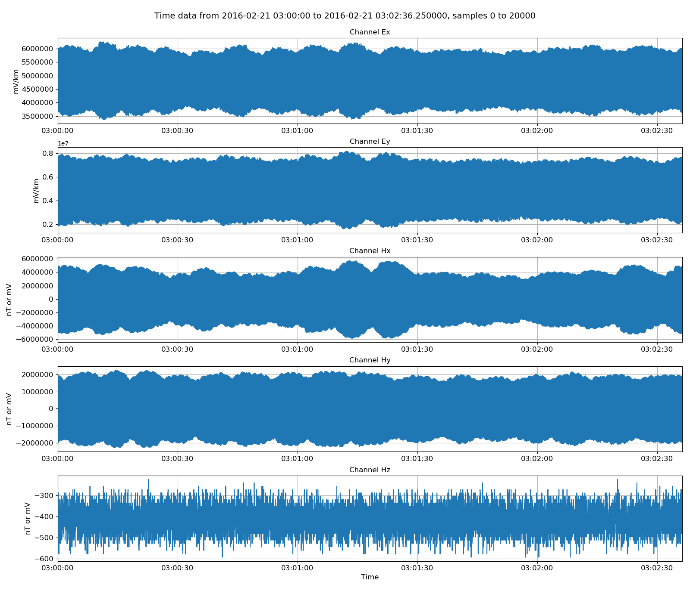
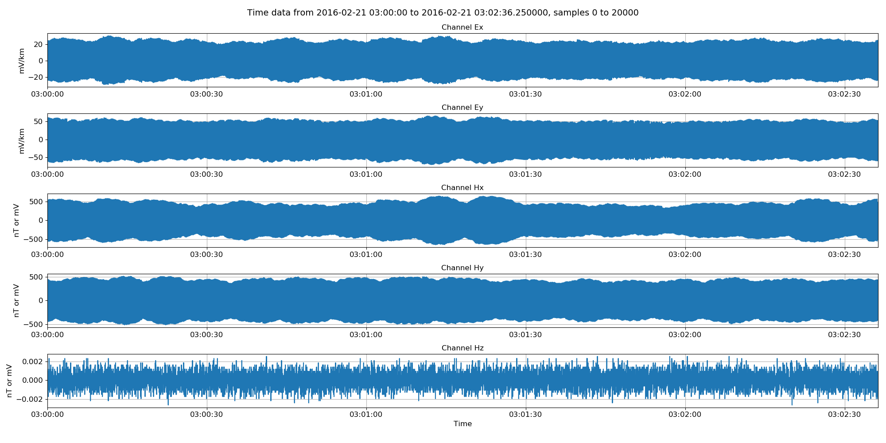
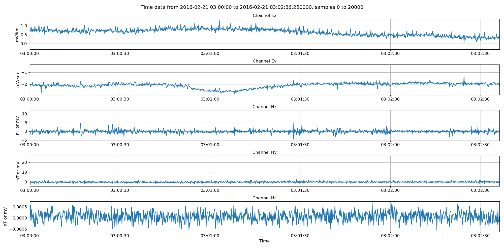

.. role:: python(code)
   :language: python

.. |Ex| replace:: E\ :sub:`x`
.. |Ey| replace:: E\ :sub:`y`
.. |Hx| replace:: H\ :sub:`x`
.. |Hy| replace:: H\ :sub:`y`
.. |Hz| replace:: H\ :sub:`z`
.. |Zxy| replace:: Z\ :sub:`xy`
.. |Zxx| replace:: Z\ :sub:`xx`
.. |Zyx| replace:: Z\ :sub:`yx`
.. |Zyy| replace:: Z\ :sub:`yy`
.. |fs| replace:: f\ :sub:`s`

ATS timeseries
--------------

ATS format is a one of the more straight-forward formats to support. Header files come in XML format and the data is stored in binary format with a single file for each channel. The data files have extension .ats. An example data folder for ATS is shown below. 

.. code-block:: text

    meas_2012-02-10_11-05-00 
    ├── 059_V01_2012-02-10_11-05-00_0.xml 
    ├── 059_V01_C00_R000_TEx_BL_4096H.ats   
    ├── 059_V01_C01_R000_TEy_BL_4096H.ats 
    ├── 059_V01_C02_R000_THx_BL_4096H.ats 
    ├── 059_V01_C02_R000_THy_BL_4096H.ats              
    └── 059_V01_C02_R000_THz_BL_4096H.ats 

ATS files are opened in resistics using the :doc:`DataReaderATS <../../api/ioHandlers.dataReaderATS>`. An example is shown below:

.. literalinclude:: ../../../../examples/conventions/atsReaderExamples.py
    :linenos:
    :language: python
    :lines: 1-6
    :lineno-start: 1

:python:`atsReader.printInfo()` prints information out to the terminal:

.. code-block:: text

    14:18:00 DataReaderATS: ####################
    14:18:00 DataReaderATS: DATAREADERATS INFO BEGIN
    14:18:00 DataReaderATS: ####################
    14:18:00 DataReaderATS: Data Path = testData\ats
    14:18:00 DataReaderATS: Global Headers
    14:18:00 DataReaderATS: {'start_time': '02:35:00.000000', 'start_date': '2016-02-21', 'stop_time': '06:27:12.375000', 'stop_date': '2016-02-21', 'meas_channels': 5, 'sample_freq': 128.0, 'num_samples': 1783345}
    14:18:00 DataReaderATS: Channels found:
    14:18:00 DataReaderATS: ['Ex', 'Ey', 'Hx', 'Hy', 'Hz']
    14:18:00 DataReaderATS: Channel Map
    14:18:00 DataReaderATS: {'Ex': 0, 'Ey': 1, 'Hx': 2, 'Hy': 3, 'Hz': 4}
    14:18:00 DataReaderATS: Channel Headers
    14:18:00 DataReaderATS: Ex
    14:18:00 DataReaderATS: {'gain_stage1': 16, 'gain_stage2': 1, 'hchopper': 0, 'echopper': 0, 'start_time': '02:35:00.000000', 'start_date': '2016-02-21', 'sample_freq': 128.0, 'num_samples': 1783345, 'ats_data_file': '443_V01_C00_R001_TEx_BL_128H.ats', 'sensor_type': 'EFP06', 'channel_type': 'Ex', 'ts_lsb': -1.76666e-06, 'pos_x1': -45.0, 'pos_x2': 41.0, 'pos_y1': 0.0, 'pos_y2': 0.0, 'pos_z1': 0.0, 'pos_z2': 0.0, 'sensor_sernum': 0, 'lsb_applied': False, 'stop_date': '2016-02-21', 'stop_time': '06:27:12.375000'}
    14:18:00 DataReaderATS: Ey
    14:18:00 DataReaderATS: {'gain_stage1': 16, 'gain_stage2': 1, 'hchopper': 0, 'echopper': 0, 'start_time': '02:35:00.000000', 'start_date': '2016-02-21', 'sample_freq': 128.0, 'num_samples': 1783345, 'ats_data_file': '443_V01_C01_R001_TEy_BL_128H.ats', 'sensor_type': 'EFP06', 'channel_type': 'Ey', 'ts_lsb': -1.76514e-06, 'pos_x1': 0.0, 'pos_x2': 0.0, 'pos_y1': -45.0, 'pos_y2': 41.1, 'pos_z1': 0.0, 'pos_z2': 0.0, 'sensor_sernum': 0, 'lsb_applied': False, 'stop_date': '2016-02-21', 'stop_time': '06:27:12.375000'}
    14:18:00 DataReaderATS: Hx
    14:18:00 DataReaderATS: {'gain_stage1': 2, 'gain_stage2': 1, 'hchopper': 1, 'echopper': 0, 'start_time': '02:35:00.000000', 'start_date': '2016-02-21', 'sample_freq': 128.0, 'num_samples': 1783345, 'ats_data_file': '443_V01_C02_R001_THx_BL_128H.ats', 'sensor_type': 'MFS06e', 'channel_type': 'Hx', 'ts_lsb': -0.000112802, 'pos_x1': 0.0, 'pos_x2': 0.0, 'pos_y1': 0.0, 'pos_y2': 0.0, 'pos_z1': 0.0, 'pos_z2': 0.0, 'sensor_sernum': 612, 'lsb_applied': False, 'stop_date': '2016-02-21', 'stop_time': '06:27:12.375000'}
    14:18:00 DataReaderATS: Hy
    14:18:00 DataReaderATS: {'gain_stage1': 1, 'gain_stage2': 1, 'hchopper': 1, 'echopper': 0, 'start_time': '02:35:00.000000', 'start_date': '2016-02-21', 'sample_freq': 128.0, 'num_samples': 1783345, 'ats_data_file': '443_V01_C03_R001_THy_BL_128H.ats', 'sensor_type': 'MFS06e', 'channel_type': 'Hy', 'ts_lsb': -0.000225735, 'pos_x1': 0.0, 'pos_x2': 0.0, 'pos_y1': 0.0, 'pos_y2': 0.0, 'pos_z1': 0.0, 'pos_z2': 0.0, 'sensor_sernum': 613, 'lsb_applied': False, 'stop_date': '2016-02-21', 'stop_time': '06:27:12.375000'}
    14:18:00 DataReaderATS: Hz
    14:18:00 DataReaderATS: {'gain_stage1': 16, 'gain_stage2': 1, 'hchopper': 1, 'echopper': 0, 'start_time': '02:35:00.000000', 'start_date': '2016-02-21', 'sample_freq': 128.0, 'num_samples': 1783345, 'ats_data_file': '443_V01_C04_R001_THz_BL_128H.ats', 'sensor_type': 'MFS06e', 'channel_type': 'Hz', 'ts_lsb': -1.41103e-05, 'pos_x1': 0.0, 'pos_x2': 0.0, 'pos_y1': 0.0, 'pos_y2': 0.0, 'pos_z1': 0.0, 'pos_z2': 0.0, 'sensor_sernum': 0, 'lsb_applied': False, 'stop_date': '2016-02-21', 'stop_time': '06:27:12.375000'}
    14:18:00 DataReaderATS: Note: Field units used. Physical data has units mV/km for electric fields and mV for magnetic fields
    14:18:00 DataReaderATS: Note: To get magnetic field in nT, please calibrate
    14:18:00 DataReaderATS: ####################
    14:18:00 DataReaderATS: DATAREADERATS INFO END
    14:18:00 DataReaderATS: ####################

This shows the headers read in by resistics and their values. There are both global headers which apply to all the channels and also channel specific headers. 

After reading in some data, it is natural to view it. This can be achieved in the following way:

.. literalinclude:: ../../../../examples/conventions/atsReaderExamples.py
    :linenos:
    :language: python
    :lines: 8-12
    :lineno-start: 8

:python:`atsReader.getUnscaledData()` returns a :doc:`TimeData <../../api/dataObjects.timeData>` object. Unscaled data is the raw data without any conversion to field units. The units for unscaled data are not consistent between data formats. 

.. note::

Time data can be viewed using the view method. 

.. literalinclude:: ../../../../examples/conventions/atsReaderExamples.py
    :linenos:
    :language: python
    :lines: 13-15
    :lineno-start: 13

    Viewing unscaled data

Physical data, which is converted to field units, can be returned and viewed as below:

.. literalinclude:: ../../../../examples/conventions/atsReaderExamples.py
    :linenos:
    :language: python
    :lines: 17-21
    :lineno-start: 17

    Viewing data scaled to field units

There are a few helpful methods built in to resistics for manipulating timeseries data. These are generally in :doc:`resitics.utilities <../api/utilities>. In the example below, a the time data is low pass filtered at 4Hz to remove any powerline or rail noise that might be in the data.

.. literalinclude:: ../../../../examples/conventions/atsReaderExamples.py
    :linenos:
    :language: python
    :lines: 23-27
    :lineno-start: 23

    Viewing physical data low pass filtered to 4Hz    

Resistics supports the writing out of data in an :doc:`internal <resistics-timeseries>` format. An examples of converting a whole dataset from ATS format to internal format is shown below.

.. literalinclude:: ../../../../examples/conventions/atsReaderExamples.py
    :linenos:
    :language: python
    :lines: 29-34
    :lineno-start: 29

Additionally, resistics can write out data in ASCII format, which allows users to view the data values, plot them in other software or otherwise transport the data for external analysis. An example is shown below.

.. literalinclude:: ../../../../examples/conventions/atsReaderExamples.py
    :linenos:
    :language: python
    :lines: 36-41
    :lineno-start: 36

.. warning:: ASCII data is not an efficient way of storing data as it requires much more space than binary data. Further, opening up large ASCII files in text readers will generally not be pleasant depending on the text reader being used. Therefore, this is only recommended when there is a specific reason to have ASCII data.