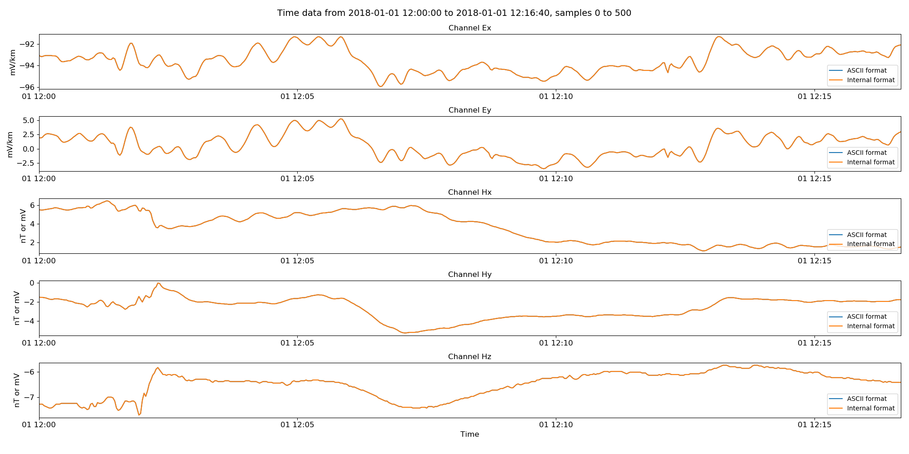

.. role:: python(code)
   :language: python

.. |Ex| replace:: E\ :sub:`x`
.. |Ey| replace:: E\ :sub:`y`
.. |Hx| replace:: H\ :sub:`x`
.. |Hy| replace:: H\ :sub:`y`
.. |Hz| replace:: H\ :sub:`z`
.. |Zxy| replace:: Z\ :sub:`xy`
.. |Zxx| replace:: Z\ :sub:`xx`
.. |Zyx| replace:: Z\ :sub:`yx`
.. |Zyy| replace:: Z\ :sub:`yy`
.. |fs| replace:: f\ :sub:`s`

ASCII timeseries
----------------

Resistics supports reading in of ascii data, allowing processing of data formats unsupported by resistics as long as the data can be converted into ASCII format. 

ASCII data folders require a separate file for each recording channel, a global header file and header files for each channel. The data files should have extension .ascii and the header files .hdr. An example data folder for ASCII is shown below: 

.. code-block:: text

    run1 
    ├── global.hdr 
    ├── chan00.hdr
    ├── chan01.hdr
    ├── chan02.hdr
    ├── chan03.hdr
    ├── chan04.hdr
    ├── bxnT.ascii   
    ├── bynT.ascii 
    ├── bznT.ascii 
    ├── exmuVm.ascii              
    └── eymuVm.ascii 

.. note::

    In order for resistics to recognise an ASCII data folder, the following have to be present:

    - Header files with extension .hdr (global and one for each channel)
    - Data files with extension .ascii

.. note::

    No scaling occurs in the ASCII data reader. All required scaling should be done prior to reading the ASCII data into resistics.

Fortunately, given some minimal information, resistics can autogenerate the header files for the ASCII data. The easiest way to explain how ASCII data works is to step through an example. To begin, there are five data files as below:

.. code-block:: text

    run1 
    ├── bxnT.dat   
    ├── bynT.dat 
    ├── bznT.dat 
    ├── exmuVm.dat              
    └── eymuVm.dat 

Remember, ASCII data files need to have the extension .ascii (otherwise it would be hard to distinguish ASCII data from other formats). Therefore, the first step is to rename all the data files until the folder looks like,

.. code-block:: text

    run1 
    ├── bxnT.ascii   
    ├── bynT.ascii 
    ├── bznT.ascii 
    ├── exmuVm.ascii              
    └── eymuVm.ascii 

The :class:`~resistics.ioHandlers.dataWriter.DataWriter` class has a handy function for autogenerating header files named :meth:`~resistics.ioHandlers.dataWriter.DataWriter.writeTemplateHeaderFiles`. Its use is shown below:

.. literalinclude:: ../../../../examples/conventions/asciiReaderExamples.py
    :linenos:
    :language: python
    :lines: 1-17
    :lineno-start: 1

The :python:`chan2FileMap` is a dictionary that maps channel names to the actual data files. The call to :meth:`~resistics.ioHandlers.dataWriter.DataWriter.writeTemplateHeaderFiles` needs to specify several parameters:

- The channels as a list of strings
- The map from the channel name to the data file
- The sampling frequency in Hz
- The number of samples
- The start date of the recording

Given this information, resistics will produce a set of header files such that the data folder now looks like this:

.. code-block:: text

    run1 
    ├── global.hdr 
    ├── chan00.hdr
    ├── chan01.hdr
    ├── chan02.hdr
    ├── chan03.hdr
    ├── chan04.hdr
    ├── bxnT.ascii   
    ├── bynT.ascii 
    ├── bznT.ascii 
    ├── exmuVm.ascii              
    └── eymuVm.ascii 

The end time of the recording is automatically calculated given the start time, sampling frequency and number of samples. This information is inserted into the header files. The global header file contains the following information: 

.. literalinclude:: ../../../../examples/conventions/timeData/ascii/global.hdr
    :linenos:
    :language: text

Channel metadata is stored in the channel header files. For example, the header file for channel |Ex| contains the following information:

.. literalinclude:: ../../../../examples/conventions/timeData/ascii/chan_00.hdr
    :linenos:
    :language: text

The data is now ready to be read in by resistics, which is achieved with the :class:`~resistics.ioHandlers.dataReaderAscii.DataReaderAscii` class. 

.. literalinclude:: ../../../../examples/conventions/asciiReaderExamples.py
    :linenos:
    :language: python
    :lines: 19-23
    :lineno-start: 19

The recording information can be printed to the terminal using the :meth:`~resistics.ioHandlers.IOHandler.printInfo` method of all input, output handlers. An example of the output is shown below:

.. literalinclude:: ../../_text/printAscii.txt
    :linenos:
    :language: text

The next step is to read some data and plot it. Resistics does not load the data into memory until it is requested. Further, the package only reads the requested data. The full dataset can be read by using the :meth:`~resistics.ioHandlers.dataReaderAscii.DataReaderAscii.getPhysicalSamples` method. Note again that no scaling is applied anywhere for ASCII data and :meth:`~resistics.ioHandlers.dataReaderAscii.DataReaderAscii.getPhysicalSamples` will return the same result as :meth:`~resistics.ioHandlers.dataReaderAscii.DataReaderAscii.getUnscaledSamples`. Both of these return a :class:`~resistics.dataObjects.timeData.TimeData` object.

.. literalinclude:: ../../../../examples/conventions/asciiReaderExamples.py
    :linenos:
    :language: python
    :lines: 25-34
    :lineno-start: 25

:python:`asciiData.printInfo()` prints time data information to the terminal. An alternative way to do this is to simply :python:`print(asciiData)`. 

.. literalinclude:: ../../_text/printAsciiData.txt
    :linenos:
    :language: text

Time data can be plotted by using the class :meth:`~resistics.dataObjects.timeData.TimeData.view` method. By passing a matplotlib figure to this, the layout can be controlled as required. The resulting image is:

.. figure:: ../../../../examples/conventions/images/ascii.png
    :align: center
    :alt: alternate text
    :figclass: align-center

    Viewing ASCII data  

Ascii time data objects are like any other time data objects returned by the other data readers. The time data object can be written out in the internal binary format to increase reading speed and reduce storage cost. This can be done with the :class:`~resistics.ioHandlers.dataWriterInternal.DataWriterInternal` class. 

.. literalinclude:: ../../../../examples/conventions/asciiReaderExamples.py
    :linenos:
    :language: python
    :lines: 36-42
    :lineno-start: 36

This dataset will be written out with a comments file that tracks the history of the data. For this example, the comments file looks like:

.. literalinclude:: ../../../../examples/conventions/timeData/asciiInternal/comments.txt
    :linenos:
    :language: text

To validate the output against the input, the internally formatted data can be read back in using the :class:`~resistics.ioHandlers.dataReaderInternal.DataReaderInternal` class and compared to the original ASCII data.

.. literalinclude:: ../../../../examples/conventions/asciiReaderExamples.py
    :linenos:
    :language: python
    :lines: 44-59
    :lineno-start: 44

Reading in the internal data is very similar to reading in the ASCII data. Another benefit of creating a figure and passing it through to the :meth:`~resistics.dataObjects.timeData.TimeData.view` method is that multiple datasets can be plotted on the same figure. The final data comparison figure is shown below.

    ASCII data and the binary internal format  

Complete example script
~~~~~~~~~~~~~~~~~~~~~~~

For the purposes of clarity, the complete example script is shown below.

.. literalinclude:: ../../../../examples/conventions/asciiReaderExamples.py
    :linenos:
    :language: python