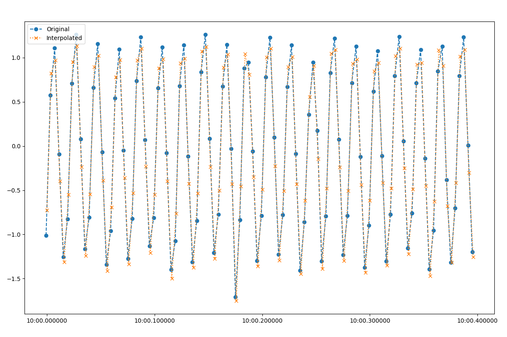

Interpolation to second
-----------------------

For best results, resistics requires data to be sampled on the second. For an example of a dataset not sampled on the second, consider recording at 10 Hz, with the first sample at 0.05 seconds. Then the sample times will be:

.. code-block:: text

    0.05 0.15 0.25 0.35 0.45 0.55 0.65 0.75 0.85 0.95 1.05 1.15 1.25 ...

Interpolating to the second will change the sample times to:

.. code-block:: text

    0.10 0.20 0.30 0.40 0.50 0.60 0.70 0.80 0.90 1.00 1.10 1.20 ...

The easiest way to show how to do this is with a practical example. First read in some SPAM data and look at the recording information.

.. literalinclude:: ../../../../examples/conventions/interpolationToSecond.py
    :linenos:
    :language: python
    :lines: 1-9
    :lineno-start: 1

The recording information printed to the screen gives:

.. literalinclude:: ../../_text/printInterp.txt
    :linenos:
    :language: text

And the time data information:

.. literalinclude:: ../../_text/printInterpData.txt
    :linenos:
    :language: text

This dataset is sampled at 250 Hz, which equates to a sampling period of 0.004 seconds. Looking at the start time, the data starts at 00:00:00.003200. This combination of start time and sampling period will not give data sampled on the second. Resistics includes the :meth:`~resistics.utilities.utilsInterp.interpolateToSecond` for interpolating time data to the second. This method uses spline interpolation.

.. literalinclude:: ../../../../examples/conventions/interpolationToSecond.py
    :linenos:
    :language: python
    :lines: 11-15
    :lineno-start: 11

.. warning:: 

    :meth:`~resistics.utilities.utilsInterp.interpolateToSecond` does not support data sampled at frequencies below 1 Hz. Please do not use it for this sort of data. 

Printing out information about this time data gives a new start time and provides interpolating information in the comments.

.. literalinclude:: ../../_text/printInterpDataInterpolated.txt
    :linenos:
    :language: text

The new start time of this time data is 00:00:01.000000, which means a few samples at the start of the data have been dropped. :meth:`~resistics.utilities.utilsInterp.interpolateToSecond` will always start the data at the next second.

It is possible to now write out this dataset using the :class:`~resistics.ioHandlers.dataWriterInternal.DataWriterInternal` class. However, header information needs to be passed to this class and can be taken from the :class:`~resistics.ioHandlers.dataReader.DataReader` object. Where there is a mismatch between the headers and the time data (for example, the start time of the headers will no longer match the start time of the interpolated data), the information in the :class:`~resistics.dataObjects.timeData.TimeData` object is preferentially used.

.. literalinclude:: ../../../../examples/conventions/interpolationToSecond.py
    :linenos:
    :language: python
    :lines: 17-31
    :lineno-start: 17

The comments associated with the new dataset are shown below.

.. literalinclude:: ../../../../examples/conventions/timeData/spamInterp/comments.txt
    :linenos:
    :language: text

To visualise the difference between the original and interpolated data, the interpolated data can be read back in using the :class:`~resistics.ioHandlers.dataReaderInternal.DataReaderInternal` class.

.. literalinclude:: ../../../../examples/conventions/interpolationToSecond.py
    :linenos:
    :language: python
    :lines: 33-38
    :lineno-start: 33

Next, request data from both the original and new reader for a given date range so that the data overlaps.

.. literalinclude:: ../../../../examples/conventions/interpolationToSecond.py
    :linenos:
    :language: python
    :lines: 40-44
    :lineno-start: 40

Finally, plot the data on the same plot using a matplotlib figure object to help out with this.

.. literalinclude:: ../../../../examples/conventions/interpolationToSecond.py
    :linenos:
    :language: python
    :lines: 46-54
    :lineno-start: 46

The figure shows that the interpolated and original data are close, but the sample timings are different. Note again that interpolation uses a spline interpolation rather than linear interpolation. 

    Original SPAM data versus interpolated data   

Complete example script
~~~~~~~~~~~~~~~~~~~~~~~

For the purposes of clarity, the complete example script is shown below.

.. literalinclude:: ../../../../examples/conventions/interpolationToSecond.py
    :linenos:
    :language: python