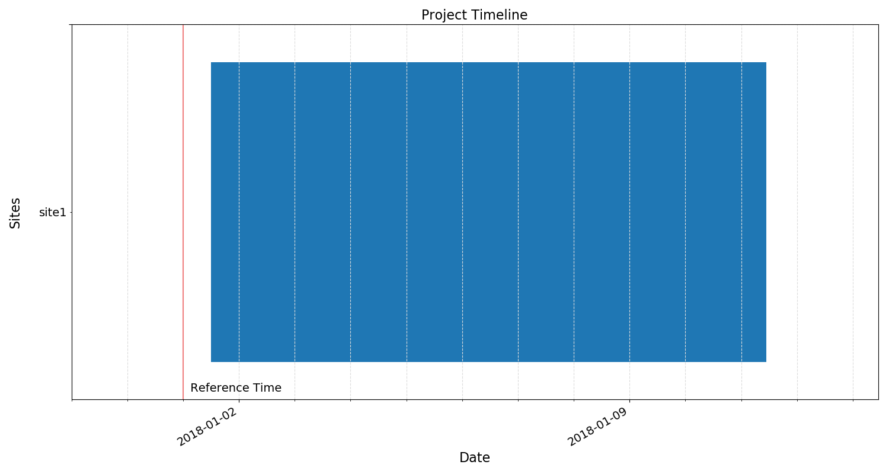
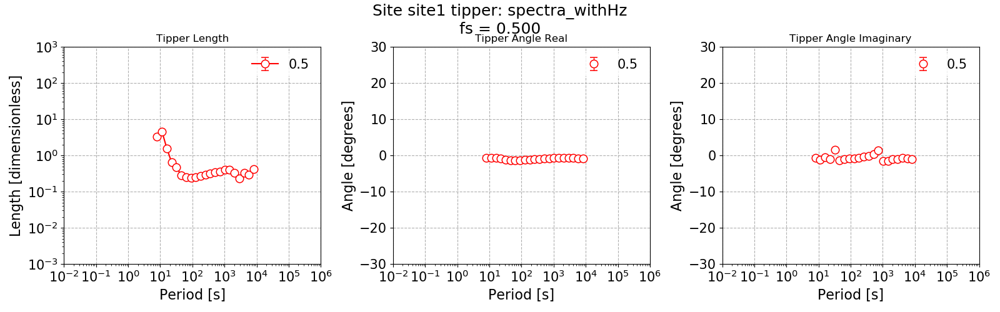
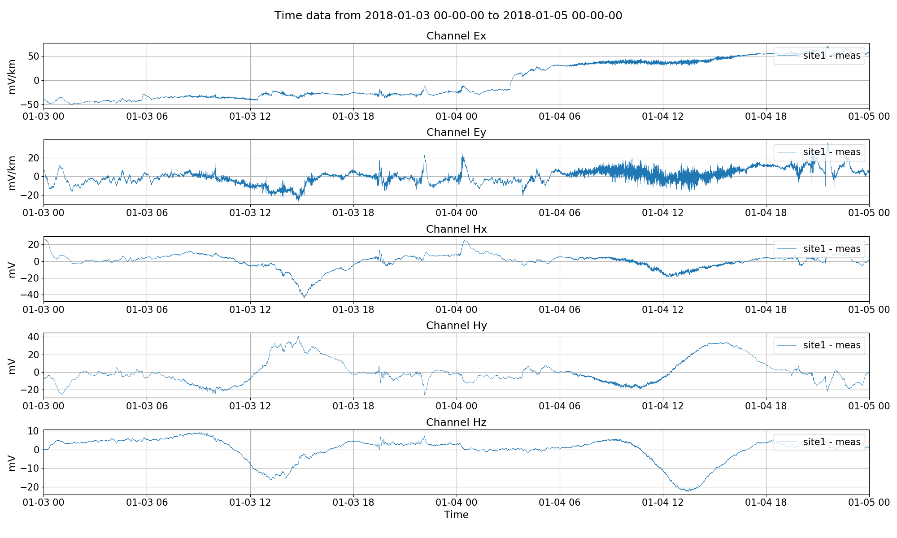
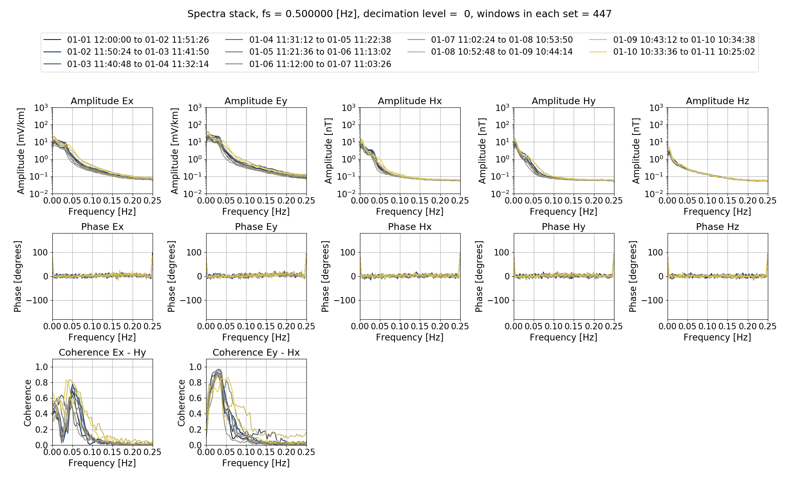
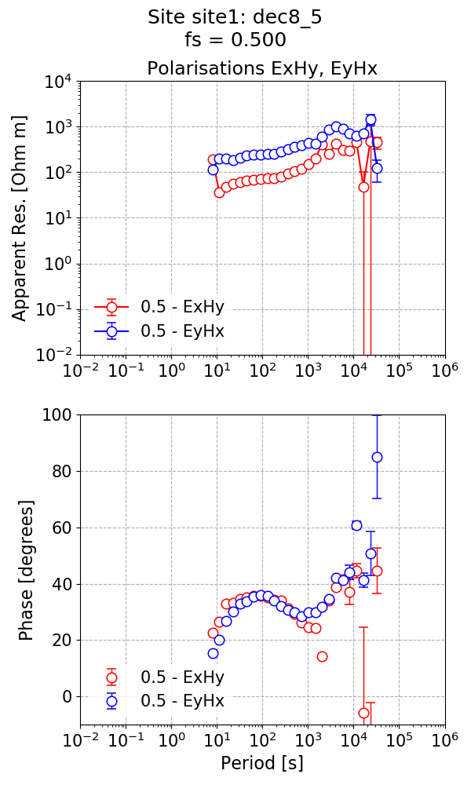
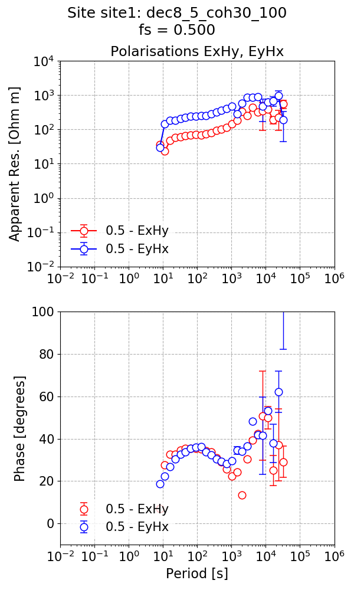

.. role:: python(code)
   :language: python

.. |Ex| replace:: E\ :sub:`x`
.. |Ey| replace:: E\ :sub:`y`
.. |Hx| replace:: H\ :sub:`x`
.. |Hy| replace:: H\ :sub:`y`
.. |Hz| replace:: H\ :sub:`z`
.. |Zxy| replace:: Z\ :sub:`xy`
.. |Zxx| replace:: Z\ :sub:`xx`
.. |Zyx| replace:: Z\ :sub:`yx`
.. |Zyy| replace:: Z\ :sub:`yy`
.. |fs| replace:: f\ :sub:`s`

Processing ASCII data
---------------------

There are instances in which magnetotelluric time series data is better dealt with in ASCII format. ASCII format has some storage and efficiency costs, but does offer a method of last resort when either a data format is not supported or ASCII data is all that is available. To read more about the ASCII data format, see :doc:`here <../formats/timeseries/ascii-timeseries>`.

The following is an example of processing long-period ASCII data from a magnotelluric observatory, recorded by a LEMI device and sampled at 0.5 Hz.

There are five data files, one for each channel:

- bxnT.ascii
- bynT.ascii
- bznT.ascii
- exmuVm.ascii
- eymuVm.ascii

.. note::
    
    The data files can be downloaded from `here <https://1drv.ms/f/s!ApKs8ZhVotKMgR6lVt3iI4cR6QUg>`_ for those interested in following along.

The units of the data are the following:

- Magnetic fields are in nT, which is the unit required by resistics (after calibration).
- Electric fields are in microvolts per metre, which is the equivalent of mV/km, again the unit required by resistics.

To begin, a new project and site is created.

.. literalinclude:: ../../../cookbook/usingAscii/createProject.py
    :linenos:
    :language: python

This is a single site, therefore, the reference time is of little significance. A dummy reference time has been set for the data. 

Under the site directory, a time series measurement directory needs to be created. This is a simple job of making a new directory, in this case named "meas". The data files should be copied into this directory as shown below.

.. code-block:: text

    asciiProject
    ├── calData 
    ├── timeData   
    │   └── site1
    |       └── meas
    |           |── bxnT.ascii
    |           |── bynT.ascii
    |           |── bznT.ascii
    |           |── exmuVm.ascii
    |           └── eymuVm.ascii            
    ├── specData      
    ├── statData
    ├── maskData   
    ├── transFuncData 
    ├── images
    └── mtProj.prj

After the project, site and measurement directory have been created, the data has to be prepared to be read in by resistics. This is achieved by using the :meth:`~resistics.time.writer.TimeWriter.writeTemplateHeaderFiles` method of the class :class:`~resistics.time.writer.TimeWriter`. 

.. literalinclude:: ../../../cookbook/usingAscii/asciiPrepare.py
    :linenos:
    :language: python

The :meth:`~resistics.time.writer.TimeWriter.writeTemplateHeaderFiles` creates dummy header files for the ASCII data allowing resistics to read it in appropriately. The dummy files it creates are:

- chan_00.hdr
- chan_01.hdr
- chan_02.hdr
- chan_03.hdr
- chan_04.hdr
- global.hdr

The measurement directory should now look like this:

.. code-block:: text

    asciiProject
    ├── calData 
    ├── timeData   
    │   └── site1
    |       └── meas
    |           |── global.hdr  
    |           |── chan_00.hdr
    |           |── chan_01.hdr
    |           |── chan_02.hdr
    |           |── chan_03.hdr         
    |           |── chan_04.hdr
    |           |── bxnT.ascii
    |           |── bynT.ascii
    |           |── bznT.ascii
    |           |── exmuVm.ascii
    |           └── eymuVm.ascii               
    ├── specData      
    ├── statData
    ├── maskData   
    ├── transFuncData 
    ├── images
    └── mtProj.prj

.. note::

    For a more in depth look at what is being done here, refer to :doc:`ASCII time series <../formats/timeseries/ascii-timeseries>`, which uses the same files to demonstrate ASCII data support in resistics.

The time series is now ready to be read in. In the below code block, the project and site timelines are plotted, giving two images, and then the time series is visualised. 

.. literalinclude:: ../../../cookbook/usingAscii/runDefault.py
    :linenos:
    :language: python
    :lines: 1-25
    :lineno-start: 1

    Project timeline, though the reference time is purely a dummy one.

.. figure:: ../_static/cookbook/usingAscii/siteTimeline.png
    :align: center
    :alt: alternate text
    :figclass: align-center

    Site timeline.

.. figure:: ../_static/cookbook/usingAscii/viewTime.png
    :align: center
    :alt: alternate text
    :figclass: align-center

    Visualising time series.

The next step is to calculate out the spectra and then produce a spectra stack plot, which will help in assessing the quality of the data.

.. literalinclude:: ../../../cookbook/usingAscii/runDefault.py
    :linenos:
    :language: python
    :lines: 27-46
    :lineno-start: 27

The spectra stack is shown below:

.. figure:: ../_static/cookbook/usingAscii/viewSpectraStack.png
    :align: center
    :alt: alternate text
    :figclass: align-center

    The spectra stack.
    
The easiest way to process the ascii data is using the default parameterisation, much like in :doc:`Up and running <../tutorial/up-and-running>`.

.. literalinclude:: ../../../cookbook/usingAscii/runDefault.py
    :linenos:
    :language: python
    :lines: 48-68
    :lineno-start: 48    

This gives the below impedance tensor estimate.

.. figure:: ../_static/cookbook/usingAscii/impedance_default.png
    :align: center
    :alt: alternate text
    :figclass: align-center
    :width: 400

    The impedance tensor estimate.

Looking at the phase estimates, the phase for the ExHy component is in the wrong quadrant. This is generally due to a different polarity convention, which can be fixed by performing a polarity reversal, which is shown below.

.. note::

    A polarity reversal sounds impressive but is simply a multiplication by -1. This does not change impedance tensor magnitude (therefore the apparent resistivity) but will have an impact on the phase.

.. literalinclude:: ../../../cookbook/usingAscii/runDefault.py
    :linenos:
    :language: python
    :lines: 70-82
    :lineno-start: 70    

The tipper estimate is shown below.

    The tipper estimate.

Changing the default parameters
~~~~~~~~~~~~~~~~~~~~~~~~~~~~~~~
As described in the :doc:`Using configuration files <../tutorial/configuration-files>` section in the :doc:`Tutorial <../tutorial>`, configuration files can be used to change the default parameterisation. The default parameters are not necessarily ideal for long period MT stations sampled at low sampling frequencies (here, 0.5 Hz). Therefore, it could be sensible to change the parameters here. 

A new configuration file has been made and is included below:

.. literalinclude:: ../_static/cookbook/usingAscii/asciiconfig.ini
    :linenos:
    :language: text

To use the configuration file, the project needs to be loaded along with the configuration file.

.. literalinclude:: ../../../cookbook/usingAscii/runWithConfig.py
    :linenos:
    :language: python
    :lines: 1-6
    :lineno-start: 1   

.. note::

    As the new configuration file includes new windowing parameters, a new set of spectra will be calculated out. The **specdir** option in the configuration deals with this. 

The first task it to view the time series data with a polarity reversal. This can be done by specifying the :python:`polreverse` keyword for :meth:`~resistics.project.time.viewTime` as demonstrated below.

.. literalinclude:: ../../../cookbook/usingAscii/runWithConfig.py
    :linenos:
    :language: python
    :lines: 8-20
    :lineno-start: 8

    Visualising time series with |Hy| multiplied by -1.   

Following a similar scheme as the default example, the spectra can be calculated and a spectra stack plotted. However, the polarity reversal needs to be specified when calculating the spectra, as is done in the below example. 

.. literalinclude:: ../../../cookbook/usingAscii/runWithConfig.py
    :linenos:
    :language: python
    :lines: 22-42
    :lineno-start: 22   

    The spectra stack for the new configuration using 8 decimation levels and 5 evalution frequencies per level.

As this configuration has fewer samples in a window, the resolution in frequency domain will be worse in comparison to the default parameters, which is clear from the plot. 

Finally, the spectra can be processed to estimate the impedance tensor and tipper. First, the impedance tensor.

.. literalinclude:: ../../../cookbook/usingAscii/runWithConfig.py
    :linenos:
    :language: python
    :lines: 44-64
    :lineno-start: 44

The impedance tensor estimate is shown below and now the phases are all in the correct quadrants.

    The impedance tensor estimate using 8 decimation levels and 5 evaluation frequencies per level.

And for the tipper:

.. literalinclude:: ../../../cookbook/usingAscii/runWithConfig.py
    :linenos:
    :language: python
    :lines: 66-77
    :lineno-start: 66

.. figure:: ../_static/cookbook/usingAscii/impedance_config_withHz.png
    :align: center
    :alt: alternate text
    :figclass: align-center

    The tipper estimate using 8 decimation levels and 5 evaluation frequencies per level.

The next question to ask is whether statistics could improve the result.

Using statistics and masks
~~~~~~~~~~~~~~~~~~~~~~~~~~
Begin once more by loading the project and configuration to continue working with the set of spectra where |Hy| has had a polarity reversal.

.. literalinclude:: ../../../cookbook/usingAscii/runWithStatistics.py
    :linenos:
    :language: python
    :lines: 1-6
    :lineno-start: 1

For more information about statistics, see the :doc:`Statistics <../tutorial/statistics>` section of the tutorial. Two statistics are calculated out here: coherence and transfer function. 

.. literalinclude:: ../../../cookbook/usingAscii/runWithStatistics.py
    :linenos:
    :language: python
    :lines: 8-11
    :lineno-start: 8

Next create a mask to perform simple coherence based rejection of time windows and view the mask.

.. literalinclude:: ../../../cookbook/usingAscii/runWithStatistics.py
    :linenos:
    :language: python
    :lines: 13-22
    :lineno-start: 13

.. figure:: ../_static/cookbook/usingAscii/maskcoh.png
    :align: center
    :alt: alternate text
    :figclass: align-center

    The number of masked windows for each evaluation frequency in decimation level 0.

More interesting plots can be made of statistics with masks as demonstrated in the :doc:`Masks <../tutorial/masks>` section of the tutorial, but this is left as an exercise.

Finally, calculate the impedance tensor estimate with the mask applied to exclude some windows.

.. literalinclude:: ../../../cookbook/usingAscii/runWithStatistics.py
    :linenos:
    :language: python
    :lines: 24-47
    :lineno-start: 24

    The impedance tensor estimate with masks applied.

If aspects of this example using ASCII data were not clear, please see the :doc:`Tutorial <../tutorial>` for more information about resistics, :doc:`Data formats <../formats>` for data supported by resistics and :doc:`Advanced <../advanced>` for an overview of the more advanced functionality of resistics.

Note, that this was not an effort to optimise the result, but rather an example and walkthrough of processing ASCII data in resistics. 

Complete example scripts
~~~~~~~~~~~~~~~~~~~~~~~~
For the purposes of clarity, the complete example scripts are provided below.

Create the project and a site:

.. literalinclude:: ../../../cookbook/usingAscii/createProject.py
    :linenos:
    :language: python

Preparing the ascii data to be read in:

.. literalinclude:: ../../../cookbook/usingAscii/asciiPrepare.py
    :linenos:
    :language: python

Transfer function calculation with default parameters:

.. literalinclude:: ../../../cookbook/usingAscii/runDefault.py
    :linenos:
    :language: python

Run with a configuration file:

.. literalinclude:: ../../../cookbook/usingAscii/runWithConfig.py
    :linenos:
    :language: python

Run with statistics:

.. literalinclude:: ../../../cookbook/usingAscii/runWithStatistics.py
    :linenos:
    :language: python