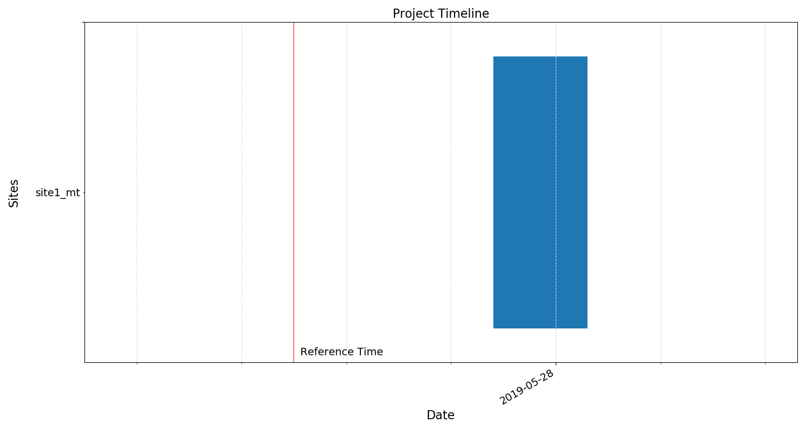
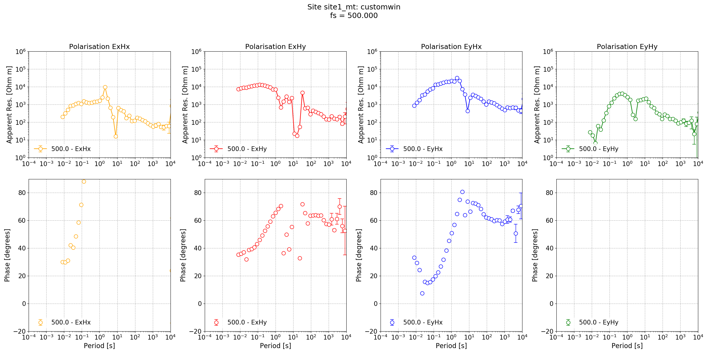
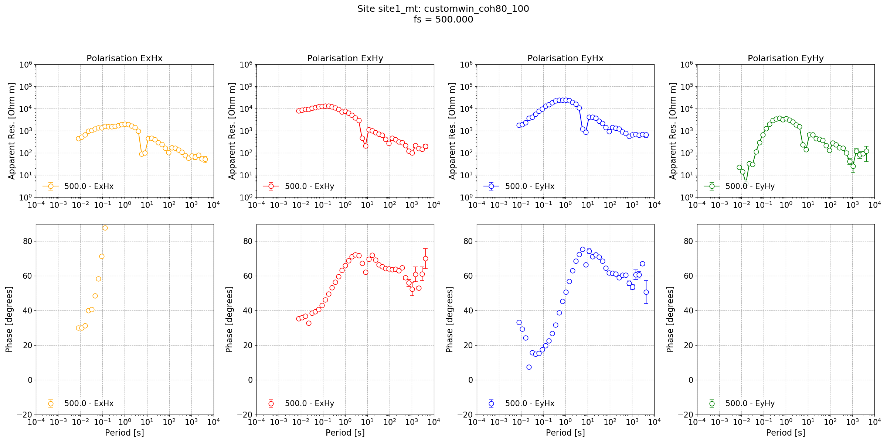

.. role:: python(code)
   :language: python

.. |Ex| replace:: E\ :sub:`x`
.. |Ey| replace:: E\ :sub:`y`
.. |Hx| replace:: H\ :sub:`x`
.. |Hy| replace:: H\ :sub:`y`
.. |Hz| replace:: H\ :sub:`z`
.. |Zxy| replace:: Z\ :sub:`xy`
.. |Zxx| replace:: Z\ :sub:`xx`
.. |Zyx| replace:: Z\ :sub:`yx`
.. |Zyy| replace:: Z\ :sub:`yy`
.. |fs| replace:: f\ :sub:`s`

Processing Lemi B423 data
-------------------------

For an introduction to using Lemi B423 data, please see :doc:`../formats/timeseries/LemiB423-timeseries`. 

Like always, begin by setting up a project.

.. literalinclude:: ../../../cookbook/usingLemiB423/createProject.py
    :linenos:
    :language: python
    :lines: 1-6
    :lineno-start: 1

There is no data in the project currently. To be able to use the Lemi B423 data, it needs to be placed into the project and the appropriate headers made. 

The Lemi B423 data is placed as follows:

.. code-block:: text

    usingLemi
    ├── calData 
    ├── timeData   
    │   └── site1_mt
    │       └── lemi01 
    │           ├── 1558950203.B423
    │           ├── 1558961007.B423
    │           ├── 1558971807.B423
    │           ├── 1558982607.B423
    │           ├── 1558993407.B423
    │           ├── 1559004207.B423
    │           ├── 1559015007.B423
    │           └── 1559025807.B423            
    ├── specData
    ├── statData
    ├── maskData   
    ├── transFuncData 
    ├── images
    └── mtProj.prj

To make the header files, the :meth:`~resistics.ioHandlers.dataReaderLemiB423.folderB423Headers` method of module :mod:`:meth:`~resistics.ioHandlers.dataReaderLemiB423` is used.

.. literalinclude:: ../../../cookbook/usingLemiB423/process.py
    :linenos:
    :language: python
    :lines: 1-8
    :lineno-start: 1

The project now looks like this:

.. code-block:: text

    usingLemi
    ├── calData 
    ├── timeData   
    │   └── site1_mt
    │       └── lemi01 
    │           ├── 1558950203.B423
    │           ├── 1558961007.B423
    │           ├── 1558971807.B423
    │           ├── 1558982607.B423
    │           ├── 1558993407.B423
    │           ├── 1559004207.B423
    │           ├── 1559015007.B423
    │           ├── 1559025807.B423
    │           ├── chan_00.h423
    │           ├── chan_01.h423
    │           ├── chan_02.h423
    │           ├── chan_03.h423
    │           ├── chan_04.h423
    │           └── global.h423                
    ├── specData
    ├── statData
    ├── maskData   
    ├── transFuncData 
    ├── images
    └── mtProj.prj

Additionally, calibration files need to be present. These are placed in the calData folder. In this case, ascii calibration files are being used. More about calibration files can be found in :doc:`Calibration <../formats/calibration>` and in particular, about ascii calibration files :doc:`here <../formats/calibration/ascii-calibration>`.

.. code-block:: text

    usingLemi
    ├── calData
    │   ├── lemi120_IC_710.txt
    │   ├── lemi120_IC_712.txt
    │   └── lemi120_IC_714.txt         
    ├── timeData   
    │   └── site1_mt
    │       └── lemi01 
    │           ├── 1558950203.B423
    │           ├── 1558961007.B423
    │           ├── 1558971807.B423
    │           ├── 1558982607.B423
    │           ├── 1558993407.B423
    │           ├── 1559004207.B423
    │           ├── 1559015007.B423
    │           ├── 1559025807.B423
    │           ├── chan_00.h423
    │           ├── chan_01.h423
    │           ├── chan_02.h423
    │           ├── chan_03.h423
    │           ├── chan_04.h423
    │           └── global.h423                
    ├── specData
    ├── statData
    ├── maskData   
    ├── transFuncData 
    ├── images
    └── mtProj.prj

.. note::

    For ascii format calibration files, the important thing is that the name is of the format:

    []_IC_[serial number].txt

    There is a calibration for each coil serial number: 712 for |Hx|, 710 for |Hy| and 714 for |Hz|.

Now the project can be loaded in the normal way and a timeline viewed.

.. literalinclude:: ../../../cookbook/usingLemiB423/process.py
    :linenos:
    :language: python
    :lines: 10-16
    :lineno-start: 10

    Project timeline

Time data can be viewed in the usual way using the :meth:`~resistics.project.projectTime.viewTime` method.

.. literalinclude:: ../../../cookbook/usingLemiB423/process.py
    :linenos:
    :language: python
    :lines: 18-29
    :lineno-start: 18

.. figure:: ../../../cookbook/usingLemiB423/images/viewTime.png
    :align: center
    :alt: alternate text
    :figclass: align-center

    Lemi B423 magnetotelluric data in field units (mV/km for electric channels and mV ffor magnetic channels)

Next, process the data to estimate the impedance tensor. This involves calculating spectra and then doing the robust regression. Additionally, statistics are being calculated for future use.

.. literalinclude:: ../../../cookbook/usingLemiB423/process.py
    :linenos:
    :language: python
    :lines: 31-45
    :lineno-start: 31

The resultant impedance tensor estimate is shown below.

.. figure:: ../../../cookbook/usingLemiB423/images/impedance_default.png
    :align: center
    :alt: alternate text
    :figclass: align-center

    Impedance tensor estimate for Lemi B423 data at a sampling frequency of 500 Hz.

Looking at the impedance tensor estimate, there are two issues:

#. Dead band data looks poor, probably because of signal to noise ratio
#. Long period data is poor, probably due to too few windows

To deal with the second point, define a new configuration setup that will provide more windows at long periods and redo the processing. Now that because the windowing scheme has changed, a new set of spectra and statistics will need to be calculated.

.. literalinclude:: ../../../cookbook/usingLemiB423/customconfig.ini
    :linenos:
    :language: text

.. literalinclude:: ../../../cookbook/usingLemiB423/processConfig.py
    :linenos:
    :language: python
    :lines: 1-21
    :lineno-start: 1

    Impedance tensor estimate for Lemi B423 data at a sampling frequency of 500 Hz with a different windowing scheme

The new windowing scheme, which reduces the window size at the long periods has produced a better result at long periods. However, there has been no improvement in the dead band. For that, a coherence mask can be tried.

.. literalinclude:: ../../../cookbook/usingLemiB423/processConfig.py
    :linenos:
    :language: python
    :lines: 23-62
    :lineno-start: 23

    Impedance tensor estimate for Lemi B423 data at a sampling frequency of 500 Hz with a different windowing scheme and variable coherence masking for each decimation level. The result is now better than default settings in both the long periods and dead band. 

The coherence mask has indeed improved the dead band reponse. With further work and investigation of statistics, it may be possible to achieve an ever better result. 

Complete example scripts
~~~~~~~~~~~~~~~~~~~~~~~~
For the purposes of clarity, the complete example scripts is provided below.

Creating the project.

.. literalinclude:: ../../../cookbook/usingLemiB423/createProject.py
    :linenos:
    :language: python

Processing with standard parameters.

.. literalinclude:: ../../../cookbook/usingLemiB423/process.py
    :linenos:
    :language: python

Processing with a configuration file.

.. literalinclude:: ../../../cookbook/usingLemiB423/processConfig.py
    :linenos:
    :language: python