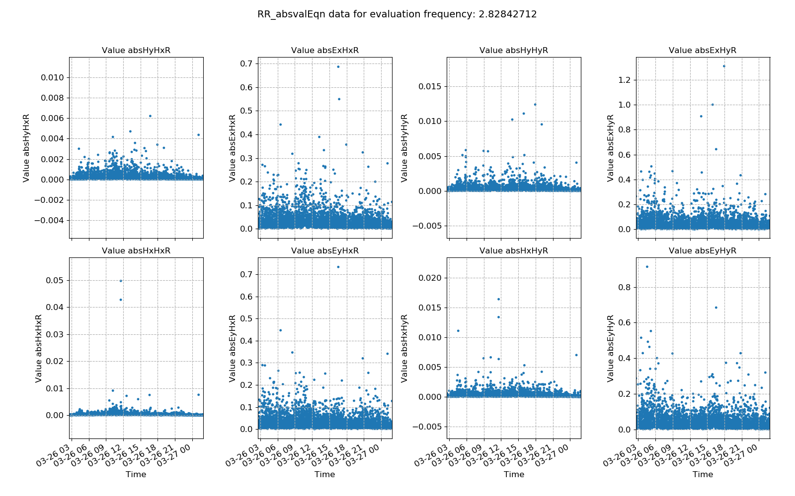

.. |Ex| replace:: E\ :sub:`x`
.. |Ey| replace:: E\ :sub:`y`
.. |Hx| replace:: H\ :sub:`x`
.. |Hy| replace:: H\ :sub:`y`
.. |Hz| replace:: H\ :sub:`z`

Remote reference absolute value
-------------------------------

The remote reference absolute value statistic is simply the remote referece equivalent of the single site :doc:`absolute value <../statistics/absval>` statistic. Instead of calculating the absolute value of cross spectra between local channels, the absolute values of cross spectra with the remote magnetic channels are calculated. It is meant to show windows which have high values that may have too much influence in the linear regression. 

.. important::

    The resistics name for the remote reference absolute value statistic is: **RR_absvalEqn**.

    The components of the remote reference absolute value statistic are:

    - abs |Ex| |Hx| R
    - abs |Ex| |Hy| R
    - abs |Ey| |Hx| R   
    - abs |Ey| |Hy| R
    - abs |Hx| |Hx| R    
    - abs |Hx| |Hy| R
    - abs |Hy| |Hx| R
    - abs |Hy| |Hy| R

Below is a plot showing the variation in time of the components of the remote refrence absolute value statistic. There are clearly some outliers in terms of absolute values. These outliers may later on have a negative impact on the regression step for estimation of the remote reference transfer function.

    Remote reference absolute value plotted over time for evaluation frequency 2.83 Hz

The histogram of the remote reference absolute values shows evidence of outliers, though small in number, by the extents of the automatic x axis limits.

.. figure:: ../../_static/examples/features/remotestats/M1_RR_absvalEqn_histogram_128.png
    :align: center
    :alt: alternate text
    :figclass: align-center

    Remote reference absolute value histogram for evaluation frequency 2.83 Hz
