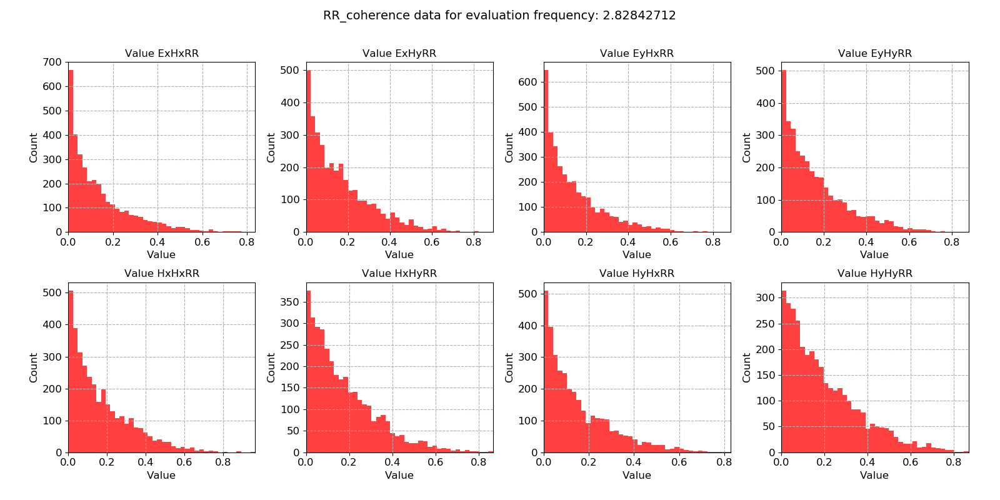

.. |Ex| replace:: E\ :sub:`x`
.. |Ey| replace:: E\ :sub:`y`
.. |Hx| replace:: H\ :sub:`x`
.. |Hy| replace:: H\ :sub:`y`
.. |Hz| replace:: H\ :sub:`z`

Remote reference coherence
--------------------------

The remote reference coherence statistic calculates the coherence between the local channels and the remote reference magnetic channels. It is really a measure of similarity between the channels measured locally and those measured at the remote site. This statistic might be interesting from the point of view of the local magnetic and remote magnetic channels to see how correlated they are. However, other than that, it is likely that the :doc:`remote reference coherence equation <coherenceEqn>` statistic will be much more effective for removing noisy time windows.

.. important::

    The resistics name for the remote reference coherence statistic is: **RR_coherence**.

    The components of the remote reference coherence statistic are:

    - |Ex| |Hx| RR, coherence between local |Ex| and remote |Hx|
    - |Ex| |Hy| RR, coherence between local |Ex| and remote |Hy| 
    - |Ey| |Hx| RR, coherence between local |Ey| and remote |Hx|
    - |Ey| |Hy| RR, coherence between local |Ey| and remote |Hy|
    - |Hx| |Hx| RR, coherence between local |Hx| and remote |Hx|
    - |Hx| |Hy| RR, coherence between local |Hx| and remote |Hy|
    - |Hy| |Hx| RR, coherence between local |Hy| and remote |Hx|
    - |Hy| |Hy| RR, coherence between local |Hy| and remote |Hy|

Looking at the two plots below, it does not look like the local electric and magnetic channels are too well correlated with the remote magnetic channels.

.. figure:: ../../_static/examples/features/remotestats/M1_RR_coherence_view_128.png
    :align: center
    :alt: alternate text
    :figclass: align-center

    Remote reference coherence statistic plotted over time for evaluation frequency 2.83 Hz

    Remote reference coherence statistic histogram for evaluation frequency 2.83 Hz
