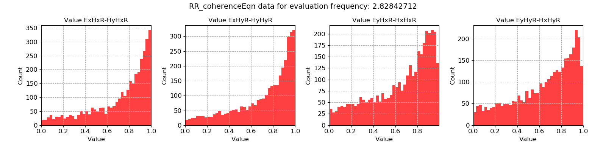

.. |Ex| replace:: E\ :sub:`x`
.. |Ey| replace:: E\ :sub:`y`
.. |Hx| replace:: H\ :sub:`x`
.. |Hy| replace:: H\ :sub:`y`
.. |Hz| replace:: H\ :sub:`z`

Remote reference coherence equation
-----------------------------------

The remote reference coherence equation statistic is the closest equivalent to the standard, single site :doc:`coherence <../statistics/coherence>` statistic. It is a measure of the linear relationship between |Ex| - |Hx|, |Ex| - |Hy|, |Ey| - |Hx| and |Ey| - |Hy|, except posed in the remote reference sense. In most cases, this is the remote reference statistic to use. A value of 1 represents a good remote reference relationship, whilst 0 represents a poor linear relationship.

By contrast, the statistic :doc:`remote reference coherence <coherence>` is actually the coherence between the local channels and the remote magnetic channels. 

.. important::

    The resistics name for the remote reference coherence equation statistic is: **RR_coherenceEqn**.

    The components of the remote reference coherence equation statistic are:

    - |Ex| |Hx| R - |Hy| |Hx| R
    - |Ex| |Hy| R - |Hy| |Hy| R
    - |Ey| |Hx| R - |Hx| |Hx| R
    - |Ey| |Hy| R - |Hx| |Hy| R

The example below shows the remote reference coherence equation statistic plotted with time. There is a significant amount of scatter and time windows with low coherence values. Ideally, these need removing.

.. figure:: ../../_static/examples/features/remotestats/M1_RR_coherenceEqn_view_128.png
    :align: center
    :alt: alternate text
    :figclass: align-center

    Remote reference coherence equation plotted over time for evaluation frequency 2.83 Hz

There are no real patterns in time in the way the statistic changes suggesting the persistent presence of electromagnetic noise (rather than day/night cycles corresponding to cultural electromagnetic noise).

A histogram of the remote reference coherence equation statistic is plotted below. Again, it is clear that there are many time windows with low coherence.

    Remote reference coherence equation histogram for evaluation frequency 2.83 Hz
