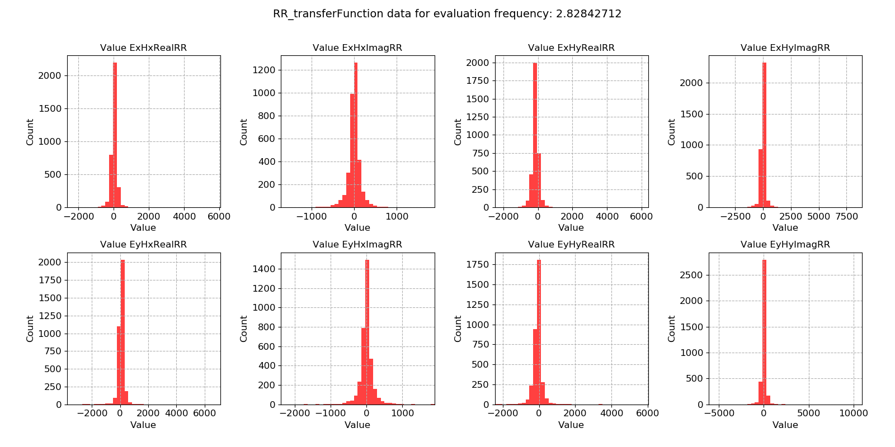
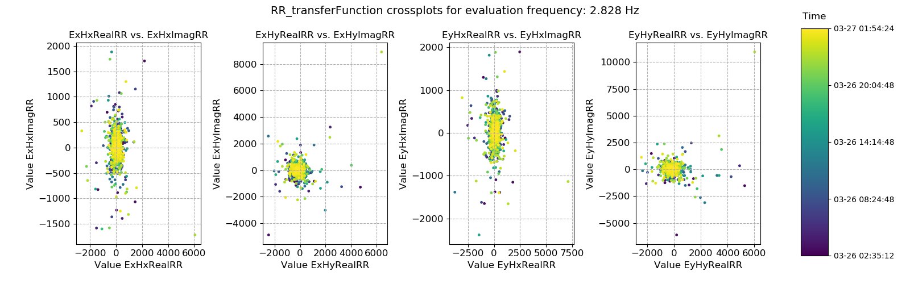

.. |Ex| replace:: E\ :sub:`x`
.. |Ey| replace:: E\ :sub:`y`
.. |Hx| replace:: H\ :sub:`x`
.. |Hy| replace:: H\ :sub:`y`
.. |Hz| replace:: H\ :sub:`z`

Remote reference transfer function
----------------------------------

It is possible to calculate out the remote reference transfer function for each window (and evaluation frequency). Whilst the geoelectric and geomagnetic fields may vary with time, the components of the remote reference transfer function should stay constant through time. Calculating out transfer function components on an evaluation frequency basis for each window allows the study of the variation in remote reference transfer function components over time and the identification of noisy windows which should be removed from further analysis.

.. note::

    Currently, the only remote reference transfer function calculated out by statistics is the impedance tensor

.. important::

    The resistics name for the remote reference transfer function statistic is: **RR_transferFunction**.

    The components of the remote reference transfer function statistic are:

    - |Ex| |Hx| RealRR
    - |Ex| |Hx| ImagRR
    - |Ex| |Hy| RealRR
    - |Ex| |Hy| ImagRR
    - |Ey| |Hx| RealRR
    - |Ey| |Hx| ImagRR
    - |Ey| |Hy| RealRR
    - |Ey| |Hy| ImagRR

An example of window-by-window remote reference transfer function esimates over time is shown below. 

.. figure:: ../../_static/examples/features/remotestats/M1_RR_transferFunction_view_128.png
    :align: center
    :alt: alternate text
    :figclass: align-center

    Remote reference transfer function estimates plotted over time for evaluation frequency 2.83 Hz

In general, the values appear quite consistent but there is significant spread. The result is illustrated in the histogram plots below, which are quite Gaussian apart from outliers.

    Remote reference transfer function estimates plotted as a histogram for evaluation frequency 2.83 Hz

Crossplots are a useful way of visualising the remote reference transfer function in the complex plane. In best cases, there should be a tight spread. 

    Remote reference transfer function estimates crossplotted for evaluation frequency 2.83 Hz

2-D histogram plots or density plots can help show the spread in the remote reference transfer function estimates. Here, there does appear to be some spread around the central point, however it does appear largely 2-D Gaussian.

.. figure:: ../../_static/examples/features/remotestats/M1_RR_transferFunction_densityplot_128.png
    :align: center
    :alt: alternate text
    :figclass: align-center

    Density plot (2-D histgoram) plot of remote reference transfer function estimates for evaluation frequency 2.83 Hz