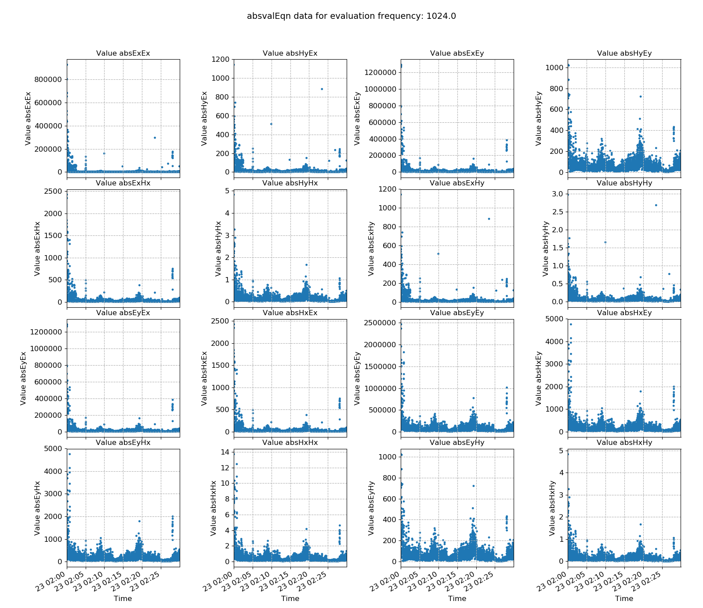
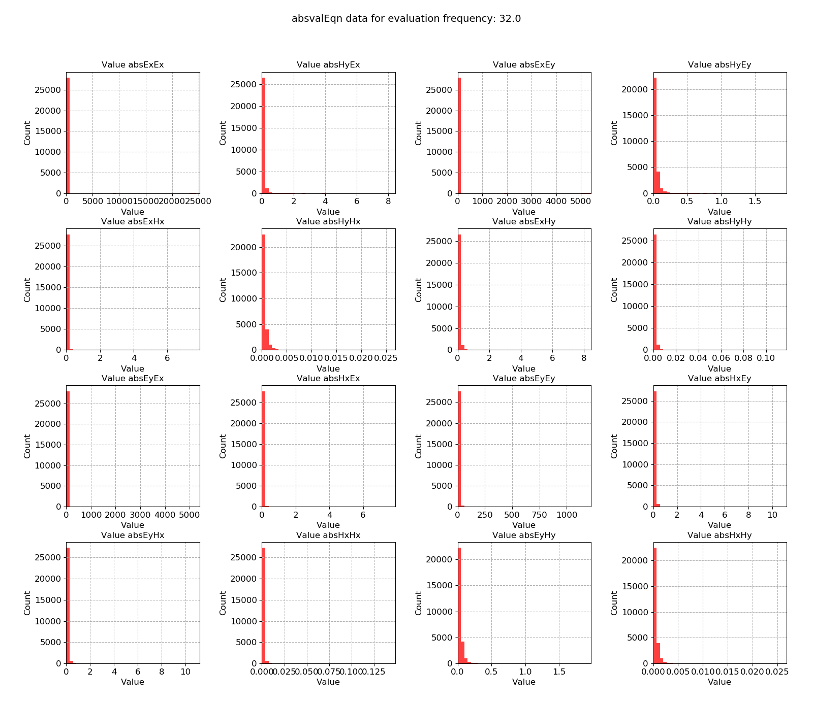

.. |Ex| replace:: E\ :sub:`x`
.. |Ey| replace:: E\ :sub:`y`
.. |Hx| replace:: H\ :sub:`x`
.. |Hy| replace:: H\ :sub:`y`
.. |Hz| replace:: H\ :sub:`z`

Absolute value
--------------

The absolute value (absvalEqn) statistic is simply the absolute value of cross spectra for each evaluation frequency. In many respects, it is similar to :doc:`Power Spectral Density <powerSpectralDensity>`. However, :doc:`Power Spectral Density <powerSpectralDensity>` only considers individual channels whilst the absvalEqn statistic is a proxy of the amplitude of cross spectra too. These are the values that feed directly into the robust regression.

.. important::

    The resistics name for the absolute value statistic is: **absvalEqn**.

    The components for the absolute value statistic (there are 16 in total) are:

    - abs |Ex| |Ex|
    - abs |Ex| |Ey| = abs |Ey| |Ex|
    - abs |Ex| |Hx| = abs |Hx| |Ex|
    - abs |Ex| |Hy| = abs |Hy| |Ex|
    - abs |Ey| |Ey|
    - abs |Ey| |Hx| = abs |Hx| |Ey|
    - abs |Ey| |Hy| = abs |Hy| |Ey|
    - abs |Hx| |Hx|
    - abs |Hx| |Hy| = abs |Ey| |Hx|
    - abs |Hy| |Hy| 

An example is shown below for a measurement recorded at 4096 Hz and evaluation frequency 1024 Hz.

    Absolute cross spectral value plotted over time for evaluation frequency 1024 Hz

.. figure:: ../../_static/examples/features/stats/M1_absvalEqn_histogram_4096.png
    :align: center
    :alt: alternate text
    :figclass: align-center

    Absolute cross spectral value plotted as a histogram for evaluation frequency 1024 Hz

As linear regression estimates can be skewed significantly by large values, it can be sometimes useful to remove windows with large absolute values from use in the linear regression problem.

Another example for a measurement at 128 Hz and evalution frequency 32 Hz is included below. Notice that it has much the same features as demonstrated in :doc:`Power Spectral Density <powerSpectralDensity>`.

.. figure:: ../../_static/examples/features/stats/Remote_absvalEqn_view_128.png
    :align: center
    :alt: alternate text
    :figclass: align-center

    Absolute cross spectral value plotted over time for evaluation frequency 32 Hz 

    Absolute cross spectral value plotted as a histogram for evaluation frequency 32 Hz 