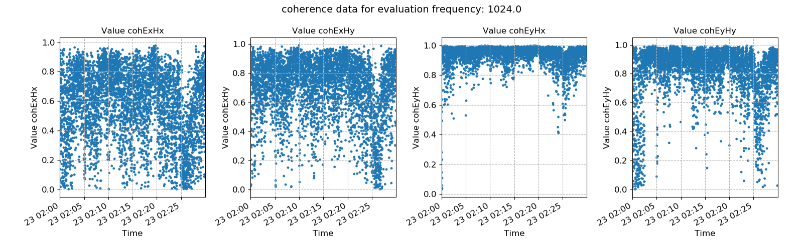
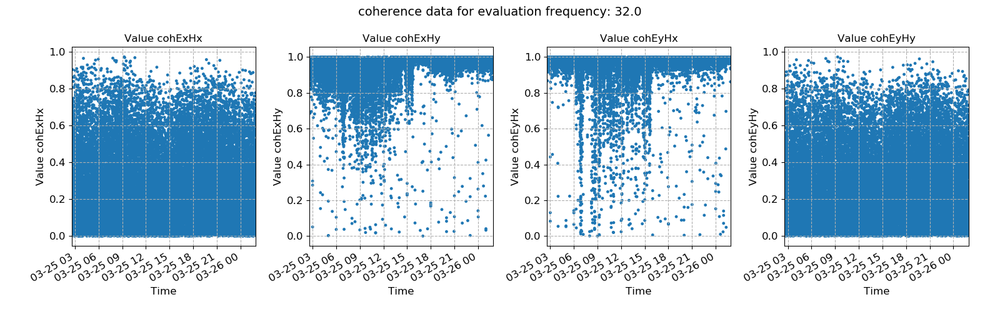
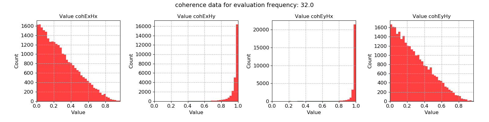

.. |Ex| replace:: E\ :sub:`x`
.. |Ey| replace:: E\ :sub:`y`
.. |Hx| replace:: H\ :sub:`x`
.. |Hy| replace:: H\ :sub:`y`
.. |Hz| replace:: H\ :sub:`z`

Coherence
---------

Coherence measures the relationship between signals. For a linear system, it can be used to estimate the power transfer between the inputs and outputs. The coherence of two signals is a value between 0 and 1, where 0 suggests no power transfer and 1 represents full power transfer. 

For more detailed information about coherence, see: `Wikipedia <https://en.wikipedia.org/wiki/Coherence_(signal_processing)>`_. 

.. important::

    The resistics name for the coherence statistic is: **coherence**.

    The following components are calculated out:

    - coh |Ex| |Hx|
    - coh |Ex| |Hy|
    - coh |Ey| |Hx|
    - coh |Ey| |Hy|

In most cases, the off-diagonals are expected to be small as |Ex| is not expected to significantly impact |Hx| and similarly with |Ey| and |Hy|. Generally, the coherences of interest are between |Ey|-|Hx| and |Ex|-|Hy|. High values of coherence between |Ex|-|Hy| and/or |Ey|-|Hx| often represent good data and time windows with such high values are normally kept for transfer function estimation. However, high coherence values can also be caused by a nearby coherent source of electromagnetic energy.

An example of window-by-window coherence values is shown below.

    An example of coherence pairs plotted over time

The above coherence shows a couple of trends:

- Generally, |Ey|-|Hx| is more coherent than |Ex|-|Hy|
- Near the end of the recording something caused the coherence to fall primarily in |Ex| coherences. Studying the |Ex| timeseries might provide more clues to the cause of this.

Another way to look at the same data is in the form of a histogram. Ideally, there should be more higher coherent values than lower ones. 

.. figure:: ../../_static/examples/features/stats/M1_coherence_histogram_4096.png
    :align: center
    :alt: alternate text
    :figclass: align-center

    A histogram of coherence values for the various coherence pairs

Below are two additional plots from a different day long recording at 128 Hz. In this case, the coherence plots show a significant improvement after 16:00. Before this time, there are significant numbers of noisy windows. The noise is probably cultural and due to daily human activity.

    Window-by-window coherence values against time

    Window-by-window coherence values plotted in a histogram