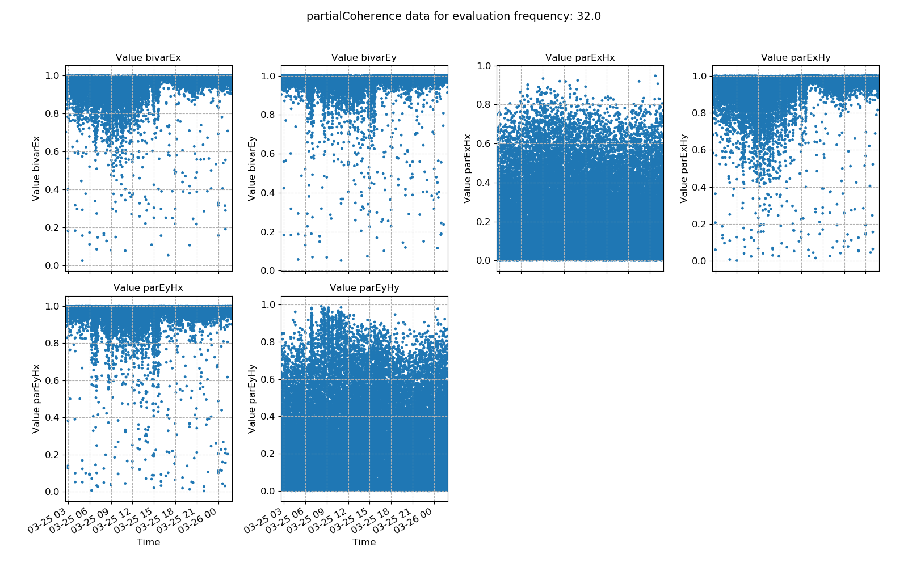

.. |Ex| replace:: E\ :sub:`x`
.. |Ey| replace:: E\ :sub:`y`
.. |Hx| replace:: H\ :sub:`x`
.. |Hy| replace:: H\ :sub:`y`
.. |Hz| replace:: H\ :sub:`z`
.. |Zxy| replace:: Z\ :sub:`xy`
.. |Zxx| replace:: Z\ :sub:`xx`
.. |Zyx| replace:: Z\ :sub:`yx`
.. |Zyy| replace:: Z\ :sub:`yy`
.. |Bix| replace:: bivar\ :sub:`x`
.. |Biy| replace:: bivar\ :sub:`y`

Partial coherence
-----------------

The bivariate coherence between inputs |Hx| and |Hy| and output |Ex| is given by:

.. math::

    bivar_x^2 = \frac{Z_{xx} <H_x, E_x^*> + Z_{xy} <H_y, E_x^*>}{<E_x, E_x^*>}

When there is a strong linear relationship between the inputs |Hx| and |Hy| and output |Ex|, this ratio is close to 1. However, when there is no such relationship, this ratio is closer to 0.

Simarly, for |Ey|, the equation is:

.. math::

    bivar_y^2 = \frac{Z_{yx} <H_x, E_y^*> + Z_{yy} <H_y, E_y^*>}{<E_y, E_y^*>}

The value can be interpreted in a similar way. 

In general, good magnetotelluric data follows a strong linear relationship such that |Bix| and |Biy| should both be close to 1.

Partial coherences measure the linear relationship between two signals after the influence of a third signal has been removed. For example, to find the partial coherence |Ex| |Hy|, the inluence of |Hx| needs to be removed. This is done as follows:

.. math::

    parcoh_{xy} = \frac{bivar_x^2 - coherence_{xx}^2}{1 - coherence_{xx}^2}

Where coherence\ :sub:`xx` is the standard coherence between |Ex| and |Hx|.

Here, the influence of |Hx| on the linear relationship between |Ex| and |Hy| is being removed. However, in most situations, the coherence between |Ex| and |Hx| is small due to induction of perpendicular currents. Therefore, partial coherences for magnetotellurics tend to give similar results to bivariate coherence and even standard coherence. 

.. important::

    The resistics name for the parital coherence statistic is: **partialCoherence**.

    The components of the partial coherence statistic are:

    - bivar |Ex|
    - bivar |Ey|
    - par |Ex| |Hx|
    - par |Ex| |Hy| 
    - par |Ey| |Hx| 
    - par |Ey| |Hy| 

An example of bivariate and partial coherence statistics are shown below. The values plotted here suggest a noisy measurement.

.. figure:: ../../_static/examples/features/stats/M1_partialCoherence_view_4096.png
    :align: center
    :alt: alternate text
    :figclass: align-center

    Bivariate and parital coherences plotted over time for evaluation frequency 1024 Hz

.. figure:: ../../_static/examples/features/stats/M1_partialCoherence_histogram_4096.png
    :align: center
    :alt: alternate text
    :figclass: align-center

    Bivariate and partial coherence histograms for evaluation frequency 1024 Hz

The same plots are shown below for another measurement sampled at 128 Hz. Here, the bivariate and partial coherences suggest good data quality in the evenings, after 16:00. However, even after this time, there is still scatter that could be removed using masks.

    Bivariate and parital coherences plotted over time for evaluation frequency 32 Hz

.. figure:: ../../_static/examples/features/stats/Remote_partialCoherence_histogram_128.png
    :align: center
    :alt: alternate text
    :figclass: align-center

    Bivariate and partial coherence histograms for evaluation frequency 32 Hz