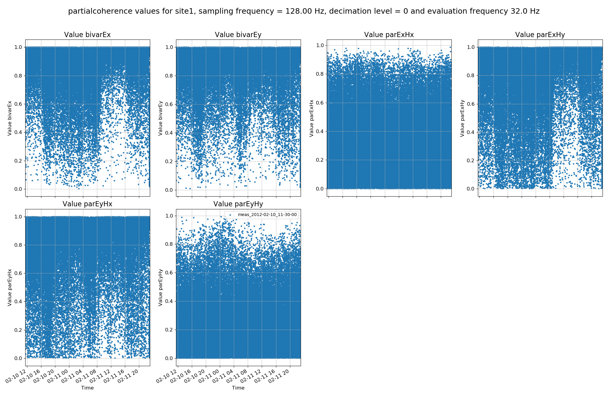

Partial Coherences
------------------

.. figure:: ../../_static/examples/features/stats/histPartialCoherence.png
    :align: center
    :alt: alternate text
    :figclass: align-center

    A histogram of coherence values for the various coherence pairs

    An example of coherence pairs plotted over time

For more information about coherence, see: https://en.wikipedia.org/wiki/Coherence_(signal_processing) 