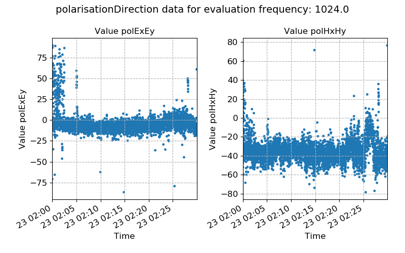
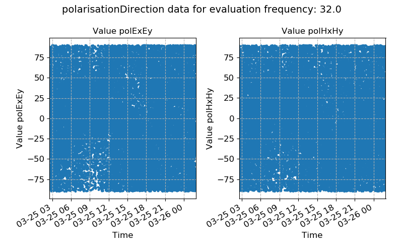
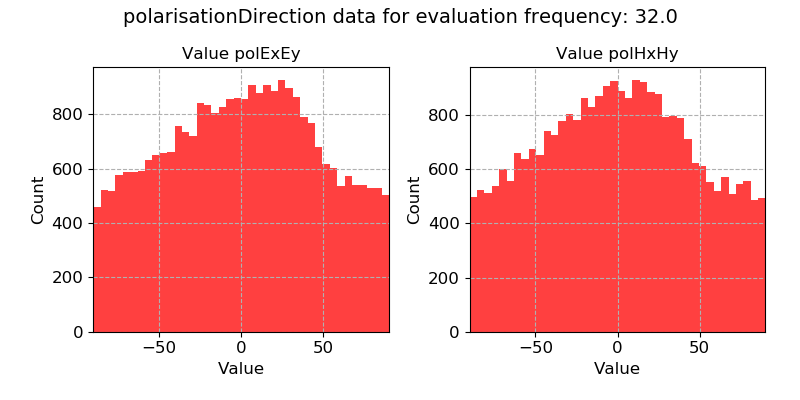

.. |Ex| replace:: E\ :sub:`x`
.. |Ey| replace:: E\ :sub:`y`
.. |Hx| replace:: H\ :sub:`x`
.. |Hy| replace:: H\ :sub:`y`
.. |Hz| replace:: H\ :sub:`z`

Polarisation directions
-----------------------  

The polarisation directions of the electric and magnetic fields are given by:

.. math::
    :nowrap:

    \begin{eqnarray}
    \alpha_E & = & \arctan{\frac{2 Re({E_x E_y^*})}{[E_x E_x^*] - [E_y E_y^*]}} \\
    \alpha_B & = & \arctan{\frac{2 Re({B_x B_y^*})}{[B_x B_x^*] - [B_y B_y^*]}}
    \end{eqnarray} 

The equations describe how two orthogonal field components with constant phasing vary. 

.. important::

    The resistics name for the polarisation direction statistic is: **polarisationDirection**.

    The components of polarisation direction statistic are:

    - pol |Ex| |Ey| describing the time-harmonic variation between the two orthogonal components of the electric field, corresponding to :math:`\alpha_E`.
    - pol |Hx| |Hy| describing the time-harmonic variation between the two orthogonal components of the magnetic field, corresponding to :math:`\alpha_B`.

For magnetotelluric data, which has numerous sources of electromagnetic energy (solar activity, atmospheric currents etc.), it is not expected that there is a coherent polarisation direction i.e. the polarisation direction should vary. 

When the polarisation direction holds a consistent value, this implies that there is an unexpected source of electromagnetic energy. This is particularly true for the magnetic field, which is the input to our system.

Below is an example of polarisation direction over time. The polarisation directions here appear to be quite consistent, suggesting an unexpected source of electromagnetic energy.

    Polarisation directions plotted over time for evaluation frequency 1024 Hz

A histogram of the polarisation direction confirms that they are consistent over time. 

.. figure:: ../../_static/examples/features/stats/M1_polarisationDirection_histogram_4096.png
    :align: center
    :alt: alternate text
    :figclass: align-center
    :width: 50%

    Polarisation direction plotted as a histogram for evaluation frequency 1024 Hz

By contrast, the below two examples demonstrate large variations in polarisation directions, in concordance with natural sources of magnetotelluric energy. 

    Polarisation directions plotted over time for evaluation frequency 32 Hz

    Polarisation direction plotted as a histogram for evaluation frequency 32 Hz
