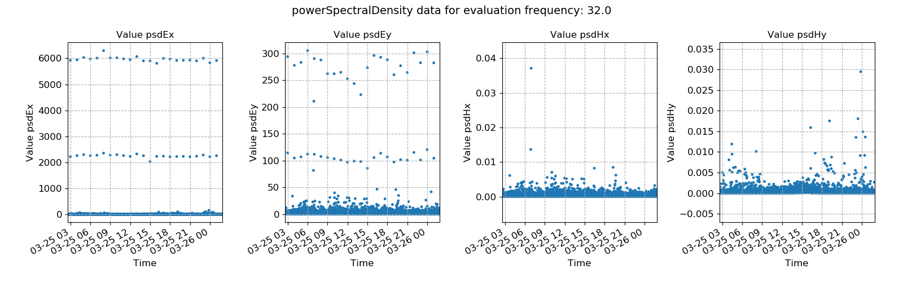

.. |Ex| replace:: E\ :sub:`x`
.. |Ey| replace:: E\ :sub:`y`
.. |Hx| replace:: H\ :sub:`x`
.. |Hy| replace:: H\ :sub:`y`
.. |Hz| replace:: H\ :sub:`z`

Power spectral density
----------------------

The power spectral density of a timeseries represents the distribution of power across its frequency components (`Wikipedia <https://en.wikipedia.org/wiki/Spectral_density>`_). However, what the power spectral density statistic measures in resistics in the how the power spectral density of a single frequency (some evaluation frequency) varies over the time of the recording. It is a proxy for the energy of the eletromagnetic data (volume, amplitude).

It is not immediately true that either high power spectral density or low power spectral density windows are either bad or good. However, the transfer function estimates are calculated through regression, which will minimise a loss function, usually mean square error or a variant thereof. By having large values in the regression problem, it is possible that estimates are skewed by trying to minimise losses for a minority of high power windows. 

.. important::

    The resistics name for the power spectral density statistic is: **powerSpectralDensity**.

    The components of the power spectral density statistic are:

    - power spectral density of |Ex|, psd |Ex|
    - power spectral density of |Ey|, psd |Ey|
    - power spectral density of |Hx|, psd |Hx|
    - power spectral density of |Hy|, psd |Hy|

An example is provided below of power spectral density variation over time for a measurement sampled at 4096 Hz and for the evaluation frequency 1024 Hz. There are numerous windows with higher values than the general.

.. figure:: ../../_static/examples/features/stats/M1_powerSpectralDensity_view_4096.png
    :align: center
    :alt: alternate text
    :figclass: align-center

    Power spectral density plotted over time for evaluation frequency 1024 Hz

The same thing can be seen on the histograms, which show many values bunched up together and than a minority of high power outliers.

.. figure:: ../../_static/examples/features/stats/M1_powerSpectralDensity_histogram_4096.png
    :align: center
    :alt: alternate text
    :figclass: align-center

    Power spectral density histogram for evaluation frequency 1024 Hz

A second example is shown from a measurement at 128 Hz for evaluation frequency 32 Hz. This has a strange trend with quite periodic bursts of high power in the electric channels. These are almost certainly not from a standard magnetotelluric source or energy and are likely noise of some form. Ideally, these windows should be removed from further processing.

    Power spectral density plotted over time for evaluation frequency 32 Hz

.. figure:: ../../_static/examples/features/stats/Remote_powerSpectralDensity_histogram_128.png
    :align: center
    :alt: alternate text
    :figclass: align-center

    Power spectral density histogram for evaluation frequency 32 Hz