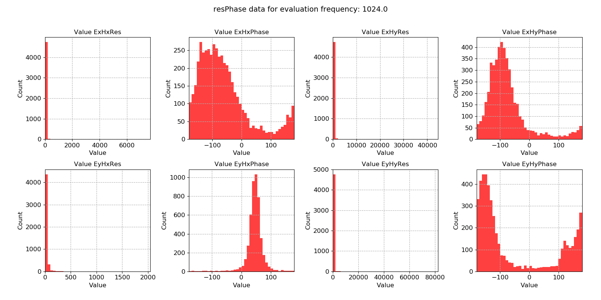
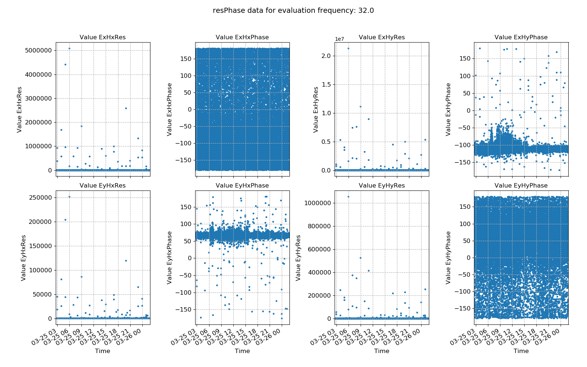
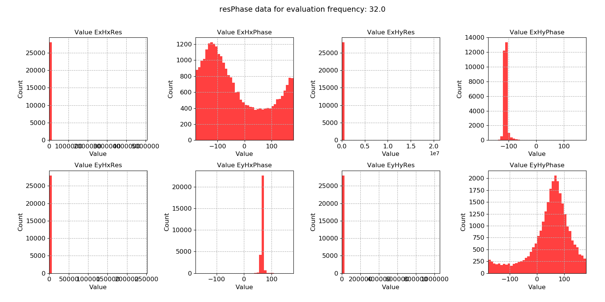

.. |Ex| replace:: E\ :sub:`x`
.. |Ey| replace:: E\ :sub:`y`
.. |Hx| replace:: H\ :sub:`x`
.. |Hy| replace:: H\ :sub:`y`
.. |Hz| replace:: H\ :sub:`z`

Resistivity and phase
---------------------

Looking at the transfer function components for each evaluation frequency is useful, but in many cases, it is easier to consider the apparent resistivity and phase. Apparent resitivty and phase are more physically relateable and can be a better choice for restricting window selection.

.. important::

    The resistics name for the resistivity and phase statistic is: **resPhase**.

    The components of the resistivity and phase statistic are:

    - |Ex| |Hx| Res
    - |Ex| |Hx| Phase
    - |Ex| |Hy| Res
    - |Ex| |Hy| Phase
    - |Ey| |Hx| Res
    - |Ey| |Hx| Phase
    - |Ey| |Hy| Res
    - |Ey| |Hy| Phase

An example of the window-by-window resistivity and phase are shown below for evaluation frequency 1024 Hz from MT data recorded at 4096 Hz. 

.. figure:: ../../_static/examples/features/stats/M1_resPhase_view_4096.png
    :align: center
    :alt: alternate text
    :figclass: align-center

    An example of resistivity and phase plotted over time for evaluation frequency 1024 Hz

There are numerous outliers in the resistivity estimates and the phase appears to be quite noisy. The same data is plotted as a histogram below. 

    An example of resistivity and phase histogram for evaluation frequency 1024 Hz

The resistivity histograms do have long tails (though these are barely visible). This suggests that the dataset has a few, very large outliers. Such outliers are good candidates for being down-weighted and excluded by robust regression, but removing them using masks will be more effective. 

Two futher example plots are provided for data sampled at 128 Hz. Again, there are a small number of very large outliers which might cause poor impedance tensor estimates. 

    An example of resistivity and phase plotted over time for evaluation frequency 32 Hz

    An example of resistivity and phase histogram for evaluation frequency 32 Hz