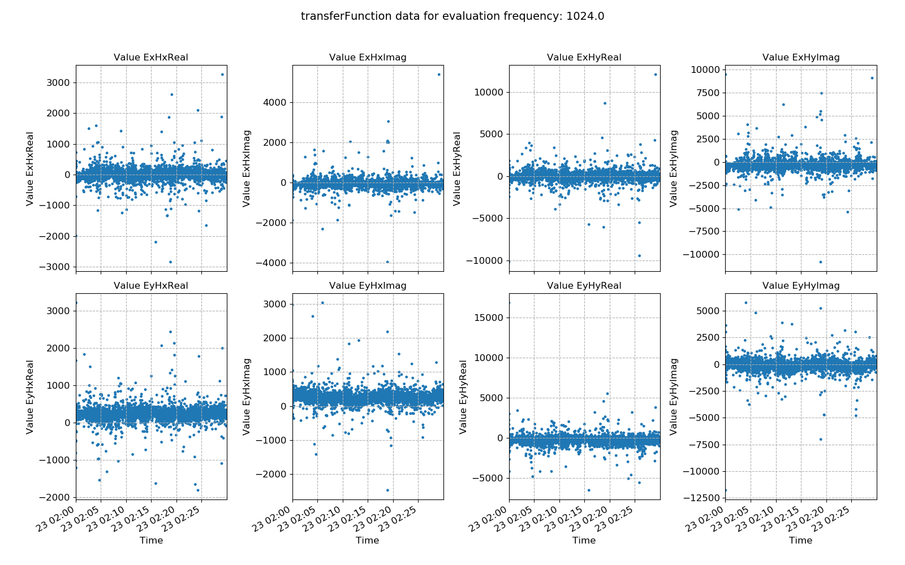
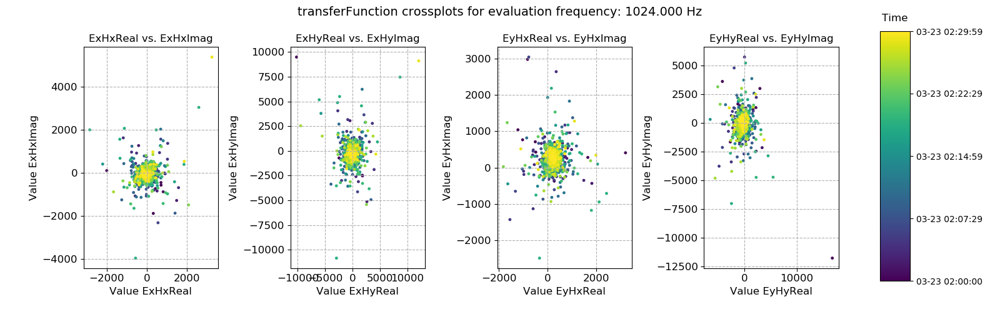
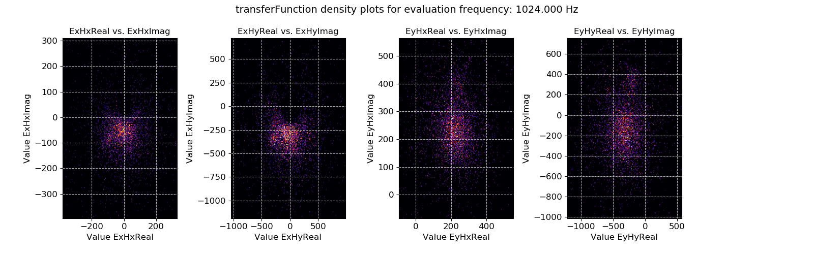
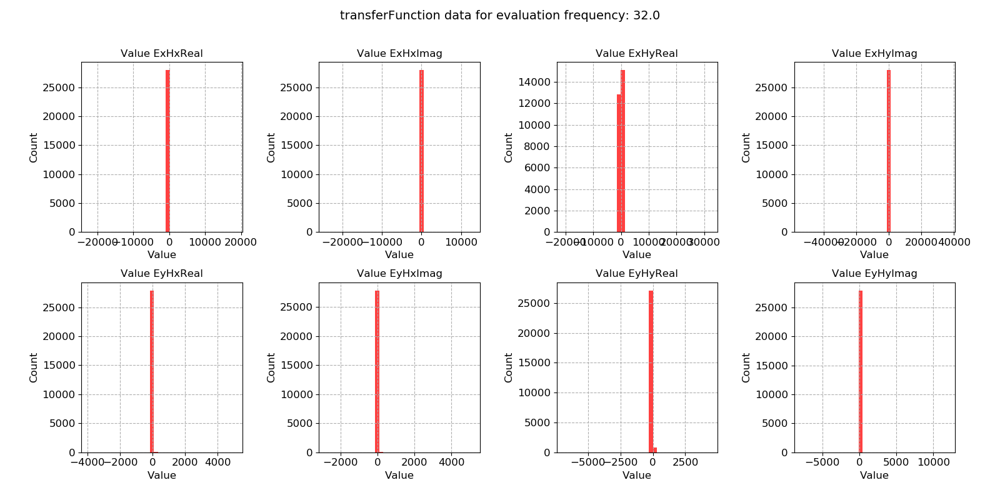
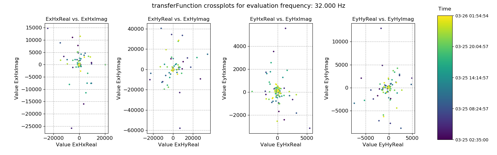

.. |Ex| replace:: E\ :sub:`x`
.. |Ey| replace:: E\ :sub:`y`
.. |Hx| replace:: H\ :sub:`x`
.. |Hy| replace:: H\ :sub:`y`
.. |Hz| replace:: H\ :sub:`z`

Transfer functions
------------------

It is possible to calculate out the transfer function for each window (and evaluation frequency). Whilst the geoelectric and geomagnetic fields may vary with time, the components of the transfer function should stay constant through time. Calculating out transfer function components on an evaluation frequency basis for each window allows the study of the variation in transfer function components over time and the identification of noisy windows which should be removed from further analysis.

.. note::

    Currently, the only transfer function calculated out by statistics is the impedance tensor

.. important::

    The resistics name for the transfer function statistic is: **transferFunction**.

    The components of the transfer function statistic are:

    - |Ex| |Hx| Real
    - |Ex| |Hx| Imag
    - |Ex| |Hy| Real
    - |Ex| |Hy| Imag
    - |Ey| |Hx| Real
    - |Ey| |Hx| Imag
    - |Ey| |Hy| Real
    - |Ey| |Hy| Imag

An example of window-by-window transfer function esimates over time is shown below. 

    Window-by-window transfer function estimates plotted over time for evaluation frequency 1024 Hz

Standard linear regression methods are maximum likelihood estimators for Gaussian distributed data. In situations where the regression data does not meet this criteria, linear regression can give poor results (hence the need for robust regression methods). A useful way to view the transfer function statistic is as a histogram to see how well the windows meet the Gaussian distribution assumption. 

.. figure:: ../../_static/examples/features/stats/M1_transferFunction_histogram_4096.png
    :align: center
    :alt: alternate text
    :figclass: align-center

    Window-by-window transfer function estimates histogram for evaluation frequency 1024 Hz

.. note::

    Using robust statistical methods to calculate out total impedance tensors does mitigate against both input and output outliers. However, removing these completely by excluding the windows from solution is even better protection.

This dataset does appear to be quite well distributed. Another useful way to look at the data is using crossplots. This will plot the transfer function estimates on the complex plane.

    Transfer function statistic crossplots for evaluation frequency 1024 Hz

Crossplots are simply scatter plots. If there are many points on scatter plots, it is not usually possible to see where the majority are. Therefore, density plots like the one below can be useful to see where the majority of the data is located.

    Transfer function statistic density plots for evaluation frequency 1024 Hz

A second set of plots for 128 Hz sampled data is shown below. In general, the below dataset is less noisy, though there are some very large outliers. 

.. figure:: ../../_static/examples/features/stats/Remote_transferFunction_view_128.png
    :align: center
    :alt: alternate text
    :figclass: align-center

    An example of power spectral density plotted over time for evaluation frequency 

    An example of power spectral density histogram for evaluation frequency 

    An example of power spectral density plotted over time for evaluation frequency 

.. figure:: ../../_static/examples/features/stats/Remote_transferFunction_densityplot_128.png
    :align: center
    :alt: alternate text
    :figclass: align-center

    An example of power spectral density histogram for evaluation frequency 