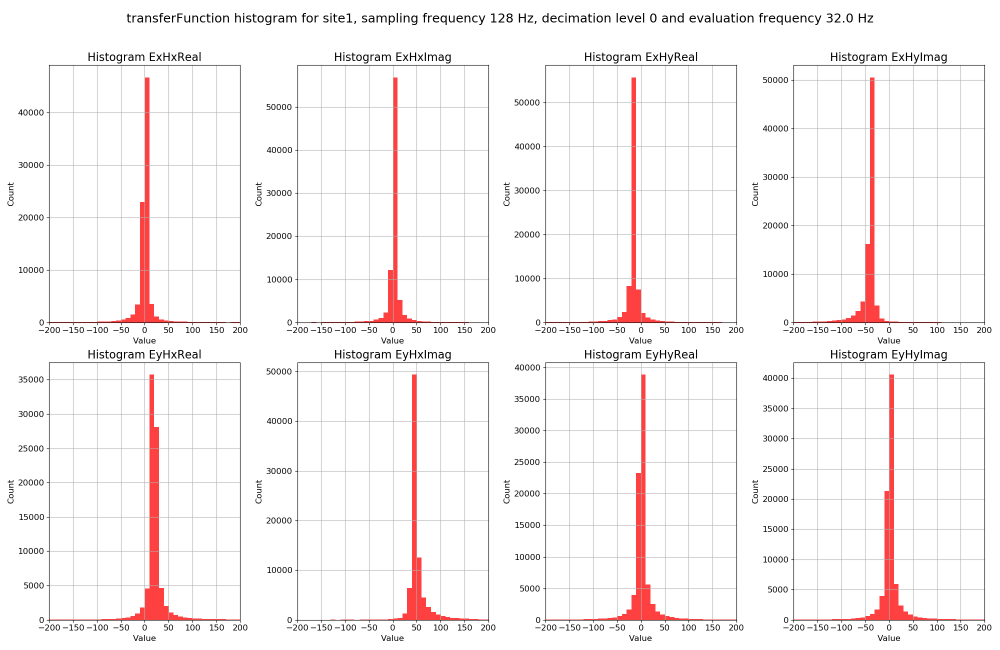
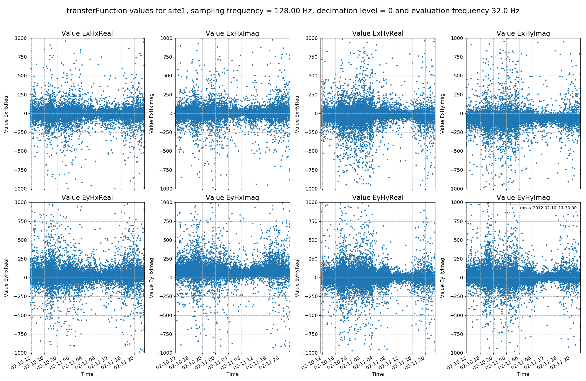

Transfer Functions
==================

Transfer functions can be calculated out for each window (and evaluation frequency). Whilst the geoelectric and geomagnetic fields may vary, the components of the impedance tensor should stay constant through time. Calculating out impedance tensor components on an evaluation frequency basis for each window allows the study of the variation in impedance tensor components over time and the identification of noisy windows which should be removed from further analysis.

Using robust statistical methods to calculate out total impedance tensors does mitigate against both input and output outliers. However, removing these completely by excluding the windows from solution is an even further protection.

An example of 

    A histogram of coherence values for the various coherence pairs

    An example of coherence pairs plotted over time