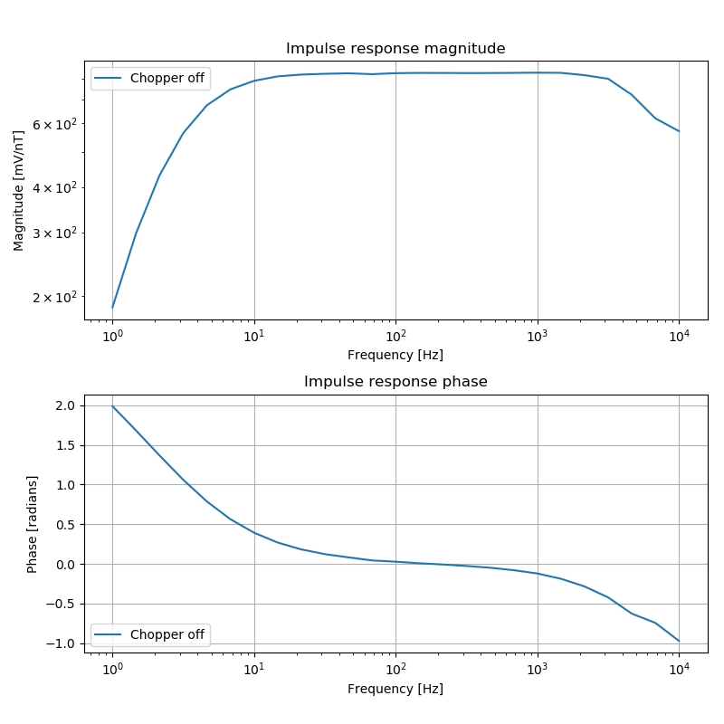
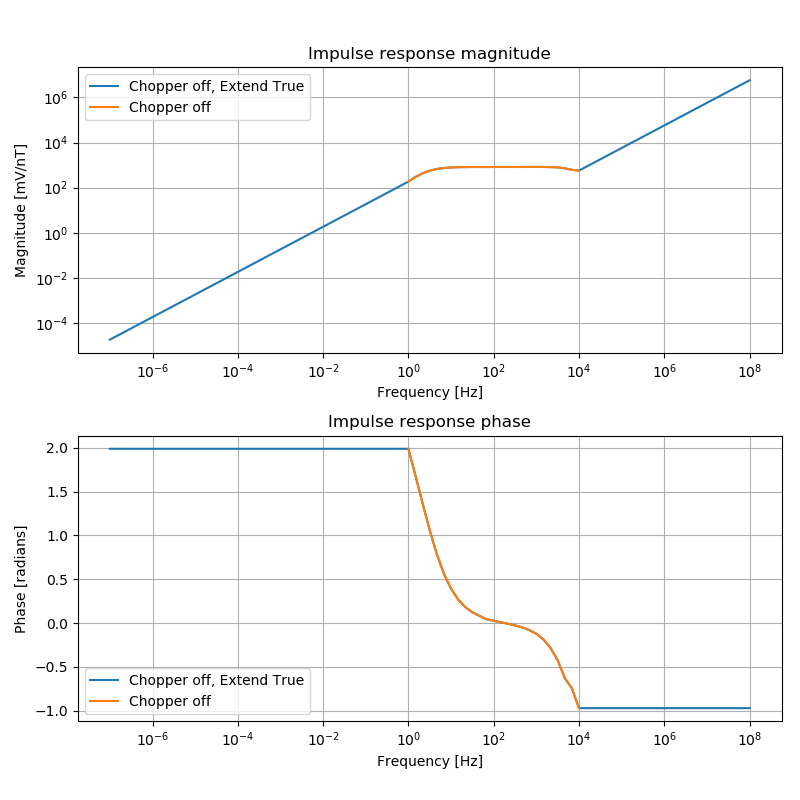

.. role:: python(code)
   :language: python

.. |Ex| replace:: E\ :sub:`x`
.. |Ey| replace:: E\ :sub:`y`
.. |Hx| replace:: H\ :sub:`x`
.. |Hy| replace:: H\ :sub:`y`
.. |Hz| replace:: H\ :sub:`z`
.. |Zxy| replace:: Z\ :sub:`xy`
.. |Zxx| replace:: Z\ :sub:`xx`
.. |Zyx| replace:: Z\ :sub:`yx`
.. |Zyy| replace:: Z\ :sub:`yy`
.. |fs| replace:: f\ :sub:`s`

Metronix Calibration
--------------------

Metronix calibration files are ASCII files with some metadata and calibration information for when the induction coil is operating with either the pre-amplifier chopper on or chopper off. 

The units of metronix calibration files are interpreted to be:

- Frequency in Hz
- Magnitude in V/(nT*Hz)
- Phase in degrees

Resistics will automatically convert these units to:

- Frequency in Hz
- Magnitude in mV/nT (including any static gain)
- Phase in radians

Naming in the project environment
~~~~~~~~~~~~~~~~~~~~~~~~~~~~~~~~~

When using the project environment, resistics automatically searches for calibration files in the calData folder. 
Metronix files should be named according to the following specification:

.. important::

    [*][SENSOR][SERIAL].TXT
    
    where, 
    
    - SENSOR is the sensor type
    - SERIAL is the serial number
    - [*] represents any general string

As an example, consider an induction coil with:

- sensor type MFS06
- sensor serial number 365

Then the file could be named:

- MFS06365.TXT
- Or could have any leading text such as: cal_MFS06365.TXT

Example
~~~~~~~

The class :class:`~resistics.ioHandlers.calibrationIO.CalibrationIO` can be used to read in Metronix calibration files. 

.. literalinclude:: ../../../../examples/formats/calibrationMetronixExample.py
    :linenos:
    :language: python
    :lines: 1-9
    :lineno-start: 1 

When using :class:`~resistics.ioHandlers.calibrationIO.CalibrationIO` to read a calibration file, the filepath and calibration data format need to be defined. Further, the chopper to read in and extension rule can be optionally passed.

The method :meth:`~resistics.ioHandlers.calibrationIO.CalibrationIO.read` returns a :class:`~resistics.dataObjects.calibrationData.CalibrationData` object. Information about this can be printed to the terminal, giving:

.. literalinclude:: ../../_text/calibrationMetronixPrint.txt
    :linenos:
    :language: text

Notice that the sensor information is blank. This is because Metronix files do not include information about the sensor type.

Once the calibration data file is read in, the calibration curve can be viewed by using the :meth:`~resistics.dataObjects.calibrationData.CalibrationData.view` method of :class:`~resistics.dataObjects.calibrationData.CalibrationData`. By passing a matplotlib figure to this, the layout of the plot can be controlled.

.. literalinclude:: ../../../../examples/formats/calibrationMetronixExample.py
    :linenos:
    :language: python
    :lines: 11-18
    :lineno-start: 11

    Viewing the calibration data for chopper off and not extended

The same calibration file can be read again, but this time with extension of the data too. The parameters of :class:`~resistics.ioHandlers.calibrationIO.CalibrationIO` can be reset by using the :meth:`~resistics.ioHandlers.calibrationIO.CalibrationIO.refresh` method.

.. literalinclude:: ../../../../examples/formats/calibrationMetronixExample.py
    :linenos:
    :language: python
    :lines: 20-23
    :lineno-start: 20

Now the extended calibration data can be plotted against the original, unextended version.

.. literalinclude:: ../../../../examples/formats/calibrationMetronixExample.py
    :linenos:
    :language: python
    :lines: 25-31
    :lineno-start: 31

Giving the possibly unexpected plot below.

    Viewing the chopper off calibration data, extended and original

.. note::

    Remember that extension happens in the original units of the calibration data. For Metronix data files, this is in V/(nT*Hz). Then the data is converted to mV/nT. The fact that the original data is a frequency density gives the slopes in the magnitude extension.

The chopper on data in the Metronix calibration file can be read by specifying :python:`chopper=True` to :class:`~resistics.ioHandlers.calibrationIO.CalibrationIO` as shown below.

.. literalinclude:: ../../../../examples/formats/calibrationMetronixExample.py
    :linenos:
    :language: python
    :lines: 33-44
    :lineno-start: 33

And the the chopper on data can be compared to the chopper off data in much the same way as the above comparison with the extended data. The comparison is shown in the following plot.

.. figure:: ../../../../examples/formats/images/calibrationMetronixChopperOn.png
    :align: center
    :alt: alternate text
    :figclass: align-center

    Viewing the calibration data for chopper off and chopper on

Finally, calibration data can be written out in a simple ASCII format. 

.. literalinclude:: ../../../../examples/formats/calibrationMetronixExample.py
    :linenos:
    :language: python
    :lines: 46-47
    :lineno-start: 46

Giving the file below:

.. literalinclude:: ../../../../examples/formats/calData/metronix2ascii.TXT
    :linenos:
    :language: text

The internal ascii calibration format writes out values in the following units:

- Magnitude in mV/nT (without static gain applied)
- Phase in radians

The magnitude is written out without static gain applied, though the static gain value is written out in the internally formatted calibration file. When this file is read in again, the static gain will be applied once more.

Chopper is True as the calibration data written out was for chopper on. There is no sensor information as Metronix calibration files do not include information about the sensor.

Complete example script
~~~~~~~~~~~~~~~~~~~~~~~

For the purposes of clarity, the example script in full.

.. literalinclude:: ../../../../examples/formats/calibrationMetronixExample.py
    :linenos:
    :language: python

The calibration file the script is reading.

.. literalinclude:: ../../../../examples/formats/calData/Hx_MFS06365.txt
    :linenos:
    :language: text

