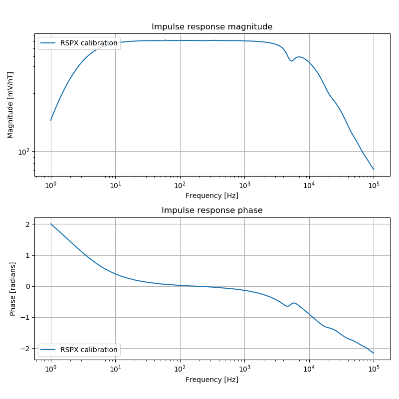
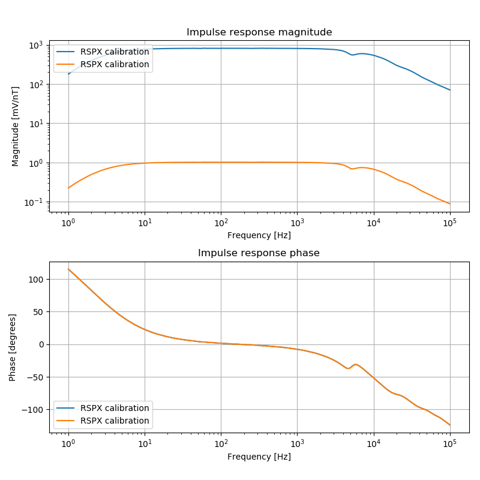

.. role:: python(code)
   :language: python

.. |Ex| replace:: E\ :sub:`x`
.. |Ey| replace:: E\ :sub:`y`
.. |Hx| replace:: H\ :sub:`x`
.. |Hy| replace:: H\ :sub:`y`
.. |Hz| replace:: H\ :sub:`z`
.. |Zxy| replace:: Z\ :sub:`xy`
.. |Zxx| replace:: Z\ :sub:`xx`
.. |Zyx| replace:: Z\ :sub:`yx`
.. |Zyy| replace:: Z\ :sub:`yy`
.. |fs| replace:: f\ :sub:`s`

RSPX Calibration
----------------

RSPX calibration files are XML files with metadata and calibration data. 

The units of RSPX calibration files are interpreted to be:

- Frequency in Hz
- Magnitude in mV/nT
- Phase in degrees

Resistics will automatically convert these units to:

- Frequency in Hz
- Magnitude in mV/nT (including any static gain)
- Phase in radians

.. note::

    Remember that extension happens in the original units of the calibration data. For RSP data files, this is in mV/nT. 

Naming in the project environment
~~~~~~~~~~~~~~~~~~~~~~~~~~~~~~~~~
When using the project environment, resistics automatically searches for calibration files in the calData folder. 
RSPX files should be named according to the following specification:

.. important::

    [*]TYPE-[SENSORNUM]_[BOARD]-ID-[SERIAL].RSPX
    
    or
    
    [*]TYPE-[SENSORNUM]_BB-ID-[SERIAL].RSPX

    where: 
    
    - SENSORNUM is the sensor number out of the sensor type written with three digits (i.e. leading zeros required if the sensor number is less than three digits)
    - BOARD is either LF (chopper on) or HF (chopper off)
    - SERIAL is the serial number written with six digits (i.e. leading zeros required if the serial number is less than six digits)
    - [*] represents any general string. 

    The BB files represent broadband calibration files that cover both chopper on and chopper off cases. 

As an example, consider an induction coil with,

- sensor type MFS06
- sensor serial number 133
- Chopper off

then,

- SENSORNUM = 006
- BOARD = HF
- SERIAL = 000133

Therefore, the file could be named:

- Metronix_Coil-----TYPE-006_HF-ID-000133.RSPX
- Metronix_Coil-----TYPE-006_BB-ID-000133.RSPX
    

Example
~~~~~~~
The class :class:`~resistics.ioHandlers.calibrationIO.CalibrationIO` can be used to read in RSPX calibration files. 

.. literalinclude:: ../../../../examples/formats/calibrationRSPXExample.py
    :linenos:
    :language: python
    :lines: 1-9
    :lineno-start: 1 

When using :class:`~resistics.ioHandlers.calibrationIO.CalibrationIO` to read a calibration file, the filepath and calibration data format (rspx) need to be defined. Further, the extension rule can be optionally passed. Because RSPX files only contain one set of calibration data (unlike Metronix files which may have calibration data for both chopper on and off), the chopper keyword is unused for reading RSPX files.

The method :meth:`~resistics.ioHandlers.calibrationIO.CalibrationIO.read` returns a :class:`~resistics.dataObjects.calibrationData.CalibrationData` object. Information about this can be printed to the terminal, giving:

.. literalinclude:: ../../_text/calibrationRSPXPrint.txt
    :linenos:
    :language: text

Once the calibration data file is read in, the calibration curve can be viewed by using the :meth:`~resistics.dataObjects.calibrationData.CalibrationData.view` method of :class:`~resistics.dataObjects.calibrationData.CalibrationData`. By passing a matplotlib figure to this, the layout of the plot can be controlled.

.. literalinclude:: ../../../../examples/formats/calibrationRSPXExample.py
    :linenos:
    :language: python
    :lines: 11-18
    :lineno-start: 11

    Viewing the unextended calibration data

The calibration static gain is applied to the magnitude data by default. To view the data without static gain, pass :python:`staticgain=False` to the :meth:`~resistics.dataObjects.calibrationData.CalibrationData.view` call. Further, to plot the phase in degrees, pass :python:`degrees=True` to  :meth:`~resistics.dataObjects.calibrationData.CalibrationData.view`.

To visualise the influence of the static gain correction, the calibration data can be plotted with and without static gain as shown in the following example.

.. literalinclude:: ../../../../examples/formats/calibrationRSPXExample.py
    :linenos:
    :language: python
    :lines: 20-28
    :lineno-start: 20

    Viewing the unextended calibration data with and without static gain

The same calibration file can be read again, but this time with extension of the data too. The parameters of :class:`~resistics.ioHandlers.calibrationIO.CalibrationIO` can be reset by using the :meth:`~resistics.ioHandlers.calibrationIO.CalibrationIO.refresh` method.

.. literalinclude:: ../../../../examples/formats/calibrationRSPXExample.py
    :linenos:
    :language: python
    :lines: 30-33
    :lineno-start: 30

To see the effect of the extension, which is a simple edge extrapolation, the original and extended data can be viewed on the same plot.

.. literalinclude:: ../../../../examples/formats/calibrationRSPXExample.py
    :linenos:
    :language: python
    :lines: 35-41
    :lineno-start: 35

.. figure:: ../../../../examples/formats/images/calibrationRSPX_extended.png
    :align: center
    :alt: alternate text
    :figclass: align-center

    Viewing the unextended and extended calibration data

The calibration data can be written out in the internal ASCII format using the :meth:`~resistics.ioHandlers.calibrationIO.CalibrationIO.writeInternalFormat` method of :class:`~resistics.ioHandlers.calibrationIO.CalibrationIO`.

.. literalinclude:: ../../../../examples/formats/calibrationRSPXExample.py
    :linenos:
    :language: python
    :lines: 43-45
    :lineno-start: 43

The internal ascii calibration format writes out values in the following units:

- Magnitude in mV/nT
- Phase in radians

This gives the file below:

.. literalinclude:: ../../../../examples/formats/calData/rspx2ascii.TXT
    :linenos:
    :language: text

.. note::

    When writing out in internal format, the static gain is removed from the magnitude but recorded in the file. When reading in the internal format again, the static gain will be reapplied.

To read in the internal ASCII format calibration file, the parameters of :class:`~resistics.ioHandlers.calibrationIO.CalibrationIO` need to be reset using the :meth:`~resistics.ioHandlers.calibrationIO.CalibrationIO.refresh` method. This time, the fileformat needs to be set to "induction".

.. literalinclude:: ../../../../examples/formats/calibrationRSPXExample.py
    :linenos:
    :language: python
    :lines: 47-50
    :lineno-start: 47

Finally, plotting the original data and the internal ASCII format data can be done in the following way:

.. literalinclude:: ../../../../examples/formats/calibrationRSPXExample.py
    :linenos:
    :language: python
    :lines: 52-58
    :lineno-start: 52

The resultant figure is:

.. figure:: ../../../../examples/formats/images/calibrationRSPXvsASCII.png
    :align: center
    :alt: alternate text
    :figclass: align-center

    Viewing the original RSPX data versus the ASCII data

Complete example script
~~~~~~~~~~~~~~~~~~~~~~~
For the purposes of clarity, the example script in full.

.. literalinclude:: ../../../../examples/formats/calibrationRSPXExample.py
    :linenos:
    :language: python

.. literalinclude:: ../../../../examples/formats/calData/Metronix_Coil-----TYPE-006_HF-ID-000133.RSPX
    :linenos:
    :language: text