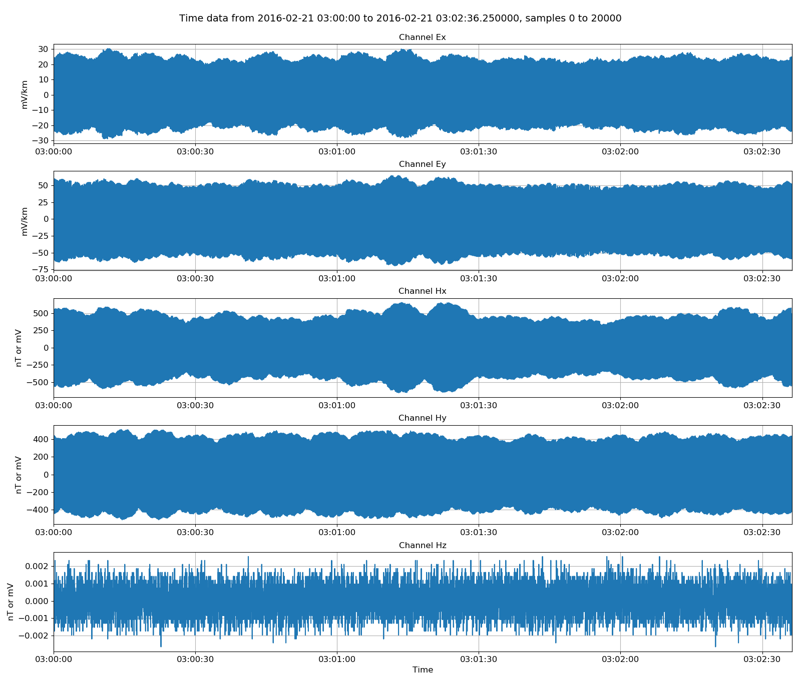
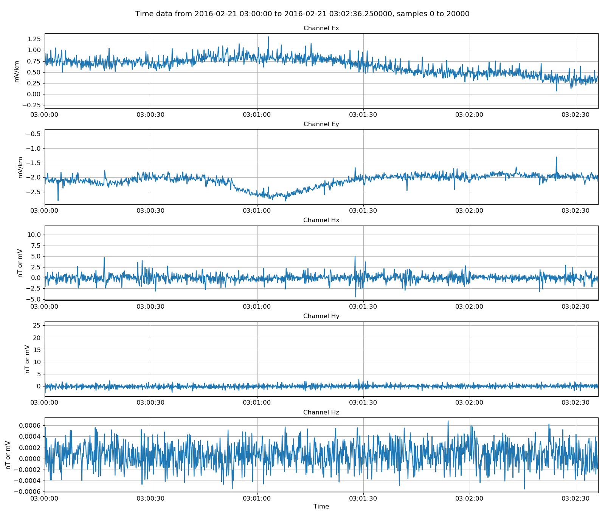
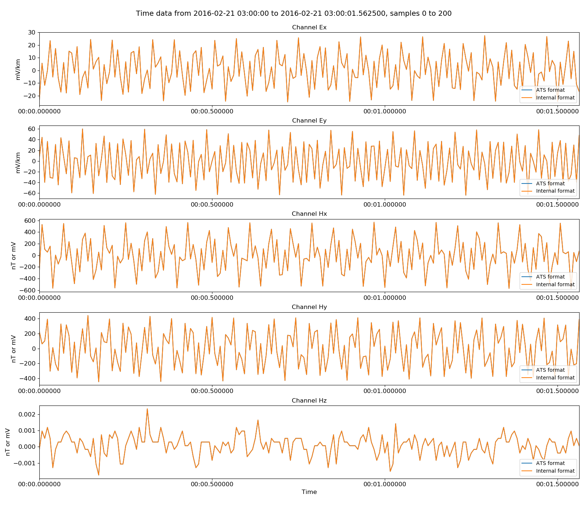

.. role:: python(code)
   :language: python

.. |Ex| replace:: E\ :sub:`x`
.. |Ey| replace:: E\ :sub:`y`
.. |Hx| replace:: H\ :sub:`x`
.. |Hy| replace:: H\ :sub:`y`
.. |Hz| replace:: H\ :sub:`z`
.. |Zxy| replace:: Z\ :sub:`xy`
.. |Zxx| replace:: Z\ :sub:`xx`
.. |Zyx| replace:: Z\ :sub:`yx`
.. |Zyy| replace:: Z\ :sub:`yy`
.. |fs| replace:: f\ :sub:`s`

ATS timeseries
--------------

ATS format is a one of the more straight-forward formats to support. Header files come in XML format and the data is stored in binary format with a single file for each channel. The data files have extension .ats. An example data folder for ATS is shown below: 

.. code-block:: text

    meas_2012-02-10_11-05-00 
    ├── 059_V01_2012-02-10_11-05-00_0.xml 
    ├── 059_V01_C00_R000_TEx_BL_4096H.ats   
    ├── 059_V01_C01_R000_TEy_BL_4096H.ats 
    ├── 059_V01_C02_R000_THx_BL_4096H.ats 
    ├── 059_V01_C02_R000_THy_BL_4096H.ats              
    └── 059_V01_C02_R000_THz_BL_4096H.ats 

.. note::

    In order for resistics to recognise an ATS data folder, the following have to be present:

    - A header file with extension .xml
    - Data files with extension .ats

.. note::

    Unscaled units for ATS data are as follows:

    - All channels are in integer counts

ATS files are opened in resistics using the :class:`~resistics.ioHandlers.dataReaderATS.DataReaderATS` class. An example is provided below:

.. literalinclude:: ../../../../examples/formats/atsReaderExamples.py
    :linenos:
    :language: python
    :lines: 1-7
    :lineno-start: 1

:python:`atsReader.printInfo()` prints the measurement information out to the terminal and displays various recording parameters.

.. literalinclude:: ../../_text/printATS.txt
    :linenos:
    :language: text

This shows the headers read in by resistics and their values. There are both global headers, which apply to all the channels, and channel specific headers. 

Resistics does not immediately load timeseries data into memory. In order to read the data from the files, it needs to be requested.

.. literalinclude:: ../../../../examples/formats/atsReaderExamples.py
    :linenos:
    :language: python
    :lines: 9-13
    :lineno-start: 9

:python:`atsReader.getUnscaledData(startTime, stopTime)` will read timeseries data from the data files and returns a :class:`~resistics.dataObjects.timeData.TimeData` object. Unscaled data is the raw data without any conversion to field units. The units for unscaled data are not consistent between data formats and in the case of ATS data are integer counts.

After reading in some data, it is natural to view it. :class:`~resistics.dataObjects.timeData.TimeData` can be viewed using the :meth:`~resistics.dataObjects.timeData.TimeData.view` method of the class. Passing a matplotlib figure object to this method allows for more control over the layout of the plot.

.. literalinclude:: ../../../../examples/formats/atsReaderExamples.py
    :linenos:
    :language: python
    :lines: 15-22
    :lineno-start: 15

.. figure:: ../../../../examples/formats/images/ats_unscaledData.png
    :align: center
    :alt: alternate text
    :figclass: align-center

    Viewing unscaled data

Physical data, which is converted to field units, can be returned by using the :meth:`~resistics.ioHandlers.dataReader.DataReader.getPhysicalData` method. If physical data for the whole recording is required, an alternative is to use :meth:`~resistics.ioHandlers.dataReader.DataReader.getPhysicalSamples`, which does not require specification of a start and end time.

.. literalinclude:: ../../../../examples/formats/atsReaderExamples.py
    :linenos:
    :language: python
    :lines: 24-31
    :lineno-start: 24

    Viewing data scaled to field units

There are a few helpful methods built in to resistics for manipulating timeseries data. These are generally in :mod:`~resistics.utilities`. In the example below, the time data is low pass filtered at 4Hz to remove any powerline or rail noise that might be in the data.

.. literalinclude:: ../../../../examples/formats/atsReaderExamples.py
    :linenos:
    :language: python
    :lines: 33-41
    :lineno-start: 33

    Viewing physical data low pass filtered to 4Hz    

Resistics supports the writing out of data in an :doc:`internal <internal-binary-format>` format. An examples of converting a whole dataset from ATS format to internal format is shown below.

.. literalinclude:: ../../../../examples/formats/atsReaderExamples.py
    :linenos:
    :language: python
    :lines: 43-49
    :lineno-start: 43

In nearly every case, it is best to write out data in physical format. When this is done, no further scaling will be applied when the data is read in again.

.. warning::

    Data can be written out in unscaled format. However, each format applies different scalings when data is read in, so it is possible to write out unscaled samples in internal format and then upon reading, have it scaled incorrectly. Therefore, it is nearly always best to write out physical samples. 

Writing out an internally formatted dataset will additionally write out a set of comments. These comments keep track of what has been done to the timeseries data and are there to improve repoducibility and traceability. Read more about comments :doc:`here <../../features/comments>`. The comments for this internally formatted dataset are:

.. literalinclude:: ../../../../examples/formats/timeData/atsInternal/comments.txt
    :linenos:
    :language: text

The internal format data can be read in and visually compared to the original data.

.. literalinclude:: ../../../../examples/formats/atsReaderExamples.py
    :linenos:
    :language: python
    :lines: 51-66
    :lineno-start: 51

    Original ATS data versus the internally formatted data   

Additionally, resistics can write out data in ASCII format, which allows users to view the data values, plot them in other software or otherwise transport the data for external analysis. 

.. literalinclude:: ../../../../examples/formats/atsReaderExamples.py
    :linenos:
    :language: python
    :lines: 68-74
    :lineno-start: 68

Again, this dataset is written out with a set of comments. 

.. literalinclude:: ../../../../examples/formats/timeData/atsAscii/comments.txt
    :linenos:
    :language: text

The same exercise of reading back the ascii data and comparing it to the original can be done. The procedure is as below:

.. literalinclude:: ../../../../examples/formats/atsReaderExamples.py
    :linenos:
    :language: python
    :lines: 76-93
    :lineno-start: 76

.. figure:: ../../../../examples/formats/images/ats_vs_ascii.png
    :align: center
    :alt: alternate text
    :figclass: align-center

    Original ATS data versus the ASCII formatted data   

Complete example script
~~~~~~~~~~~~~~~~~~~~~~~
For the purposes of clarity, the complete example script is shown below.

.. literalinclude:: ../../../../examples/formats/atsReaderExamples.py
    :linenos:
    :language: python