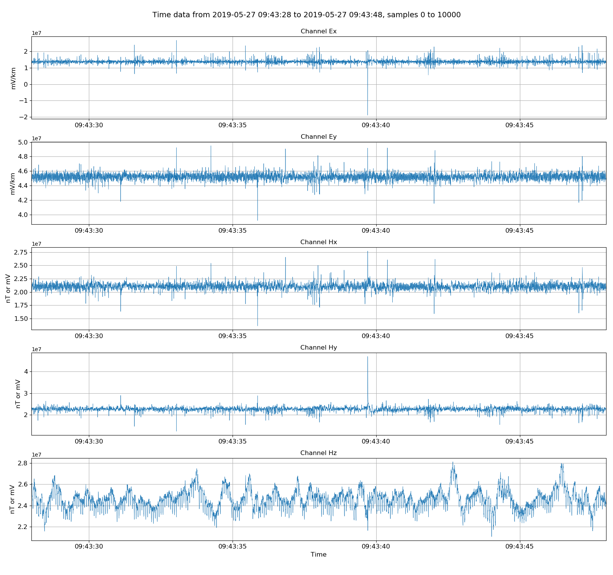
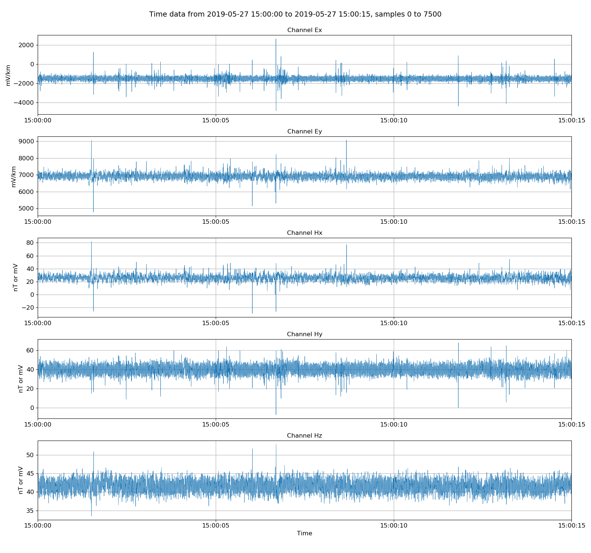
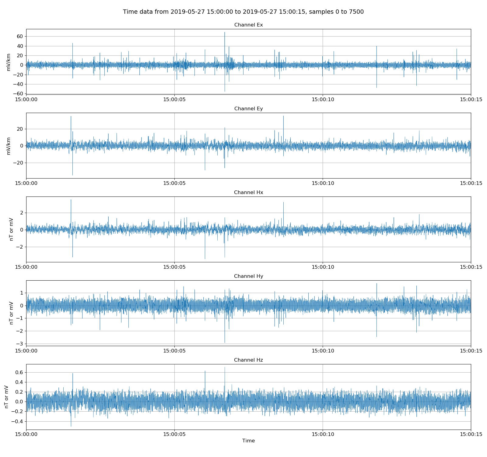
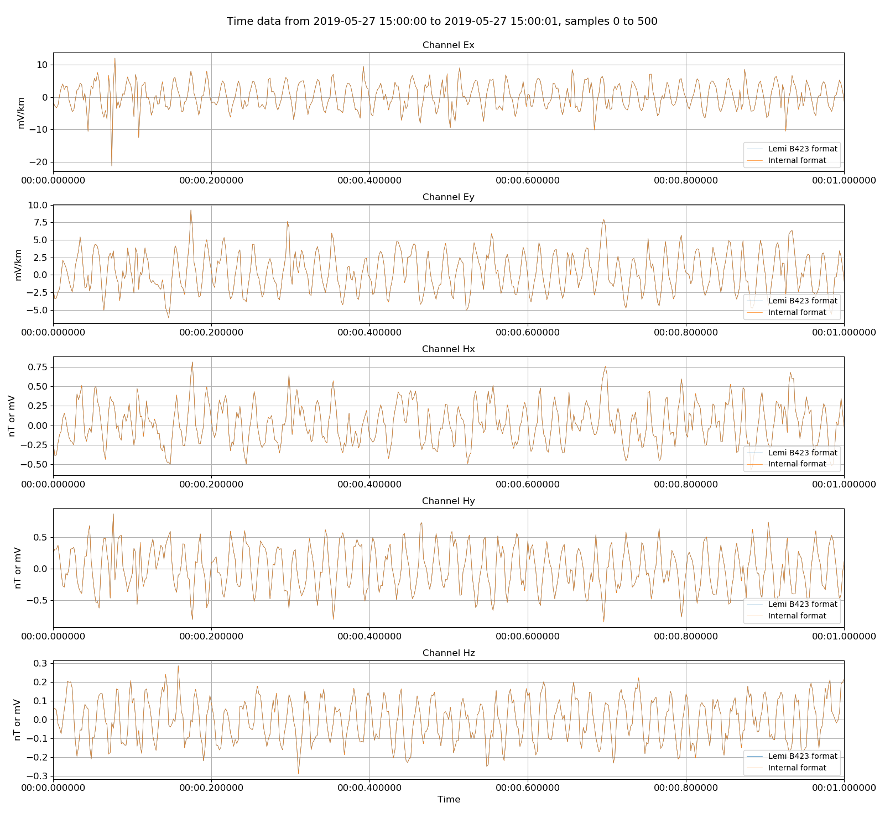
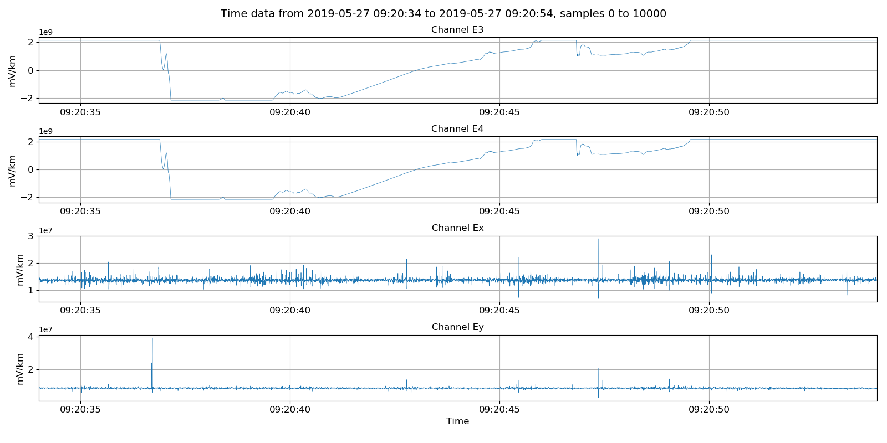
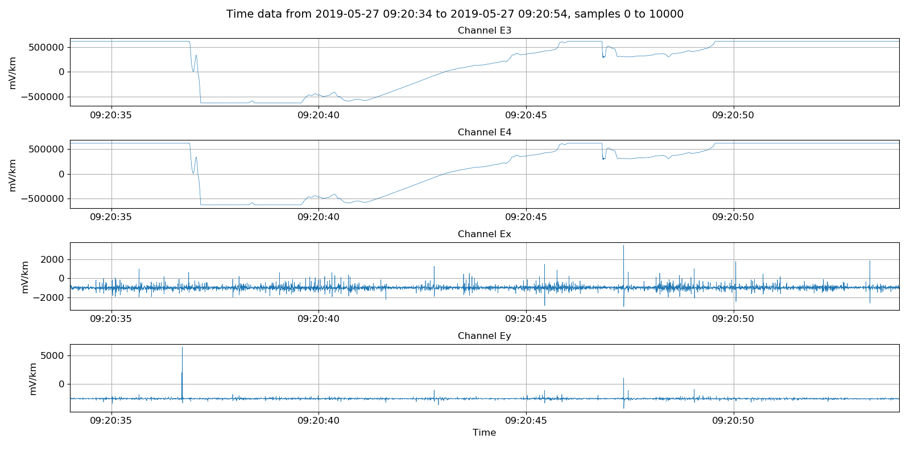
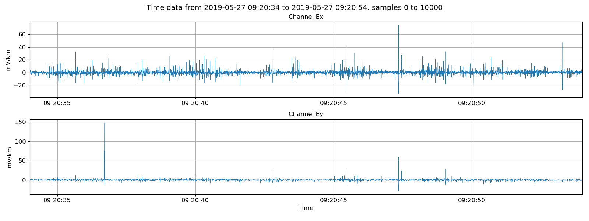

.. role:: python(code)
   :language: python

.. |Ex| replace:: E\ :sub:`x`
.. |Ey| replace:: E\ :sub:`y`
.. |Hx| replace:: H\ :sub:`x`
.. |Hy| replace:: H\ :sub:`y`
.. |Hz| replace:: H\ :sub:`z`
.. |E1| replace:: E\ :sub:`1`
.. |E2| replace:: E\ :sub:`2`
.. |E3| replace:: E\ :sub:`3`
.. |E4| replace:: E\ :sub:`4`
.. |Zxy| replace:: Z\ :sub:`xy`
.. |Zxx| replace:: Z\ :sub:`xx`
.. |Zyx| replace:: Z\ :sub:`yx`
.. |Zyy| replace:: Z\ :sub:`yy`
.. |fs| replace:: f\ :sub:`s`

Lemi B423 timeseries
--------------------

Lemi B423 files come in two varieties

- Lemi B423 magnetotelluric files with five channels: |Ex|, |Ey|, |Hx|, |Hy|, |Hz|
    - :ref:`formats/timeseries/LemiB423-timeseries:Lemi B423 MT headers`
    - :ref:`formats/timeseries/LemiB423-timeseries:Lemi B423 MT data`
- Lemi B423E telluric files with four channels: |E1|, |E2|, |E3|, |E4|
    - :ref:`formats/timeseries/LemiB423-timeseries:Lemi B423E telluric headers`
    - :ref:`formats/timeseries/LemiB423-timeseries:Lemi B423E telluric data`

For both formats, all the channel data is recorded in a single data file. However, the recording itself can be separated in to multiple files if it is sufficiently long.

Whilst Lemi B423 and Lemi B423E  file formats are similar, they are not exactly the same and the process to deal with them varies from one to the other. Both will be detailed here. 

The first thing to note is Lemi B423 and Lemi B423E files do not come with header files. There are ASCII headers within the data, but these are incomplete in several ways versus the expectations resistics has of header files. Therefore, the first job when dealing with Lemi B423 and B423E data is to generate headers files. Fortunately, resistics has built in methods to do this, which are outlined in the individual sub-sections for :ref:`formats/timeseries/LemiB423-timeseries:Lemi B423 MT headers` and :ref:`formats/timeseries/LemiB423-timeseries:Lemi B423E telluric headers`.

.. note::

    In the project environment, for resistics to recognise Lemi B423 data, header files with extension .h423 must be present. To recognise Lemi B423E, header files with extension .h423E must be present.

.. note::

    A note about units. Unscaled Lemi data are integer counts. Additional scalings can be applied to give electric channels in microvolts and magnetic channels in millivolts but with the gain still applied (these are the ascii scalings in the Lemi data files). Getting physical data returns data in the resistics standard field units, which is electric channels in mV/km and magnetic channels in mV. To get magnetic channels in nT, they must be calibrated. 

.. note::

    For a complete example of processing Lemi B423 data from generating headers to impedance tensor, please see :doc:`Processing Lemi B423 <../../cookbook/processing-lemi-b423>`. An example of intersite processing with Lemi B423 and Lemi B423E data can be found in :doc:`Intersite processing <../../advanced/intersite-transfer-function>`.

Lemi B423 MT headers
~~~~~~~~~~~~~~~~~~~~
A typical Lemi B423 magnetotelluric recording looks like this:

.. code-block:: text

    lemi01 
    ├── 1558950203.B423 
    └── 1558961007.B423

This is a continuous recording split into two files. Each file contains channels |Ex|, |Ey|, |Hx|, |Hy|, |Hz|. However, there is no header file holding information about the recording start and end date, sampling frequency or any other paramter.

Resistics requires this metadata in its time series data model. Therefore, headers must be constructed before the data can be read in. This can be done using the :meth:`~resistics.ioHandlers.dataReaderLemiB423.measB423Headers`. 

.. literalinclude:: ../../../../examples/formats/lemiB423ReaderExamples.py
    :linenos:
    :language: python
    :lines: 1-12
    :lineno-start: 1

In :meth:`~resistics.ioHandlers.dataReaderLemiB423.measB423Headers`, the following should be defined:

- The path to the folder with the Lemi B423 data files.
- The sampling frequency in Hz of the data. In the above example, 500 Hz. 
- hxSensor: the serial number of the |Hx| coil for the purposes of future calibration. This defaults to 0 if not provided (and no calibration will be performed).
- hySensor: the serial number of the |Hy| coil for the purposes of future calibration. This defaults to 0 if not provided (and no calibration will be performed)
- hZSensor: the serial number of the |Hz| coil for the purposes of future calibration. This defaults to 0 if not provided (and no calibration will be performed)
- hGain: the internal gain on the magnetic channels. For example, 16.
- dx: the |Ex| dipole length
- dy: the |Ey| dipole length

After running :meth:`~resistics.ioHandlers.dataReaderLemiB423.measB423Headers` with the appropriate parameters, the recording folder will look like:

.. code-block:: text

    lemi01 
    ├── 1558950203.B423
    ├── 1558961007.B423
    ├── chan_00.h423
    ├── chan_01.h423
    ├── chan_02.h423
    ├── chan_03.h423
    ├── chan_04.h423
    └── global.h423

Six header files with extension .h423 have been added, one for each channel and then a global header file. The global header file is included below.

.. literalinclude:: ../../../../examples/formats/timeData/lemiB423/global.h423
    :linenos:
    :language: text

The channel header file for |Hx| is presented below. The sensor serial number has been saved in the sensor_sernum header word and the magnetic channel gain in header gain_stage1.

.. literalinclude:: ../../../../examples/formats/timeData/lemiB423/chan_00.h423
    :linenos:
    :language: text

The channel header file for |Ex| instead saves the information about the dipole length in the header file. The |Ex| dipole length is given by the absolute difference between pos_x2 and pos_x1.  

.. literalinclude:: ../../../../examples/formats/timeData/lemiB423/chan_03.h423
    :linenos:
    :language: text

.. important::

    For many field surveys, a site includes multiple measurements using the same measurement parameters. For example, when a site is setup, the dipole lengths are unlikely to change as well as the sensor serial numbers. In this case, it is better to use the method :meth:`~resistics.ioHandlers.dataReaderLemiB423.folderB423Headers`, which will write out headers for all measurements in a folder. 

Batch header files for Lemi B423 data can be written out using the method :meth:`~resistics.ioHandlers.dataReaderLemiB423.folderB423Headers`.

.. literalinclude:: ../../../../examples/formats/lemiB423ReaderExamples.py
    :linenos:
    :language: python
    :lines: 64-73
    :lineno-start: 64

In this case, the folder structure before headers was:

.. code-block:: text

    lemiB423_site
    ├── lemi01 
    |   └── 1558950203.B423
    └── lemi01 
        └── 1558961007.B423

After generating the headers, the folder structure looks as below. 

.. code-block:: text

    lemiB423_site
    ├── lemi01 
    |   ├── 1558950203.B423
    |   ├── chan_00.h423
    |   ├── chan_01.h423
    |   ├── chan_02.h423
    |   ├── chan_03.h423
    |   └── global.h423
    └── lemi01 
        ├── 1558961007.B423
        ├── chan_00.h423
        ├── chan_01.h423
        ├── chan_02.h423
        ├── chan_03.h423
        └── global.h423    

Printing out information for measurement "lemi01" gives:

.. literalinclude:: ../../_text/printLemiB423ESite.txt
    :linenos:
    :language: text

.. note::

    Once the header files are generated, the measurement data can be added to a resistics project and processed just as any other dataset. 

Now the header files have been prepared, the data can be loaded. To do this, the :class:`~resistics.ioHandlers.dataReaderLemiB423.DataReaderLemiB423` of module :mod:`~resistics.ioHandlers.dataReaderLemiB423` is used as described in :ref:`formats/timeseries/LemiB423-timeseries:Lemi B423 MT data`.

Lemi B423 MT data
~~~~~~~~~~~~~~~~~
To load Lemi B423 data (after headers have been prepared), the :class:`~resistics.ioHandlers.dataReaderLemiB423.DataReaderLemiB423` of module :mod:`~resistics.ioHandlers.dataReaderLemiB423` is used.

.. literalinclude:: ../../../../examples/formats/lemiB423ReaderExamples.py
    :linenos:
    :language: python
    :lines: 14-16
    :lineno-start: 14

Printing the measurement information gives the following output to the terminal.

.. literalinclude:: ../../_text/printLemiB423.txt
    :linenos:
    :language: text

Now the Lemi B423 data can be accessed in much the same way as the other data readers. For example, viewing the unscaled data can be achieved by using the :meth:`~resistics.ioHandlers.dataReaderLemiB423.DataReaderLemiB423.getUnscaledSamples` method, which returns a :class:`~resistics.dataObjects.timeData.TimeData` object.

.. literalinclude:: ../../../../examples/formats/lemiB423ReaderExamples.py
    :linenos:
    :language: python
    :lines: 18-26
    :lineno-start: 18

    Viewing unscaled data. Units here are integer counts.

There are two stages of scaling in Lemi files:

#. The first converts the integer counts to microvolts for electric channels and mV for magnetic channels with the internal gain still applied. To get this data, the scale keyword to :meth:`~resistics.ioHandlers.dataReaderLemiB423.DataReaderLemiB423.getUnscaledSamples` needs to be set to :python:`True`.
#. The second scaling converts the microvolt electric channels to mV/km by also dividing by the diploe lengths in km. The gain on the magnetic channels is removed to give magnetic channels in mV. This is the resistics standard field units. The methods :meth:`~resistics.ioHandlers.dataReaderLemiB423E.DataReaderLemiB423.getPhysicalSamples` or :meth:`~resistics.ioHandlers.dataReaderLemiB423E.DataReaderLemiB423.getPhysicalData` will return a :class:`~resistics.dataObjects.timeData.TimeData` object in field units.

For example, to achieve scaling 1:

.. literalinclude:: ../../../../examples/formats/lemiB423ReaderExamples.py
    :linenos:
    :language: python
    :lines: 28-35
    :lineno-start: 18

    Viewing unscaled data. Units here are microvolts for electric channels and millivolts for magnetic channels with gain still applied.

Finally, to get data in field units of mV/km for electric channels and mV for magnetic channels, the methods :meth:`~resistics.ioHandlers.dataReaderLemiB423.DataReaderLemiB423.getPhysicalSamples` or :meth:`~resistics.ioHandlers.dataReaderLemiB423.DataReaderLemiB423.getPhysicalData` of :class:`~resistics.ioHandlers.dataReaderLemiB423.DataReaderLemiB423` can be used like in the below example. This is equivalent to scaling situation 2 and returns the :class:`~resistics.dataObjects.timeData.TimeData` object in resistics standard field units. 

.. literalinclude:: ../../../../examples/formats/lemiB423ReaderExamples.py
    :linenos:
    :language: python
    :lines: 37-42
    :lineno-start: 37

    Viewing data in physical units. Electric channels in mV/km and magnetic channels in mV. 

Much like the other data formats supported by resistics, Lemi B423 data can be written out in internal or ascii format.

.. literalinclude:: ../../../../examples/formats/lemiB423ReaderExamples.py
    :linenos:
    :language: python
    :lines: 44-50
    :lineno-start: 44

Reading in the internally formatted data, the dataset comments can be inspected.

.. literalinclude:: ../../../../examples/formats/lemiB423ReaderExamples.py
    :linenos:
    :language: python
    :lines: 52-56
    :lineno-start: 52

.. literalinclude:: ../../../../examples/formats/timeData/lemiB423Internal/comments.txt
    :linenos:
    :language: text

The comment files in resistics detail the dataset history and the workflow to produce the dataset. They allow for easier reproducibility. For more information, see :doc:`here <../../features/comments>`.

The internally formatted data and the Lemi B423 data can be plotted together to make sure they are the same. 

.. literalinclude:: ../../../../examples/formats/lemiB423ReaderExamples.py
    :linenos:
    :language: python
    :lines: 57-62
    :lineno-start: 57

    Lemi B423 data versus the internally formatted data. There are no differences.

Lemi B423E telluric headers
~~~~~~~~~~~~~~~~~~~~~~~~~~~
The Lemi B423E telluric format is similar to the Lemi B423 format. However, there are only four channels instead of five, namely, |E1|, |E2|, |E3|, |E4|. Again, headers need to be generated and for Lemi B423E, this is done using the :meth:`~resistics.ioHandlers.dataReaderLemiB423E.measB423EHeaders` method of module :mod:`~resistics.ioHandlers.dataReaderLemiB423E`. An example is shown below.

.. literalinclude:: ../../../../examples/formats/lemiB423EReaderExamples.py
    :linenos:
    :language: python
    :lines: 1-14
    :lineno-start: 1

To generate headers for a measurement, the following information needs to be provided:

- The path to the folder with the Lemi B423E data files.
- The sampling frequency in Hz of the data. In the above example, 500 Hz. 
- dx: the |Ex| dipole length
- dy: the |Ey| dipole length
- ex: The channel which is |Ex|. This is one of |E1|, |E2|, |E3| or |E4|
- ey: The channel which is |Ey|. This is one of |E1|, |E2|, |E3| or |E4|

In this case, |E1| maps to |Ex| and |E2| maps to |Ey|. These channels will now be relabelled as |Ex| and |Ey|. Note that no electrodes were connected to either |E3| or |E4|. The channel data for |E3| and |E4| is meaningless.

Before headers are generated, the measurement folder looks like this:

.. code-block:: text

    lemi01 
    ├── 1558950203.B423 
    └── 1558961007.B423

And after, five header files with extension .h423E have been created. One global header and one header file each for channels |E1|, |E2|, |E3| and |E4|.

.. code-block:: text

    lemi01 
    ├── 1558950203.B423
    ├── 1558961007.B423
    ├── chan_00.h423E
    ├── chan_01.h423E
    ├── chan_02.h423E
    ├── chan_03.h423E
    └── global.h423E

The global header file is included below.

.. literalinclude:: ../../../../examples/formats/timeData/lemiB423E/global.h423E
    :linenos:
    :language: text

The channel header file for |Ey| is presented below. The channel header saves the information about the dipole length. The |Ey| dipole length is given by the absolute difference between pos_y2 and pos_y1.

.. literalinclude:: ../../../../examples/formats/timeData/lemiB423E/chan_01.h423E
    :linenos:
    :language: text

The channel header file for |E4| is shown below. As specified to the call to :meth:`~resistics.ioHandlers.dataReaderLemiB423E.measB423EHeaders`, |E1| and |E2| have been mapped to |Ex| and |Ey| respectively. |E3| and |E4| are left unaltered and their dipole lengths remain as 1.  

.. literalinclude:: ../../../../examples/formats/timeData/lemiB423E/chan_03.h423E
    :linenos:
    :language: text

Similarly to Lemi B423 data, header files can be created in a batch fashion for measurments in a folder where the parameters do not change. This is achieved using the :meth:`~resistics.ioHandlers.dataReaderLemiB423E.folderB423EHeaders` method as shown below. 

.. literalinclude:: ../../../../examples/formats/lemiB423EReaderExamples.py
    :linenos:
    :language: python
    :lines: 46-52
    :lineno-start: 46

In this case, the folder structure before headers was:

.. code-block:: text

    lemiB423_site
    ├── lemi01 
    |   └── 1558948829.B423
    └── lemi01 
        └── 1558959633.B423

After generating the headers, the folder structure looks as below. 

.. code-block:: text

    lemiB423_site
    ├── lemi01 
    |   ├── 1558948829.B423
    |   ├── chan_00.h423
    |   ├── chan_01.h423
    |   ├── chan_02.h423
    |   ├── chan_03.h423
    |   ├── chan_04.h423
    |   └── global.h423
    └── lemi01 
        ├── 1558959633.B423
        ├── chan_00.h423
        ├── chan_01.h423
        ├── chan_02.h423
        ├── chan_03.h423
        ├── chan_04.h423
        └── global.h423   

.. note::

    Once the header files are generated, the measurement data can be added to a resistics project and processed just as any other dataset. 

Lemi B423E telluric data
~~~~~~~~~~~~~~~~~~~~~~~~
Now the headers have been generated, the data can be read as normal. Similar to Lemi B423 data, the raw unscaled data is in integer counts and there are two sets of scaling that can be applied. 

#. The first converts the integer counts to microvolts for electric channels. To get this data, the scale keyword to :meth:`~resistics.ioHandlers.dataReaderLemiB423.DataReaderLemiB423.getUnscaledSamples` needs to be set to :python:`True`.
#. The second scaling converts the microvolt electric channels to mV/km by also dividing by the diploe lengths in km. This is the resistics standard field units. The methods :meth:`~resistics.ioHandlers.dataReaderLemiB423E.DataReaderLemiB423E.getPhysicalSamples` or :meth:`~resistics.ioHandlers.dataReaderLemiB423E.DataReaderLemiB423E.getPhysicalData` will return a :class:`~resistics.dataObjects.timeData.TimeData` object in field units.

Plotting the integer counts can be achieved as follows:

.. literalinclude:: ../../../../examples/formats/lemiB423EReaderExamples.py
    :linenos:
    :language: python
    :lines: 16-26
    :lineno-start: 16

    Viewing unscaled data. Units here are integer counts.

To get the electric channels in microvolts (and **not** corrected for dipole length):

.. literalinclude:: ../../../../examples/formats/lemiB423EReaderExamples.py
    :linenos:
    :language: python
    :lines: 28-35
    :lineno-start: 28

    Viewing partially scaled units with electric channels in microvolts.

Finally, to get electric channels in field units, which is mV/km, the :meth:`~resistics.ioHandlers.dataReaderLemiB423E.DataReaderLemiB423E.getPhysicalSamples` or :meth:`~resistics.ioHandlers.dataReaderLemiB423E.DataReaderLemiB423E.getPhysicalData` methods can be used.

.. literalinclude:: ../../../../examples/formats/lemiB423EReaderExamples.py
    :linenos:
    :language: python
    :lines: 37-44
    :lineno-start: 37

    Viewing electric channels in mV/km or field units.

Complete example script
~~~~~~~~~~~~~~~~~~~~~~~
For the purposes of clarity, the complete example scripts are shown below.

For reading Lemi B423 magnetotelluric data.

.. literalinclude:: ../../../../examples/formats/lemiB423ReaderExamples.py
    :linenos:
    :language: python

And reading Lemi B423E telluric data.

.. literalinclude:: ../../../../examples/formats/lemiB423EReaderExamples.py
    :linenos:
    :language: python