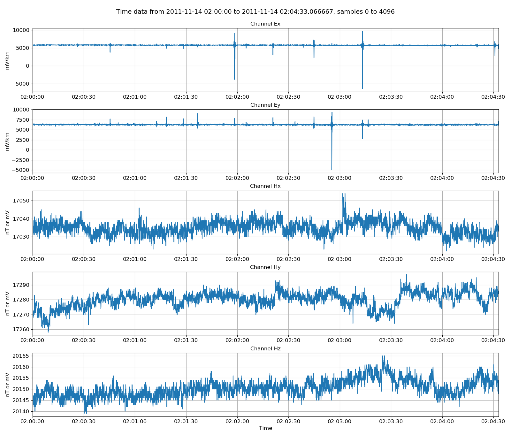
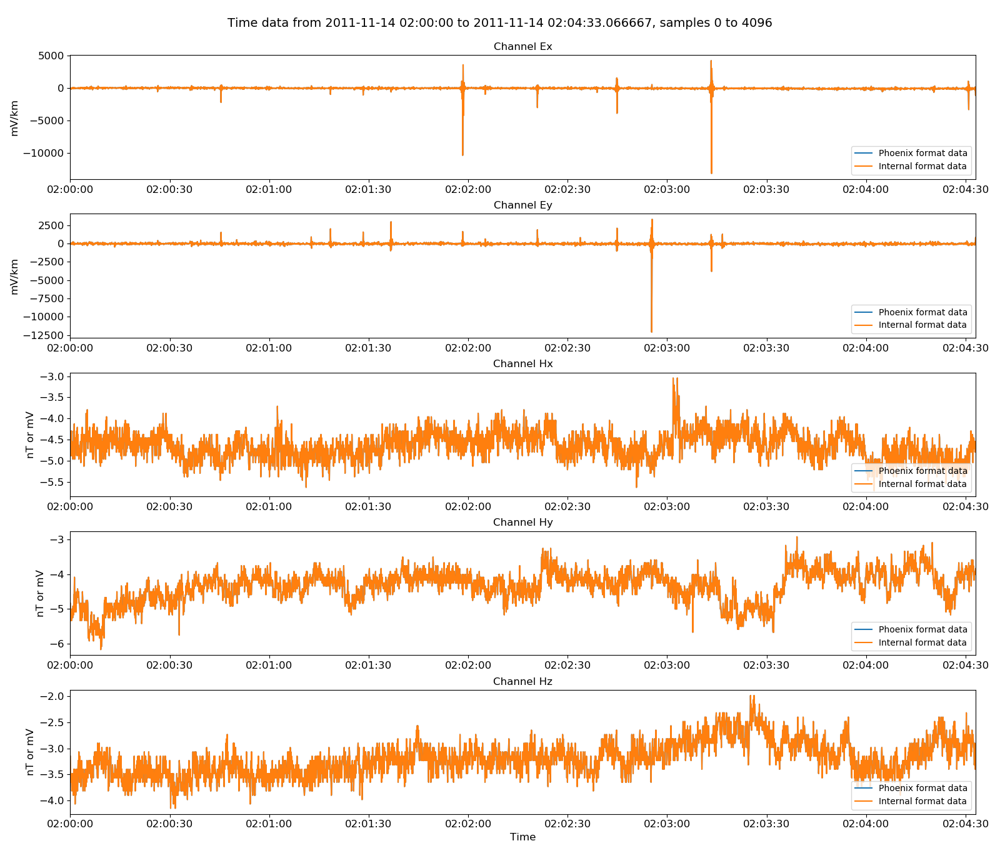

.. role:: python(code)
   :language: python

.. |Ex| replace:: E\ :sub:`x`
.. |Ey| replace:: E\ :sub:`y`
.. |Hx| replace:: H\ :sub:`x`
.. |Hy| replace:: H\ :sub:`y`
.. |Hz| replace:: H\ :sub:`z`
.. |Zxy| replace:: Z\ :sub:`xy`
.. |Zxx| replace:: Z\ :sub:`xx`
.. |Zyx| replace:: Z\ :sub:`yx`
.. |Zyy| replace:: Z\ :sub:`yy`
.. |fs| replace:: f\ :sub:`s`

Phoenix timeseries
------------------

Phoenix recordings are the most challenging to support as they do not nicely fit the resistics model of data. A typical phoenix data directory will have a .tbl header file and three data files, one for three different sampling frequencies.

.. code-block:: text

    phnx01 
    ├── 1463N13.TBL 
    ├── 1463N13.TS3
    ├── 1463N13.TS4 
    └── 1463N13.TS5   

The highest TS number is the file with the continuously sampled data, which is normally the lowest sampling frequency.  

.. note::

    In order for resistics to recognise a Phoenix data folder, the following have to be present:

    - A header file with extension .TBL
    - Data files with extension .TS? where ? represents an integer

.. warning::

    The scaling currently applied for phoenix data has not been verified and requires further testing. Therefore, it is not currently known what 
    
    Phoenix binary formatted calibration files are also not supported but ASCII files can be used instead as required.

Phoenix recordings are opened in resistics using the :class:`~resistics.ioHandlers.dataReaderPhoenix.DataReaderPhoenix` class. An example is provided below:

.. literalinclude:: ../../../../examples/formats/phoenixReaderExamples.py
    :linenos:
    :language: python
    :lines: 1-8
    :lineno-start: 1

The phoenix data reader can show information about the sampling frequencies for the various data files by using the :meth:`~resistics.ioHandlers.dataReaderPhoenix.DataReaderPhoenix.printDataFileList` method.

.. literalinclude:: ../../_text/printPhoenixFileList.txt
    :linenos:
    :language: text

Three data files are listed, along with their sampling frequencies and the number of samples in each. Further, the continuous recording file is shown.

The phoenix data reader essentially only supports the continuous data file. When data is requested, only data from the continuous data channel is returned. Similarly, headers refer to the continuous recording data file as can been seen when printing the recording information out using :python:`phoenixReader.printInfo()`.

.. literalinclude:: ../../_text/printPhoenix.txt
    :linenos:
    :language: text

Much like the other data readers, there are both global headers, which apply to all the channels, and channel specific headers. 

Resistics does not immediately load timeseries data into memory. In order to read the data from the files, it needs to be requested.

.. literalinclude:: ../../../../examples/formats/phoenixReaderExamples.py
    :linenos:
    :language: python
    :lines: 10-14
    :lineno-start: 10

:python:`phoenixReader.getUnscaledData(startTime, stopTime)` will read timeseries data from the data files and returns a :class:`~resistics.dataObjects.timeData.TimeData` object with data in the raw data units. Alternatively, to get all the data without any time restrictions, use :python:`phoenixReader.getUnscaledSamples()`. 

Information about the time data can be printed using either :python:`unscaledData.printInfo()` or simply :python:`print(unscaledData)`. An example of the time data information is below:

.. literalinclude:: ../../_text/printPhoenixData.txt
    :linenos:
    :language: text

After reading in some data, it is natural to view it. Time data can be viewed using the :meth:`~resistics.dataObjects.timeData.TimeData.view` method of the class. By additionally providing a matplotlib figure object, the style and layout of the plot can be controlled.

.. literalinclude:: ../../../../examples/formats/phoenixReaderExamples.py
    :linenos:
    :language: python
    :lines: 16-23
    :lineno-start: 16

    Viewing unscaled data  

Unscaled data is generally not of use. More useful is data scaled to physically meaningful units. Resistics uses magnetotelluric field units and the method,

.. code-block:: python

    phoenixReader.getPhysicalData(startTime, stopTime) 
    
returns a time data object in physical units. This time data object can also be visualised.

.. literalinclude:: ../../../../examples/formats/phoenixReaderExamples.py
    :linenos:
    :language: python
    :lines: 25-32
    :lineno-start: 25

.. figure:: ../../../../examples/formats/images/phoenixPhysical.png
    :align: center
    :alt: alternate text
    :figclass: align-center

    Viewing physically scaled data

There are a few helpful methods built in to resistics for manipulating timeseries data. These are generally in :mod:`~resistics.utilities`. In the example below, the time data is high pass filtered 4 Hz and then plotted.

.. literalinclude:: ../../../../examples/formats/phoenixReaderExamples.py
    :linenos:
    :language: python
    :lines: 34-42
    :lineno-start: 34

.. figure:: ../../../../examples/formats/images/phoenixFiltered.png
    :align: center
    :alt: alternate text
    :figclass: align-center

    Viewing physically scaled and then high pass filtered data

The phoenix reader has a helpful function for reformatting the continuous phoenix channel to the internal binary data format. The below example shows how this is done:

.. literalinclude:: ../../../../examples/formats/phoenixReaderExamples.py
    :linenos:
    :language: python
    :lines: 44-46
    :lineno-start: 44

To check the fidelity of this function, the internally formatted data can be read back in and plotted with the original data. To read the data back in, use the :class:`~resistics.ioHandlers.dataReaderInternal.DataReaderInternal` class. 

.. literalinclude:: ../../../../examples/formats/phoenixReaderExamples.py
    :linenos:
    :language: python
    :lines: 48-56
    :lineno-start: 48

The comments of this reformatted dataset show the various scalings and modifications that have been applied to the data. 

.. literalinclude:: ../../../../examples/formats/timeData/phoenixInternal/meas_ts5_2011-11-13-17-04-02_2011-11-14-14-29-46/comments.txt
    :linenos:
    :language: text

The datasets can be compared by plotting them together. First, read in some physical data from the internal data reader.

.. literalinclude:: ../../../../examples/formats/phoenixReaderExamples.py
    :linenos:
    :language: python
    :lines: 57-58
    :lineno-start: 57

And then plot both the original data and the internally formatted data on the same plot:

.. literalinclude:: ../../../../examples/formats/phoenixReaderExamples.py
    :linenos:
    :language: python
    :lines: 60-66
    :lineno-start: 60

    Phoenix original data versus the reformatted data in the internal data format

Complete example script
~~~~~~~~~~~~~~~~~~~~~~~

For the purposes of clarity, the complete example script is shown below.

.. literalinclude:: ../../../../examples/formats/phoenixReaderExamples.py
    :linenos:
    :language: python