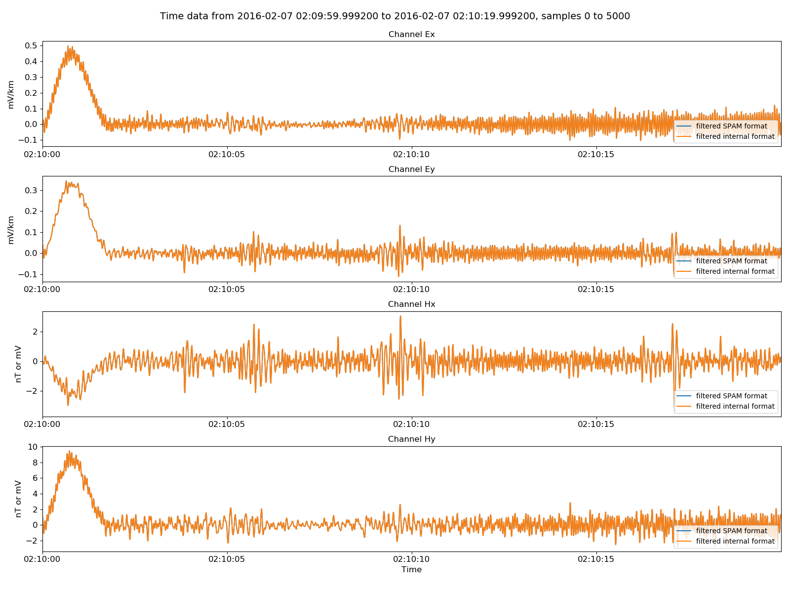

.. role:: python(code)
   :language: python

.. |Ex| replace:: E\ :sub:`x`
.. |Ey| replace:: E\ :sub:`y`
.. |Hx| replace:: H\ :sub:`x`
.. |Hy| replace:: H\ :sub:`y`
.. |Hz| replace:: H\ :sub:`z`
.. |Zxy| replace:: Z\ :sub:`xy`
.. |Zxx| replace:: Z\ :sub:`xx`
.. |Zyx| replace:: Z\ :sub:`yx`
.. |Zyy| replace:: Z\ :sub:`yy`
.. |fs| replace:: f\ :sub:`s`

SPAM timeseries
---------------

SPAM recordings are more complex than ATS recordings. Continuous recordings can either be stored in a single data file or multiple smaller data files. All channels are in the same data file. 

Therefore, a typical SPAM data directory can look like this,

.. code-block:: text

    run01 
    ├── 0996_LP00100Hz_HP00000s_R016_W038.XTR            
    └── 0996_LP00100Hz_HP00000s_R016_W038.RAW   

or this,

.. code-block:: text

    run02 
    ├── 0996_LP00100Hz_HP00000s_R016_W079.XTR 
    ├── 0996_LP00100Hz_HP00000s_R016_W079.RAW
    ├── 0996_LP00100Hz_HP00000s_R016_W080.XTR 
    ├── 0996_LP00100Hz_HP00000s_R016_W080.RAW   
    ├── 0996_LP00100Hz_HP00000s_R016_W081.XTR                              
    └── 0996_LP00100Hz_HP00000s_R016_W081.RAW   

as long as together, the recordings are continuous and without gaps.

.. warning::

    Resistics requires that each data folder represents a continuous recording without gaps. If gaps are encountered, resistics will quit execution and state where gaps were encountered.

.. note::

    In order for resistics to recognise a SPAM data folder, the following have to be present:

    - A header file with extension .XTR or .XTRX
    - Data files with extension .RAW

    Note that .XTRX headers are not yet supported. But where a .XTRX header is present, header information is read from the header of the binary data file.

.. note::

    Unscaled units for SPAM data are as follows:

    - All channels are floats in mV

    Raw SPAM timeseries data in the data files is in Volts. However, some scaling is applied to give "unscaled" data in mV. The reason for this is due to varying gains between SPAM data files, even when they together constitute a single continuous recording. Therefore, for the data to make sense as a single data source, gains are removed, leaving "unscaled" data in mV. When getting "physical" samples, electric channels are further divided by the electrode spacing in km.

SPAM recordings are opened in resistics using the :class:`~resistics.ioHandlers.dataReaderSpam.DataReaderSPAM` class. An example is provided below:

.. literalinclude:: ../../../../examples/formats/spamReaderExamples.py
    :linenos:
    :language: python
    :lines: 1-7
    :lineno-start: 1

:python:`spamReader.printInfo()` prints the measurement information out to the terminal and displays various recording parameters.

.. literalinclude:: ../../_text/printSPAM.txt
    :linenos:
    :language: text

This shows the headers read in by resistics and their values. There are both global headers, which apply to all the channels, and channel specific headers. 

Resistics does not immediately load timeseries data into memory. In order to read the data from the files, it needs to be requested.

.. literalinclude:: ../../../../examples/formats/spamReaderExamples.py
    :linenos:
    :language: python
    :lines: 9-20
    :lineno-start: 9

:python:`spamReader.getPhysicalData(startTime, stopTime)` will read timeseries data from the data files and returns a :class:`~resistics.dataObjects.timeData.TimeData` object with data in field units. Alternatively, to get all the data without any time restrictions, use the :meth:`~resistics.ioHandlers.dataReaderSpam.DataReaderSPAM.getPhysicalSamples` method. Information about the time data can be printed using either the :meth:`~resistics.ioHandlers.ioHandler.IOHandler.printInfo` method or by simply printing a :class:`~resistics.dataObjects.timeData.TimeData` object. An example of the time data information is below:

.. literalinclude:: ../../_text/printSPAMData.txt
    :linenos:
    :language: text

After reading in some data, it is natural to view it. Time data can be viewed using the :meth:`~resistics.dataObjects.timeData.TimeData.view` method of the class. By providing a matplotlib figure object to the call to view, 

.. code-block:: python
    
    physicalSPAMData.view(fig=fig, sampleStop=2000), 

plots can be formatted in more detail. In this case, the figure size and layout is being set external of the view method.

.. figure:: ../../../../examples/formats/images/spam.png
    :align: center
    :alt: alternate text
    :figclass: align-center

    Viewing physical data  

SPAM data can be converted to the internal data format using the :class:`~resistics.ioHandlers.dataWriterInternal.DataWriterInternal`. In nearly all cases, it is better to write out physical data.

.. literalinclude:: ../../../../examples/formats/spamReaderExamples.py
    :linenos:
    :language: python
    :lines: 22-28
    :lineno-start: 22

.. warning::

    Data can be written out in unscaled format. However, each format applies different scalings when data is read in, so it is possible to write out unscaled samples in internal format and then upon reading, have it scaled incorrectly. Therefore, it is nearly always best to write out physical samples. 

Writing out an internally formatted dataset will additionally write out a set of comments. These comments keep track of what has been done to the timeseries data and are there to improve repoducibility and traceability. Read more about comments :doc:`here <../../features/comments>`. The comments for this internally formatted dataset are:

.. literalinclude:: ../../../../examples/formats/timeData/spamInternal/comments.txt
    :linenos:
    :language: text

The internal format data can be read in and compared to the original data.

.. literalinclude:: ../../../../examples/formats/spamReaderExamples.py
    :linenos:
    :language: python
    :lines: 30-45
    :lineno-start: 30

.. figure:: ../../../../examples/formats/images/spam_vs_internal.png
    :align: center
    :alt: alternate text
    :figclass: align-center

    Original SPAM data versus the internally formatted data

There are a few helpful methods built in to resistics for manipulating timeseries data. These are generally in :mod:`~resistics.utilities`. In the example below, the time data is band pass filtered between 0.2 Hz and 16 Hz.

.. literalinclude:: ../../../../examples/formats/spamReaderExamples.py
    :linenos:
    :language: python
    :lines: 47-51
    :lineno-start: 47

Printing the new time data information using :python:`filteredSPAMData.printInfo()` now includes the application of the filter in the time data comments.

.. literalinclude:: ../../_text/printSPAMDataFiltered.txt
    :linenos:
    :language: text

It is possible to write out a modified time data object in internal (or ASCII) format. To do this, instead of using,

.. code-block:: python
 
    writer.writeDataset(spamReader, physical=True) 

which writes out a whole dataset given a DataReader object, use

.. code-block:: python
    
    writer.writeData(spamReader.getHeaders(), chanHeaders, filteredSPAMData, physical=True)

to write out a TimeData object directly. Header information needs to be explicitly passed to this function. For more information, see the example below and :class:`~resistics.ioHandlers.dataWriter.DataWriter>`. In the below example, the filtered time data is written out.

.. literalinclude:: ../../../../examples/formats/spamReaderExamples.py
    :linenos:
    :language: python
    :lines: 53-57
    :lineno-start: 53

Opening the comments file for the newly written dataset, it can be seen that a line has been added which records the application of a filter to the dataset.

.. literalinclude:: ../../../../examples/formats/timeData/spamInternalFiltered/comments.txt
    :linenos:
    :language: text

Finally, to check everything is fine with the new dataset, the internal formatted  filtered dataset can be read in and the data compared to the original filtered time data.

.. literalinclude:: ../../../../examples/formats/spamReaderExamples.py
    :linenos:
    :language: python
    :lines: 59-76
    :lineno-start: 59

Plotting the two time data objects on the same plot results in the image below. 

    Filtered SPAM data versus the internally formatted filtered data

Complete example script
~~~~~~~~~~~~~~~~~~~~~~~
For the purposes of clarity, the complete example script is shown below.

.. literalinclude:: ../../../../examples/formats/spamReaderExamples.py
    :linenos:
    :language: python