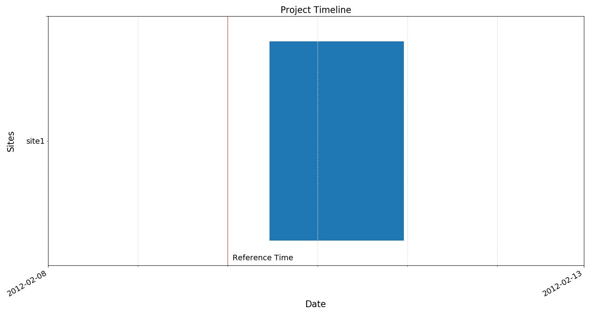
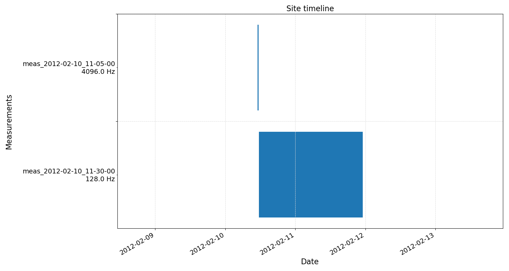

.. role:: python(code)
   :language: python

The project environment
-----------------------

Resistics uses a project structure for processing magnetotelluric data. There are two things required to create a new project:

- A path for the new project
- A reference time for the new project

The reference time should be a time before any time data was recorded and gives a reference point for time windowing the entire project. 

Below is an example of setting up a new project in the folder exampleProject. The newProject method create new folders as required and returns a :doc:`ProjectData <../../dataObjects.projectData>` object which holds the project information. 

.. literalinclude:: ../../../../examples/ex1_createProject.py
    :linenos:
    :language: python
    :lines: 1-10
    :lineno-start: 1

Project information can be viewed by calling the :python:`projData.printInfo()` method or by simply :python:`print(projData)`.

.. code-block:: text

    12:34:03 ProjectData: Time data path = exampleProject\timeData
    12:34:03 ProjectData: Spectra data path = exampleProject\specData
    12:34:03 ProjectData: Statistics data path = exampleProject\statData
    12:34:03 ProjectData: Mask data path = exampleProject\maskData
    12:34:03 ProjectData: TransFunc data path = exampleProject\transFuncData
    12:34:03 ProjectData: Calibration data path = exampleProject\calData
    12:34:03 ProjectData: Images data path = exampleProject\images
    12:34:03 ProjectData: Reference time = 2012-02-10 00:00:00
    12:34:03 ProjectData: Project start time = 2019-03-03 12:34:03.709213
    12:34:03 ProjectData: Project stop time = 2019-03-03 12:34:03.709213
    12:34:03 ProjectData: Project found 0 sites:
    12:34:03 ProjectData: Sampling frequencies found in project (Hz):

Within the folder exampleProject, Resistics creates another set of folders as shown below:

.. code-block:: text

    exampleProject
    ├── calData : directory for storing calibration files
    ├── timeData : directory where time data should be stored   
    ├── specData : directory where spectra data is saved       
    ├── statData : directory where statistic data is saved
    ├── maskData : directory where window masking information is saved        
    ├── transFuncData : directory where transfer function files are saved
    ├── images : directory where images are saved 
    └── mtProj.prj : the project file which allows reloading of a project

The mtProj.prj project file stores some information about the project allowing it to be reloaded easily. It is a text file and can be opened in a text editor such as notepad or notepad++. For this exampleProject, the mtProj.prj file looks like:

.. code-block:: text

    Calibration data path = exampleProject\calData
    Time data path = exampleProject\timeData
    Spectra data path = exampleProject\specData
    Statistics data path = exampleProject\statData
    Mask data path = exampleProject\maskData
    TransFunc data path = exampleProject\transFuncData
    Image data path = exampleProject\images
    Reference time = 2012-02-10 00:00:00

The next step is to create a directory for a new site. This can be done using :python:`projData.createSite(siteName)`. However, printing the project information again still shows zero sites. This is because only folders with time series data in them are counted as sites. 

.. literalinclude:: ../../../../examples/ex1_createProject.py
    :linenos:
    :language: python
    :lines: 11-13
    :lineno-start: 11

Creating a new site only involves creating a new directory. This can also be done manually in the timeData folder. 

.. code-block:: text

    exampleProject
    ├── calData 
    ├── timeData   
    │   └── site1 
    ├── specData
    ├── statData
    ├── maskData   
    ├── transFuncData 
    ├── images
    └── mtProj.prj

Once a project has been created, time series data should be added to the timeData directory under a site directory. 

.. code-block:: text

    exampleProject
    ├── calData 
    ├── timeData   
    │   └── site1
    |       |── dataFolder1
    │       |── dataFolder2
    |       |──     .     
    |       |──     .
    |       |──     .
    |       └── dataFolderN
    ├── specData
    ├── statData
    ├── maskData   
    ├── transFuncData 
    ├── images
    └── mtProj.prj

Once a project has been created and a site populated with data folders, the project can be loaded. It will automatically pick up the new files. Please see the :doc:`conventions <../conventions>` section is your data is not being picked up

.. literalinclude:: ../../../../examples/ex1_loadProject.py
    :linenos:
    :language: python
    :lines: 1-8
    :lineno-start: 1    

Printing the project information now that there is a site with data shows the number of sites found and their start and end dates.

.. code-block:: text

    13:01:50 ProjectData: Time data path = exampleProject\timeData
    13:01:50 ProjectData: Spectra data path = exampleProject\specData
    13:01:50 ProjectData: Statistics data path = exampleProject\statData
    13:01:50 ProjectData: Mask data path = exampleProject\maskData
    13:01:50 ProjectData: TransFunc data path = exampleProject\transFuncData
    13:01:50 ProjectData: Calibration data path = exampleProject\calData
    13:01:50 ProjectData: Images data path = exampleProject\images
    13:01:50 ProjectData: Reference time = 2012-02-10 00:00:00
    13:01:50 ProjectData: Project start time = 2012-02-10 11:05:00.000000
    13:01:50 ProjectData: Project stop time = 2012-02-11 23:03:43.992188
    13:01:50 ProjectData: Project found 1 sites:
    13:01:50 ProjectData: site1             start: 2012-02-10 11:05:00      end: 2012-02-11 23:03:43.992188
    13:01:50 ProjectData: Sampling frequencies found in project (Hz): 128.0, 4096.0

Another useful function is to view the project timeline. This can be done with :python:`projData.view()`.

.. literalinclude:: ../../../../examples/ex1_loadProject.py
    :linenos:
    :language: python
    :lines: 10-11
    :lineno-start: 10    

    The exampleProject timeline

Site information can be accessed by using :python:`projData.getSiteData(siteName)`. :doc:`SiteData <../../dataObjects.projectData>` objects hold information about sites which can be printed in the same way as project information.

.. literalinclude:: ../../../../examples/ex1_loadProject.py
    :linenos:
    :language: python
    :lines: 13-16
    :lineno-start: 13

.. code-block:: text

    13:51:26 SiteData: Site = site1
    13:51:26 SiteData: Time data path = exampleProject\timeData\site1
    13:51:26 SiteData: Spectra data path = exampleProject\specData\site1
    13:51:26 SiteData: Statistics data path = exampleProject\statData\site1
    13:51:26 SiteData: TransFunc data path = exampleProject\transFuncData\site1
    13:51:26 SiteData: Site start time = 2012-02-10 11:05:00
    13:51:26 SiteData: Site stop time = 2012-02-11 23:03:43.992188
    13:51:26 SiteData: Sampling frequencies recorded = 128.00000000, 4096.00000000
    13:51:26 SiteData: Number of measurement files = 2
    13:51:26 SiteData: Measurement          Sample Frequency (Hz)           Start Time              End Time
    13:51:26 SiteData: meas_2012-02-10_11-05-00             4096.0          2012-02-10 11:05:00         2012-02-10 11:24:59.999756
    13:51:26 SiteData: meas_2012-02-10_11-30-00             128.0           2012-02-10 11:30:00         2012-02-11 23:03:43.992188

Site timelines can also be viewed using :python:`siteData.view()`. 

    The site timeline