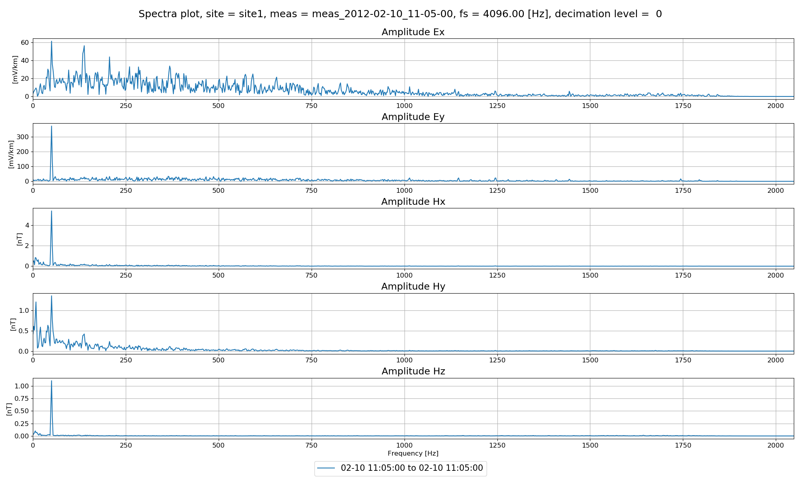
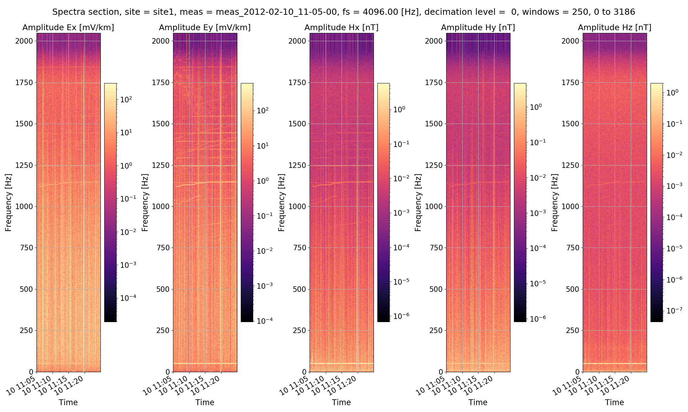
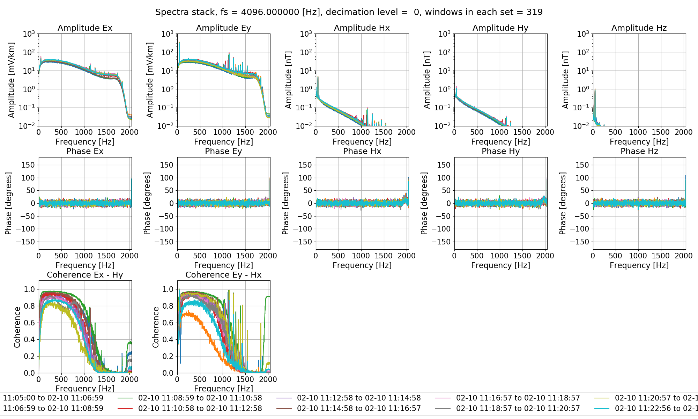
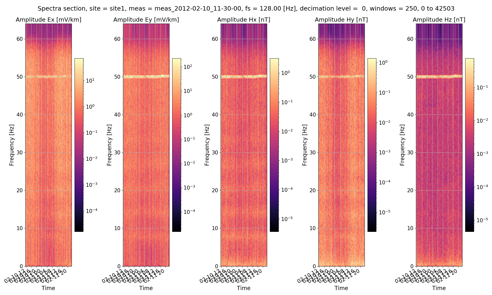
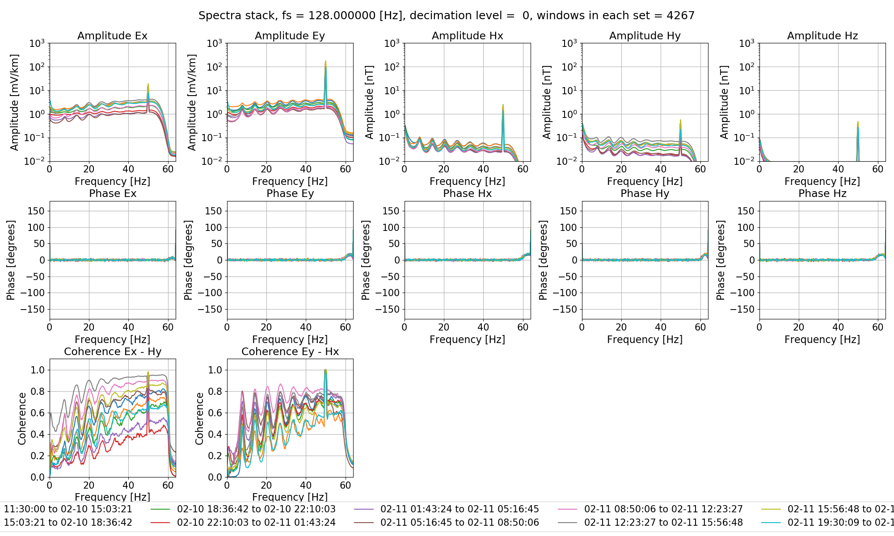

Viewing spectra
---------------

Spectra data is stored in the following locations. 

.. code-block:: text

    exampleProject
    ├── calData 
    ├── timeData   
    │   └── site1
    |       |── dataFolder1
    │       |── dataFolder2
    |       |──     .     
    |       |──     .
    |       |──     .
    |       └── dataFolderN     
    ├── specData
    │   └── site1
    |       |── dataFolder1
    |       |   └── spectra
    │       |── dataFolder2
    |       |   └── spectra    
    |       |──     .     
    |       |──     .
    |       |──     .
    |       └── dataFolderN
    |           └── spectra        
    ├── statData
    ├── maskData   
    ├── transFuncData 
    ├── images
    └── mtProj.prj

Each spectra file that is calculated is written out with a set of comments. The comment file is a text file that can be opened in any text editor and records the various parameters used when calculating out spectra. An example is given below.

.. code-block:: text

    Unscaled data 2012-02-10 11:05:00 to 2012-02-10 11:24:59.999756 read in from measurement exampleProject\timeData\site1\meas_2012-02-10_11-05-00, samples 0 to 4915199
    Sampling frequency 4096.0
    Removing gain and scaling electric channels to mV/km
    Remove zeros: False, remove nans: False, remove average: True
    ---------------------------------------------------
    Calculating project spectra
    Using default configuration
    Channel Ex not calibrated
    Channel Ey not calibrated
    Channel Hx calibrated with calibration data from file exampleProject\calData\Hx_MFS06365.TXT
    Channel Hy calibrated with calibration data from file exampleProject\calData\Hy_MFS06357.TXT
    Channel Hz calibrated with calibration data from file exampleProject\calData\Hz_MFS06307.TXT
    Decimating with 7 levels and 7 frequencies per level
    Evaluation frequencies for this level 1024.0, 724.0773439350246, 512.0, 362.0386719675123, 256.0, 181.01933598375615, 128.0
    Windowing with window size 2048 samples and overlap 512 samples
    Time data decimated from 4096.0 Hz to 512.0 Hz, new start time 2012-02-10 11:05:00, new end time 2012-02-10 11:24:59.998047
    Evaluation frequencies for this level 90.50966799187808, 64.0, 45.25483399593904, 32.0, 22.62741699796952, 16.0, 11.31370849898476
    Windowing with window size 512 samples and overlap 128 samples
    Time data decimated from 512.0 Hz to 64.0 Hz, new start time 2012-02-10 11:05:00, new end time 2012-02-10 11:24:59.984375
    Evaluation frequencies for this level 8.0, 5.65685424949238, 4.0, 2.82842712474619, 2.0, 1.414213562373095, 1.0
    Windowing with window size 512 samples and overlap 128 samples
    Time data decimated from 64.0 Hz to 8.0 Hz, new start time 2012-02-10 11:05:00, new end time 2012-02-10 11:24:59.875000
    Time data decimated from 8.0 Hz to 4.0 Hz, new start time 2012-02-10 11:05:00, new end time 2012-02-10 11:24:59.750000
    Evaluation frequencies for this level 0.7071067811865475, 0.5, 0.35355339059327373, 0.25, 0.17677669529663687, 0.125, 0.08838834764831843
    Windowing with window size 512 samples and overlap 128 samples
    Spectra data written out to exampleProject\specData\site1\meas_2012-02-10_11-05-00\spectra on 2019-03-03 19:33:27.595114
    ---------------------------------------------------

There are a number of methods in :doc:`projectSpectra <../../project.projectSpectra>` that can be used to visualise spectra.

    Plot of the tipper result when |Hz| is set as the only output channel

    Plot of the tipper result when |Hz| is set as the only output channel

    Plot of the tipper result when |Hz| is set as the only output channel

For the 128Hz data

    Plot of the tipper result when |Hz| is set as the only output channels

    Plot of the tipper result when |Hz| is set as the only output channel

