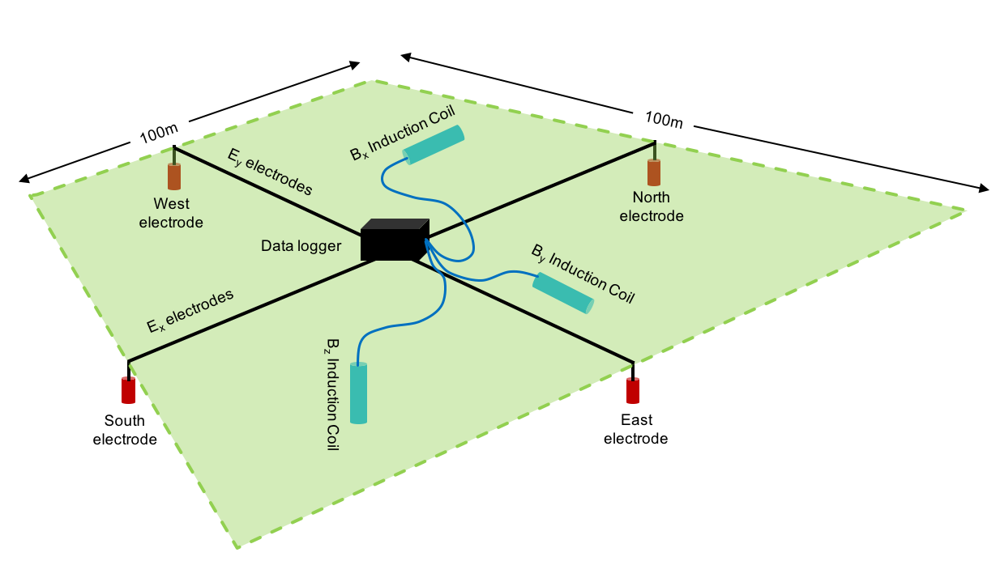
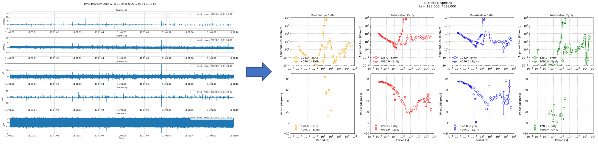
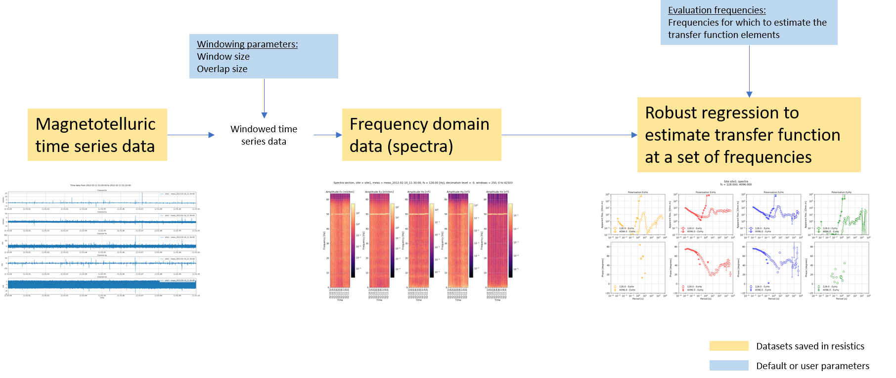
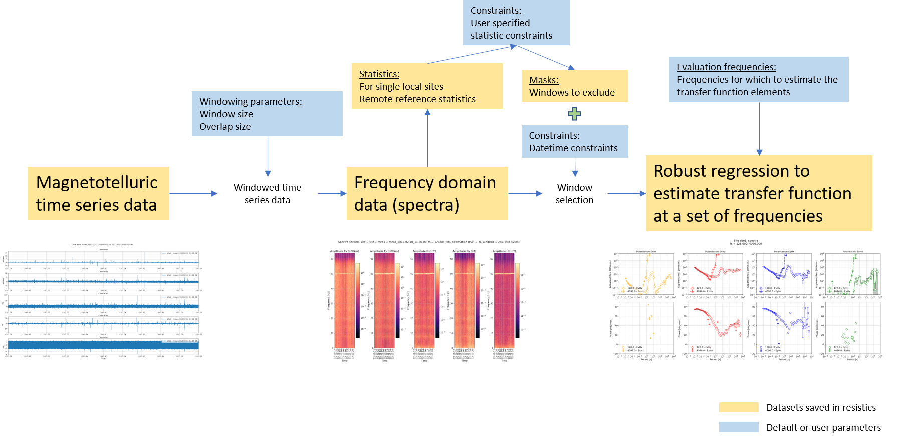
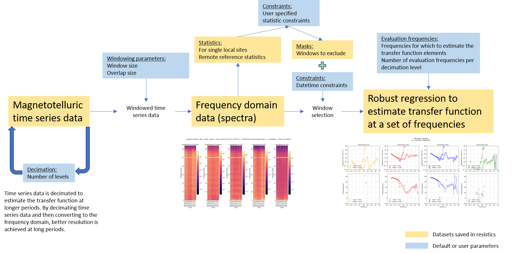

.. |Ex| replace:: E\ :sub:`x`
.. |Ey| replace:: E\ :sub:`y`
.. |Hx| replace:: H\ :sub:`x`
.. |Hy| replace:: H\ :sub:`y`
.. |Hz| replace:: H\ :sub:`z`
.. |Zxy| replace:: Z\ :sub:`xy`
.. |Zxx| replace:: Z\ :sub:`xx`
.. |Zyx| replace:: Z\ :sub:`yx`
.. |Zyy| replace:: Z\ :sub:`yy`
.. |fs| replace:: f\ :sub:`s`
.. |Tx| replace:: T\ :sub:`x`
.. |Ty| replace:: T\ :sub:`y`
.. role:: python(code)
   :language: python

Tutorial
--------
The tutorial assumes knowledge of magnetotelluric (MT) theory and terminology. Before embarking on the tutorial, a quick refresher is provided of magnetotelluric theory and the general magnetotelluric data processing flow which resistics follows. The dataset for the tutorial is available for those who would like to follow along. A link can be found :ref:`here <tutorial:Working through the tutorial>`.

Magnetotelluric theory
~~~~~~~~~~~~~~~~~~~~~~
Magnetotellurics (MT) is a passive geophysical method for estimating the electrical properties of the subsurface. The MT method uses variations in the natural geoelectric and geomagnetic fields as the source of energy.

In the field, electrodes are used to measure potential difference variations  in the x direction (|Ex|) and y direction (|Ey|). Induction coils measure variations of the geomagnetic field in the x, y and z directions (|Hx|, |Hy| and |Hz| respectively). Commonly, x represents East-West and y represents North-South, though only orthongonality is really required. The vertical direction is represented by z.

    An example magnetotelluric setup in the field

Using these measurements, magnetotellurics poses a linear, time invariant system in the frequency domain. 

.. math::
    :nowrap:

    \begin{eqnarray}
    E_x & = & Z_{xx} H_x + Z_{xy} H_y \\
    E_y & = & Z_{yx} H_x + Z_{yy} H_y 
    \end{eqnarray} 

|Zxx|, |Zxy|, |Zyx| and |Zyy| are the components of the 2-D impedance tensor with magnetic channels as input and electric channels as output. The components of the impedance tensor describe volumetrically averaged electrical properites of the subsurface. The frequency for which the impedance tensor is calculated is a proxy for the depth of the volume (the penetration depth or skin depth).

Another parameter of interest is the ratio of vertical to horizontal magnetic fields, often called the "tipper", "tipper vectors" or "induction arrows". For the tipper, the inputs are again the horizontal magnetic fields |Hx| and |Hy|, but in this case, the output is the vertical magnetic field |Hz|. The tipper has two components, |Tx| and |Ty|, which are both complex valued. The equation for the tipper is given below.

.. math::
    :nowrap:

    \begin{eqnarray}
    H_z & = & T_{x} H_x + T_{y} H_y 
    \end{eqnarray} 

Vertical magnetic fields are generated by lateral conductivity gradients. The ratio of horizontal to vertical magnetic fields indicates lateral variations in conductivity.

There are several assumptions made for magnetotellurics. For a clear outline of these assumptions, please see the following references:

* Wikipedia: https://en.wikipedia.org/wiki/Magnetotellurics
* Practical Magnetotellurics (Simpson and Bahr)
* The Magnetotelluric Method (Chave and Jones)
* Models and Methods of Magnetotellurics (Berdichevsky and Dmitriev)

Processing theory
~~~~~~~~~~~~~~~~~
Magnetotelluric processing is the task of taking geoelectric and geomagnetic field values recorded in the field and estimating the impedance tensor or tipper. The overarching aim is summarised in the below image.

    The aim is to take magnetotelluric time series data and from it, calculate the apparent resistivy, phase and other parameters

The general resistics workflow to estimate the impedance tensor or tipper is shown below. There are two important steps:

- Conversion to frequency domain
- Regression to calculate elements of transfer function (i.e. impedance tensor or tipper)

.. important::

    The transfer function is the general term for a function describing the relationship between the inputs and outputs of a linear, time invariant system. Both the impedance tensor and the tipper are transfer functions, describing the relationships between different systems as described above. For more information, see: https://en.wikipedia.org/wiki/Transfer_function.

    Often, transfer function and/or impedance tensor/tipper are used interchangeably. 

    A basic magnetotelluric workflow

Recall, in the frequency domain the magnetotelluric formulation is a linear, time invariant system, meaning it can be solved using linear regression (or robust linear regression). Therefore, the data is converted is windowed and converted into the frequency domain before doing the regression and finding the components of the transfer function (i.e. the impedance tensor or the tipper).

The time series data is windowed to have more samples in the linear regression problem. For the windowing, resistics has default parameters. However, users can specify different windowing schemes to either reduce or increase the number of windows available. 

Transfer functions could be (and can be using :doc:`statistics <tutorial/statistics>`) calculated out for each time window individually. Alternatively, one estimate of the transfer function can be made by using the equations from each and every time window to give an over-determined linear regression setup.

The components of the transfer function are a function of frequency. Strictly, it is possible to estimate the coefficients of the transfer function for every frequency in the frequency spectra. However, this is generally unrequired. Therefore, a set of evaluation frequencies are defined (resistics uses a default set, but it can be overridden by users) for which the transfer function is estimated. 

In addition to the basic workflow, resistics has more functions to select or reject time sections. The expanded workflow is shown below.

    Extending the workflow with more data selection options

Using statistics and masks allows users to reject time windows that do not meet a specificed set of constraints. Further, the time windows to use can be selected by defining a time range. For example, it is often beneficial in eletromagnetically noisy environments to select time windows during the night when cultural electromagnetic noise might be at a minimum.

One missing step in the above workflows is decimation. Decimation is a means to estimate the transfer function at increasing longer periods (or lower frequencies). By decimating the data before windowing and spectra calculation, the resolution at lower frequencies is improved in the frequency domain. Therefore, the transfer function can be better estimated at longer periods (lower frequencies). 

    Adding decimation to the processing workflow

Evaluation frequencies need to be defined for each decimation level. Evaluation frequencies are usually on a log scale, though they can be customised in resistics. 

The apparent resistivity, phase and other parameters are generally the first step on a longer journey to model the electrical resistivity of the subsurface. This can be done using either a 1-D, 2-D and 3-D inversion depdending on the number of measurements and their orientation. 

Working through the tutorial
~~~~~~~~~~~~~~~~~~~~~~~~~~~~
To install resistics, follow the instructions in the :doc:`installation <installation>`.

The following tutorial sections detail basic features and requirements of resistics. 

.. toctree::
    :maxdepth: 2
    :titlesonly:

    tutorial/project-environment.rst
    tutorial/viewing-data.rst
    tutorial/up-and-running.rst
    tutorial/tipper.rst
    tutorial/viewing-spectra.rst
    tutorial/multiple-spectra.rst
    tutorial/configuration-files.rst
    tutorial/statistics.rst
    tutorial/masks.rst
    tutorial/mask-processing.rst
    tutorial/recap-and-deeper-dive.rst
    tutorial/date-time-constraints.rst
    
Resistics is a project based package, which means the first step in learning how to use the package is to set up a new project and place the time data files in the appropriate location. 

.. note::

    In the tutorial examples, the first line will usually be an import of datapaths. For example, in the script to create a project.

    .. literalinclude:: ../../examples/tutorial/createProject.py
        :linenos:
        :language: python

    This is purely to help separate the tutorial data from the resistics repository. The datapaths defined in datapaths.py are shown below. 

    .. literalinclude:: ../../examples/tutorial/datapaths.py
        :linenos:
        :language: python 

.. note::

    In most example cases, the images will neither be saved or shown, and the figure will be saved explicitly. This is to help the documentation process. Usually, the best way is to use the save option when viewing images to save the images to the project "images" folder. For example:

    .. literalinclude:: ../../examples/tutorial/simpleRun.py
        :linenos:
        :language: python
        :lines: 21-22
        :lineno-start: 21
    
    In the above code snippet, the save option could be set to :python:`True` to save the image to the "images" folder. Then the explicit save would not be required.

A dataset has been made available for new starters to practice with. This includes two recordings, one at 128Hz and the other at 4096Hz. The dataset is available here:

`Dataset link <https://1drv.ms/f/s!ApKs8ZhVotKMavU3EpQTeEwuxoc>`_

| **For more information about this dataset, see the paper:**
| `3-D analysis and interpretation of magnetotelluric data from the Aluto-Langano geothermal field, Ethiopia <https://academic.oup.com/gji/article/202/3/1923/614429>`_
| F. Samrock  A. Kuvshinov  J. Bakker  A. Jackson  S. Fisseha
| *Geophysical Journal International, Volume 202, Issue 3, September, 2015* 
| *Pages 1923–1948* 
| https://doi.org/10.1093/gji/ggv270

In most cases, only the API for the project functionality will be of interest. However, for even more advanced examples, have a look at the :doc:`advanced <advanced>` and :doc:`cookbook <cookbook>` sections, which will demonstrate more advanced processing of magnetotelluric data or usage of lower level resistics API. 