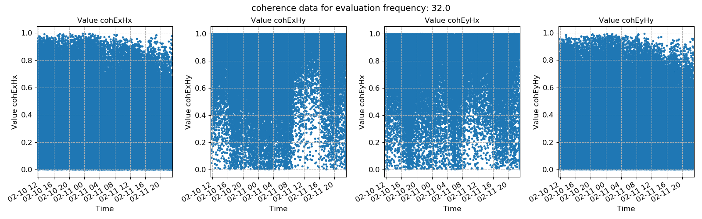
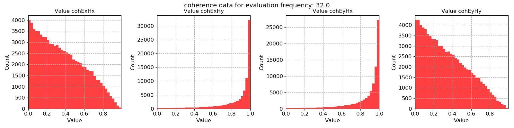

Using configuration files
-------------------------

Configuration files are a powerful way to set multiple parameters. For more information about the parameters in configuration files, please see :doc:`Configuration files <../features/configuration>`. 

A user supplied configuration only needs to include non-default parameters (those where the values are changed). Details on the easiest way to create a configuration file are provided :doc:`here <../features/configuration>`.

To use configuration files, they should be specified when loading in a project. An example configuration file is shown below. 

.. literalinclude:: ../../../examples/tutorial/tutorialconfig.ini
    :linenos:
    :language: text

This configuration has been named *dec8_5* because it uses a decimation scheme of 8 decimation levels with 5 evaluation frequencies per level. Configuration names should be meaningful and unique to allow disambiguation and easy repeatability. Configuration file names are stored in dataset comments to ensure transparency.

The below shows how to load a project with a configuration specified by a configuration file.

.. literalinclude:: ../../../examples/tutorial/usingConfigFiles.py
    :linenos:
    :language: python
    :lines: 1-7
    :lineno-start: 1

The configuration file above specifies a spectra directory to use. For more on what this means, please see the :doc:`Multiple spectra <multiple-spectra>` page. The result is that all project methods which use the :class:`~resistics.dataObjects.projectData.ProjectData` instance loaded with the configuration file will pick up the configuration parameters.

Calculating spectra is now straightforward. When passing the :class:`~resistics.dataObjects.projectData.ProjectData` instance loaded with the tutorialConfig.ini configuration file to :meth:`~resistics.project.projectSpectra.calculateSpectra`, the **specdir** option in the configuration file will automatically be picked up.

.. literalinclude:: ../../../examples/tutorial/usingConfigFiles.py
    :linenos:
    :language: python
    :lines: 9-13
    :lineno-start: 9

The spectra will be stored in the following location:

.. code-block:: text

    exampleProject
    ├── calData 
    ├── timeData   
    │   └── site1
    |       |── dataFolder1
    │       |── dataFolder2
    |       |──     .     
    |       |──     .
    |       |──     .
    |       └── dataFolderN     
    ├── specData
    │   └── site1
    |       |── dataFolder1
    |       |   └── dec8_5
    |       |   
    │       |── dataFolder2
    |       |   └── dec8_5    
    |       |──     .     
    |       |──     .
    |       |──     .
    |       └── dataFolderN
    |           └── dec8_5        
    ├── statData
    ├── maskData   
    ├── transFuncData 
    ├── images
    └── mtProj.prj

To process these spectra, it's a similar situation. Passing the :class:`~resistics.dataObjects.projectData.ProjectData` instance loaded with the tutorialConfig.ini configuration file to :meth:`~resistics.project.projectTransferFunction.processProject`, the **specdir** option in the configuration file will automatically be picked up.

.. literalinclude:: ../../../examples/tutorial/usingConfigFiles.py
    :linenos:
    :language: python
    :lines: 15-21
    :lineno-start: 15

Now the plot using the new configuration parameters (8 decimation levels with 5 evaluation frequencies per decimation level) can be compared to the default parameterisation.

    Using the customised configuration

    Using the default configuration

Complete example script
~~~~~~~~~~~~~~~~~~~~~~~

For the purposes of clarity, the complete example script is provided below.

.. literalinclude:: ../../../examples/tutorial/usingConfigFiles.py
    :linenos:
    :language: python