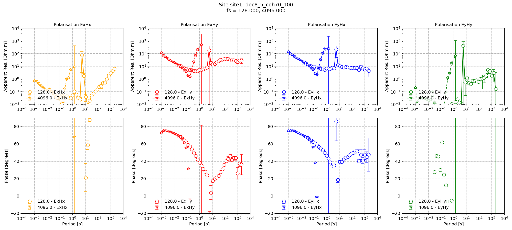
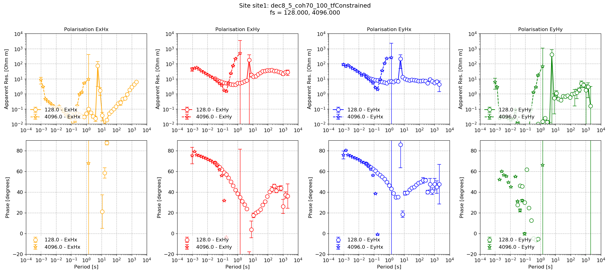

Processing with masks
---------------------

Now that statistics and masks have been calculated, the final step is to include those masks in the transfer function calculation. There is a simple addition to the standard transfer function calculation workflow presented in :doc:`Up and running <up-and-running>` and :doc:`Tippers <tipper>`.

As always, load the project. 

.. literalinclude:: ../../../examples/tutorial/runWithMasks.py
    :linenos:
    :language: python
    :lines: 1-5
    :lineno-start: 1

Now perform the transfer function calculation with the addition of a mask.

.. literalinclude:: ../../../examples/tutorial/runWithMasks.py
    :linenos:
    :language: python
    :lines: 7-17
    :lineno-start: 7

The elements of note in this code block are:

- masks keyword. A mask needs to be associated with a site and provided in a dictionary. More than a single mask file can be supplied for a site by passing a list of masks.
- postpend keyword. This is the postpend on the output transfer function data file to avoid overwriting existing transfer function calculation files.

The resultant impedance tensor result can be visualised in the same way as demonstrated in previous sections using the :meth:`~resistics.project.transfunc.viewImpedance` method of the project :mod:`~resistics.project.transfunc` module. 

.. literalinclude:: ../../../examples/tutorial/runWithMasks.py
    :linenos:
    :language: python
    :lines: 19-29
    :lineno-start: 1

    Impedance tensor estimate with the coherence masking

Repeating the process for the mask with additional transfer function constraints gives:

.. literalinclude:: ../../../examples/tutorial/runWithMasks.py
    :linenos:
    :language: python
    :lines: 31-48
    :lineno-start: 31

    Impedance tensor estimate with both coherence and transfer function masking

Complete example script
~~~~~~~~~~~~~~~~~~~~~~~
For the purposes of clarity, the complete example script is provided below.

.. literalinclude:: ../../../examples/tutorial/runWithMasks.py
    :linenos:
    :language: python