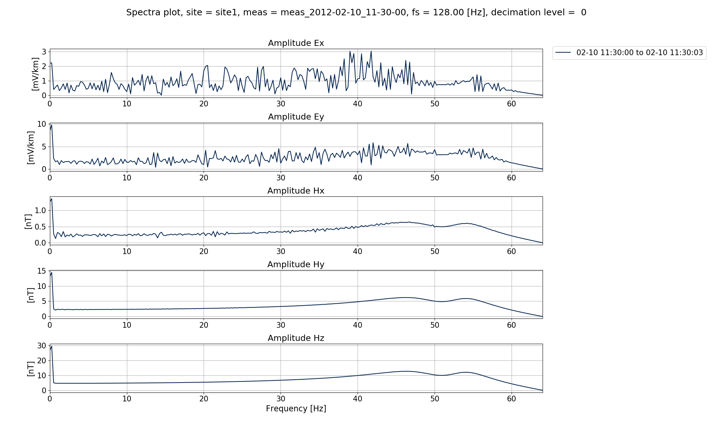
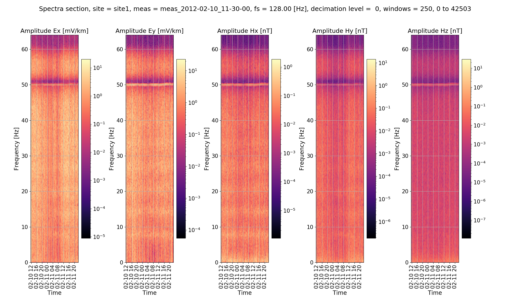
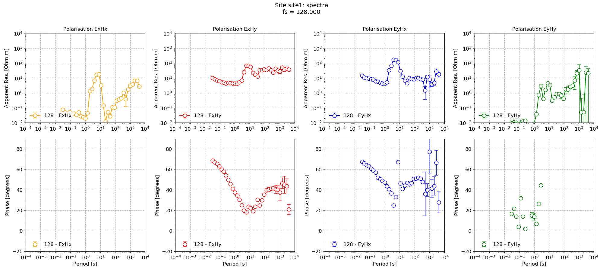

.. role:: python(code)
   :language: python

.. |Ex| replace:: E\ :sub:`x`
.. |Ey| replace:: E\ :sub:`y`
.. |Hx| replace:: H\ :sub:`x`
.. |Hy| replace:: H\ :sub:`y`
.. |Hz| replace:: H\ :sub:`z`
.. |Zxy| replace:: Z\ :sub:`xy`
.. |Zxx| replace:: Z\ :sub:`xx`
.. |Zyx| replace:: Z\ :sub:`yx`
.. |Zyy| replace:: Z\ :sub:`yy`
.. |fs| replace:: f\ :sub:`s`

Multiple spectra
----------------

It is often beneficial to compare the difference between various spectra calculation parameters. To make this easier, resistics supports the calculation of multiple spectra for each timeseries data folder. This is achieved through the **specdir** (short for spectra directory) option.

.. note::

    This section describes the **specdir** option and how multiple spectra are saved and supported. However, the easiest way to specify the **specdir** option is in configuration files. For more information, please see :doc:`Using configuration files <configuration-files>`.

By default, the **specdir** is called **spectra** and spectra data is saved in the following location:

.. code-block:: text

    exampleProject
    ├── calData 
    ├── timeData   
    │   └── site1
    |       |── dataFolder1
    │       |── dataFolder2
    |       |──     .     
    |       |──     .
    |       |──     .
    |       └── dataFolderN     
    ├── specData
    │   └── site1
    |       |── dataFolder1
    |       |   └── spectra
    │       |── dataFolder2
    |       |   └── spectra    
    |       |──     .     
    |       |──     .
    |       |──     .
    |       └── dataFolderN
    |           └── spectra        
    ├── statData
    ├── maskData   
    ├── transFuncData 
    ├── images
    └── mtProj.prj

However, by specifying the **specdir** option in :meth:`~resistics.project.spectra.calculateSpectra`, a new set of spectra can be calculated.
In the :doc:`Viewing spectra <viewing-spectra>` section, it was clear that the time series spectra had a peak at 50 Hz, which is a common powerline frequency. Therefore, an example is shown below where a second set of spectra are calculated with a notch filter applied at 50 Hz and **specdir** is specified as :python:`specdir = "notch"`.

.. literalinclude:: ../../../examples/tutorial/multipleSpectra.py
    :linenos:
    :language: python
    :lines: 1-10
    :lineno-start: 1

The new set of spectra data with :python:`specdir = "notch"` are saved in the following way: 

.. code-block:: text

    exampleProject
    ├── calData 
    ├── timeData   
    │   └── site1
    |       |── dataFolder1
    │       |── dataFolder2
    |       |──     .     
    |       |──     .
    |       |──     .
    |       └── dataFolderN     
    ├── specData
    │   └── site1
    |       |── dataFolder1
    |       |   |── notch
    |       |   └── spectra
    |       |   
    │       |── dataFolder2
    |       |   |── notch
    |       |   └── spectra    
    |       |──     .     
    |       |──     .
    |       |──     .
    |       └── dataFolderN
    |           |── notch
    |           └── spectra        
    ├── statData
    ├── maskData   
    ├── transFuncData 
    ├── images
    └── mtProj.prj

To view the new spectra data, **specdir** needs to be specified in the calls to :meth:`~resistics.project.spectra.viewSpectra`, :meth:`~resistics.project.spectra.viewSpectraSection` and :meth:`~resistics.project.spectra.viewSpectraStack`. An example is provided below using :meth:`~resistics.project.spectra.viewSpectraSection`.

.. literalinclude:: ../../../examples/tutorial/multipleSpectra.py
    :linenos:
    :language: python
    :lines: 12-26
    :lineno-start: 12

In the plots below, the default spectra data and the notched spectra data are shown. 

.. figure:: ../_static/examples/tutorial/viewSpec_projspec_128_view.png
    :align: center
    :alt: alternate text
    :figclass: align-center

    Default spectra data

    Notched spectra data

A spectra section can also be plotted in a similar to way the example shown in :doc:`Viewing Spectra <viewing-spectra>`.

.. literalinclude:: ../../../examples/tutorial/multipleSpectra.py
    :linenos:
    :language: python
    :lines: 28-37
    :lineno-start: 28

    Notched spectra section

For the sake of comarpison, the default (no notch) spectra section.

.. figure:: ../_static/examples/tutorial/viewSpec_projspec_128_section.png
    :align: center
    :alt: alternate text
    :figclass: align-center

    Default spectra section

Further, inspecting the comments of the notched spectra data, the application of the notch filter and the frequency is recorded.

.. literalinclude:: ../_static/examples/tutorial/multspec_comments.txt
    :linenos:
    :language: text

The next step is to process the notched spectra data. To do this, **specdir** has to be specified in the call to :meth:`~resistics.project.transfunc.processProject` as shown below:

.. literalinclude:: ../../../examples/tutorial/multipleSpectra.py
    :linenos:
    :language: python
    :lines: 39-42
    :lineno-start: 39

Finally, the transfer function data for the notched spectra data can be viewed by once more specifying the **specdir** option in the call to :meth:`~resistics.project.transfunc.viewImpedance`

.. literalinclude:: ../../../examples/tutorial/multipleSpectra.py
    :linenos:
    :language: python
    :lines: 44-68
    :lineno-start: 44

The impedance for the default spectra calculated parameters and then for the notch parameters are shown below.

.. figure:: ../_static/examples/tutorial/multspec_viewimp_notch.png
    :align: center
    :alt: alternate text
    :figclass: align-center

    Default impedance tensor estimation

    Impedance tensor estimation using the notched spectra data

As mentioned in the note at the top of this page, the simplest way to use the specdir option is through configuration files. 

.. important:: 

    When specifying specdir in a configuration file, the specdir keyword no longer has to be passed to the various method calls as it is picked up directly from the confiugration file. This makes everything much simpler and removes a source of mistakes.

More information about configuration files is provided in the :doc:`Configuration files <../features/configuration>` section. An example of using configuration files is provided in the :doc:`Using configuration files <configuration-files>` section.

Complete example script
~~~~~~~~~~~~~~~~~~~~~~~
For the purposes of clarity, the complete example script is provided below.

.. literalinclude:: ../../../examples/tutorial/multipleSpectra.py
    :linenos:
    :language: python