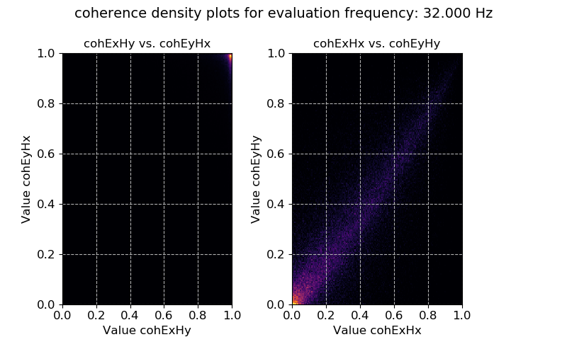
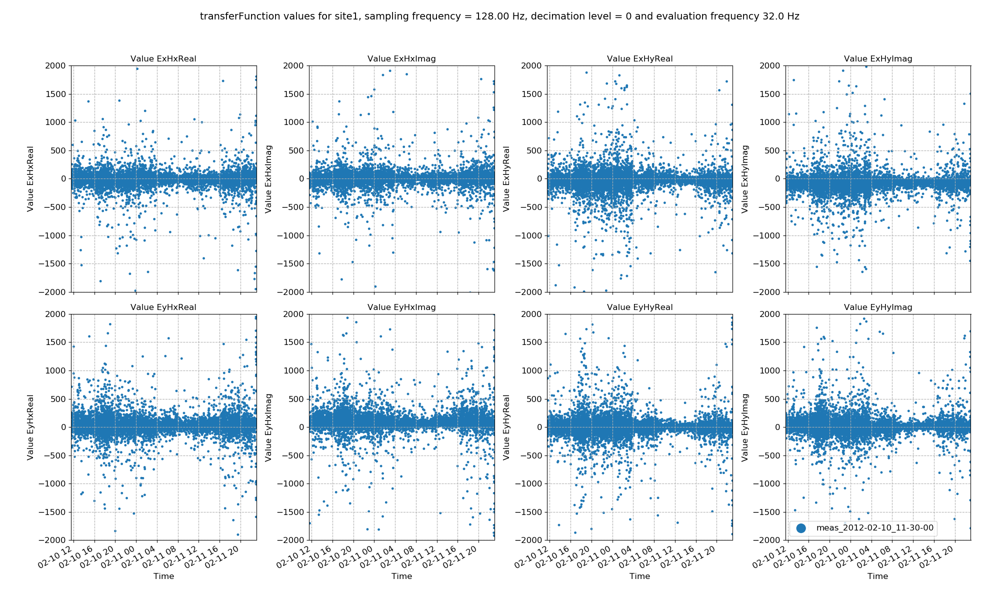
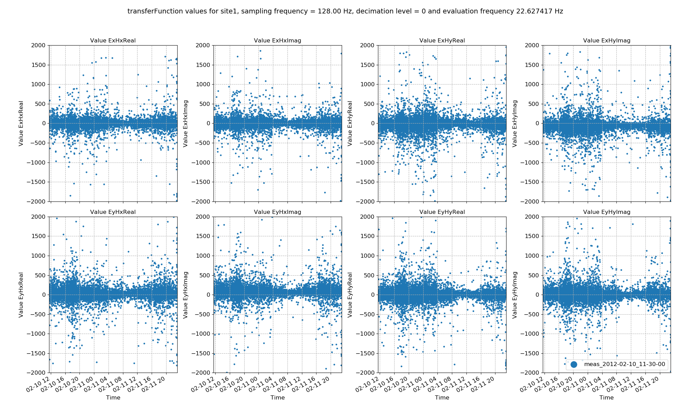

.. role:: python(code)
   :language: python

.. |Ex| replace:: E\ :sub:`x`
.. |Ey| replace:: E\ :sub:`y`
.. |Hx| replace:: H\ :sub:`x`
.. |Hy| replace:: H\ :sub:`y`
.. |Hz| replace:: H\ :sub:`z`
.. |Zxy| replace:: Z\ :sub:`xy`
.. |Zxx| replace:: Z\ :sub:`xx`
.. |Zyx| replace:: Z\ :sub:`yx`
.. |Zyy| replace:: Z\ :sub:`yy`
.. |fs| replace:: f\ :sub:`s`

Statistics
----------

Statistics are a feature of resistics meant to provide more insight into the data and more options for masking noisy or bad time windows. **They are calculated out for each evaluation frequency at each decimation level**. As statistics are calculated out for each evaluation frequency, variation in statistic values can be viewed across time and evaluation frequency. 

There are a number of built in statistics and an intention to support custom statistics in the future. The following section covers the usage of statistics. For more information about the available statistics and their meanings, please refer to :doc:`Statistics <../features/statistics>` and :doc:`Remote statistics <../features/remote-statistics>`. 

As normal, begin with loading the project.

.. literalinclude:: ../../../examples/tutorial/usingStatistics.py
    :linenos:
    :language: python
    :lines: 1-5
    :lineno-start: 1

The next step is to get a list of the resistics built in statistics. These come in two flavours:

- Statistics that are calculated for a single site
- Statistics that incorporate a remote reference site

.. literalinclude:: ../../../examples/tutorial/usingStatistics.py
    :linenos:
    :language: python
    :lines: 7-10
    :lineno-start: 7

.. note::

    For statistics that incorporate a remote reference, please see :doc:`Remote reference statistics <../advanced/remote-reference-statistics>`.

Statistics are calculated using the :meth:`~resistics.project.statistics.calculateStatistics` method of the project :mod:`~resistics.project.statistics` module. By default, this does not calculate all available statistics but by passing the **stats** keyword, the statistics to calculate can be specified.

.. literalinclude:: ../../../examples/tutorial/usingStatistics.py
    :linenos:
    :language: python
    :lines: 12-15
    :lineno-start: 12

The single site statistics which are calculated by default are coherence and transfer function values. There are two ways to manually specify the statistics to calculate. These are:

- By providing the **stats** keyword with a list of statistics as above
- By defining the statistics to use in a configuration file

.. note::

    Calculating statistics is quite demanding on compute. If the time series data quality is generally good, it is sufficient to calculate out only window coherence or window coherence and impedance tensor. In more complex situations, some of the other statistics may add value. For more on the different statistics available on what they mean, please see :doc:`Statistics <../features/statistics>` and :doc:`Remote statistics <../features/remote-statistics>`.

Once calculated, statistics are stored in the following location:

.. code-block:: text

    exampleProject
    ├── calData 
    ├── timeData   
    │   └── site1
    |       |── dataFolder1
    │       |── dataFolder2
    |       |──     .     
    |       |──     .
    |       |──     .
    |       └── dataFolderN     
    ├── specData
    │   └── site1
    |       |── dataFolder1
    |       |   |── dec8_5
    |       |   └── spectra
    |       |   
    │       |── dataFolder2
    |       |   |── dec8_5
    |       |   └── spectra    
    |       |──     .     
    |       |──     .
    |       |──     .
    |       └── dataFolderN
    |           |── dec8_5
    |           └── spectra        
    ├── statData
    │   └── site1
    |       |── dataFolder1
    |       |   |── dec8_5
    |       |   |   |── coherence
    |       |   |   |──     .
    |       |   |   |──     .
    |       |   |   |──     .        
    |       |   |   |── resPhase
    |       |   |   └── transferFunction            
    |       |   └── spectra
    |       |       |── coherence
    |       |       |──     .
    |       |       |──     .
    |       |       |──     .        
    |       |       |── resPhase
    |       |       └── transferFunction       
    |       |   
    │       |── dataFolder2
    |       |   |── dec8_5
    |       |   |   |── coherence
    |       |   |   |──     .
    |       |   |   |──     .
    |       |   |   |──     .        
    |       |   |   |── resPhase
    |       |   |   └── transferFunction     
    |       |   └── spectra
    |       |       |── coherence
    |       |       |──     .
    |       |       |──     .
    |       |       |──     .        
    |       |       |── resPhase
    |       |       └── transferFunction          
    |       |──     .     
    |       |──     .
    |       |──     .
    |       └── dataFolderN
    |           |── dec8_5
    |           |   |── coherence
    |           |   |──     .
    |           |   |──     .
    |           |   |──     .        
    |           |   |── resPhase
    |           |   └── transferFunction     
    |           └── spectra
    |               |── coherence
    |               |──     .
    |               |──     .
    |               |──     .        
    |               |── resPhase
    |               └── transferFunction           
    ├── maskData   
    ├── transFuncData 
    ├── images
    └── mtProj.prj

Every statistic is indexed by:

1. The site
2. The time series measurement directory
3. The spectra directory
4. The name of the statistic

When statistics are written out, they are written out with a comments file detailing the processing sequence of the data. An example comments file is shown below:

.. literalinclude:: ../_static/examples/tutorial/usingStats_comments.txt
    :linenos:
    :language: text

To calculate statistics for a different spectra directory, either the **specdir** keyword can be specified in the call to :meth:`~resistics.project.statistics.calculateStatistics` or the specdir can be defined in a configuration file. For more information about using configuration files, see :doc:`configuration-files`.

Statistics can be calculated again, but this time using a configuration file. The project needs to be loaded again with the configuration file in order to do this. 

.. literalinclude:: ../../../examples/tutorial/usingStatistics.py
    :linenos:
    :language: python
    :lines: 17-21
    :lineno-start: 17

Statistic data can be read in using the :meth:`~resistics.project.statistics.getStatisticData` method of the project :mod:`~resistics.project.statistics` module. As stated earlier, statistic data is indexed by site, measurement directory, spectra directory and statistic name. These have to be provided to :meth:`~resistics.project.statistics.getStatisticData`. However, if the **specdir** keyword is not provided, :meth:`~resistics.project.statistics.getStatisticData` will check if **specdir** is defined in the configuration file. If not, it will revert to the default configuration (and spectra directory). Additionally, the decimation level to read in has to be specified. Below is an example.

.. literalinclude:: ../../../examples/tutorial/usingStatistics.py
    :linenos:
    :language: python
    :lines: 23-29
    :lineno-start: 23

The :meth:`~resistics.project.statistics.getStatisticData` method returns a :class:`~resistics.statistics.data.StatisticData` object. Statistic data is another data object similar to :class:`~resistics.project.data.ProjectData`, :class:`~resistics.site.data.SiteData`, :class:`~resistics.time.data.TimeData` or :class:`~resistics.spectra.data.SpectrumData`. 

There are multiple view methods in :class:`~resistics.statistics.data.StatisticData`. These are:

- :meth:`~resistics.statistics.data.StatisticData.view`, which plots the statistic value against time
- :meth:`~resistics.statistics.data.StatisticData.histogram`, which plots a histogram of the statistic
- :meth:`~resistics.statistics.data.StatisticData.crossplot`, which plots crossplots of the statistic components
- :meth:`~resistics.statistics.data.StatisticData.densityplot`, which plots 2-D histograms (density plots) of the statistic components

Examples of using these methods to view statistic values and variation are shown below:

.. literalinclude:: ../../../examples/tutorial/usingStatistics.py
    :linenos:
    :language: python
    :lines: 30-46
    :lineno-start: 30

These produce the following plots:

.. figure:: ../_static/examples/tutorial/usingStats_statistic_coherence_view.png
    :align: center
    :alt: alternate text
    :figclass: align-center

    Coherence data plotted for evaluation frequency 32 Hz using the :meth:`~resistics.statistics.data.StatisticData.view` method

.. figure:: ../_static/examples/tutorial/usingStats_statistic_coherence_histogram.png
    :align: center
    :alt: alternate text
    :figclass: align-center

    Coherence data plotted for evaluation frequency 32 Hz using the :meth:`~resistics.statistics.data.StatisticData.histogram` method

.. figure:: ../_static/examples/tutorial/usingStats_statistic_coherence_crossplot.png
    :align: center
    :alt: alternate text
    :figclass: align-center
    :width: 600    

    Coherence data plotted for evaluation frequency 32 Hz using the :meth:`~resistics.statistics.data.StatisticData.crossplot` method

    Coherence data plotted for evaluation frequency 32 Hz using the :meth:`~resistics.statistics.data.StatisticData.densityplot` method

In the above case, the coherence statistic was read in. Another statistic is the transfer function calculated on a window-by-window basis. The statistic data for this can be read in and plotted in a similar way.

.. literalinclude:: ../../../examples/tutorial/usingStatistics.py
    :linenos:
    :language: python
    :lines: 48-83
    :lineno-start: 48

.. figure:: ../_static/examples/tutorial/usingStats_statistic_transferfunction_view.png
    :align: center
    :alt: alternate text
    :figclass: align-center

    Transfer function data plotted for evaluation frequency 32 Hz using the :meth:`~resistics.statistics.data.StatisticData.view` method

.. figure:: ../_static/examples/tutorial/usingStats_statistic_transferfunction_histogram.png
    :align: center
    :alt: alternate text
    :figclass: align-center

    Transfer function data plotted for evaluation frequency 32 Hz using the :meth:`~resistics.statistics.data.StatisticData.histogram` method

The next example is the crossplot for the transfer function statistic. This make more intuitive sense than the coherence crossplot above, as it allows the plotting of the transfer function data on the complex plane. 

.. figure:: ../_static/examples/tutorial/usingStats_statistic_transferfunction_crossplot.png
    :align: center
    :alt: alternate text
    :figclass: align-center

    Transfer function data plotted for evaluation frequency 32 Hz using the :meth:`~resistics.statistics.data.StatisticData.crossplot` method

The crossplot can be used to show the scatter of the window-by-window transfer function estimates on the complex plane. Another way to look at this data is using density plots (2-D histograms), which can be achieved using the :meth:`~resistics.statistics.data.StatisticData.densityplot`.

.. figure:: ../_static/examples/tutorial/usingStats_statistic_transferfunction_densityplot.png
    :align: center
    :alt: alternate text
    :figclass: align-center

    Transfer function data plotted for evaluation frequency 32 Hz using the :meth:`~resistics.statistics.data.StatisticData.densityplot` method. This view actually shows that the window-by-window estimates of the transfer function are actually densely clustered around the highlighted points and much more consistent than suggested by simply viewing using the :meth:`~resistics.statistics.data.StatisticData.crossplot` method. 

In all of these cases, a 0 is being passed to the plotting methods. This 0 is the evaluation frequency index for that decimation level. Changing it will plot a different evaluation frequency. 

.. note:: 

    The evaluation frequency index starts from 0 and goes to the number of evaluation frequencies per decimation level - 1. So if there are 7 evaluation frequencies per decimation level, the evaluation frequency indices will be 0, 1, 2, 3, 4, 5, 6.

    Evaluation frequency and decimation level indices will be covered in more detail further down.

.. literalinclude:: ../../../examples/tutorial/usingStatistics.py
    :linenos:
    :language: python
    :lines: 85-87
    :lineno-start: 85

.. figure:: ../_static/examples/tutorial/usingStats_statistic_transferfunction_view_eval1.png
    :align: center
    :alt: alternate text
    :figclass: align-center

    Transfer function data plotted for evaluation frequency 22.627417 Hz using the :meth:`~resistics.statistics.data.StatisticData.view` method.

Statistics across time series measurements
~~~~~~~~~~~~~~~~~~~~~~~~~~~~~~~~~~~~~~~~~~
The above examples were reading in statistic data for a single measurement. However, in many cases, the statistics over all the time series measurements of a certain sampling frequency in a site are of more interest. In order to plot and view these, the methods available in the :mod:`~resistics.project` :mod:`~resistics.project.statistics` module will be more useful. The project module :mod:`~resistics.project.statistics` has four plotting methods:

- :meth:`~resistics.project.statistics.viewStatistic`
- :meth:`~resistics.project.statistics.viewStatisticHistogram`
- :meth:`~resistics.project.statistics.viewStatisticCrossplot`
- :meth:`~resistics.project.statistics.viewStatisticDensityplot`

These do much the same as the methods available in the class :class:`~resistics.statistics.data.StatisticData`, however, they will bring together all the statistics in a site for measurements of a given sampling frequency. 

.. note::

    For the tutorial project, there is only a single measurement at 128 Hz and a single measurement at 4096 Hz, meaning that this is not the best example of the functionality. For more interesting examples, please see :doc:`Statistic plotting <../cookbook/statistic-plotting>` in the cookbook. 

For example, statistic value variation across time can be plotted using :meth:`~resistics.project.statistics.viewStatistic`:

.. literalinclude:: ../../../examples/tutorial/usingStatistics.py
    :linenos:
    :language: python
    :lines: 88-101
    :lineno-start: 88

This produces the plot below: 

    Transfer function data plotted for all time series measurements of a given sampling frequency in a site using the :meth:`~resistics.project.statistics.viewStatistic` 

Statistic histograms over all time series measurements of a specified sampling frequency in a site can be plotted in a similar way.

.. literalinclude:: ../../../examples/tutorial/usingStatistics.py
    :linenos:
    :language: python
    :lines: 103-110
    :lineno-start: 103

.. figure:: ../_static/examples/tutorial/usingStats_projstat_transfunction_hist.png
    :align: center
    :alt: alternate text
    :figclass: align-center

    Transfer function data plotted for all time series measurements of a given sampling frequency in a site using the :meth:`~resistics.project.statistics.viewStatisticHistogram` 

Recall, statistic values are calculated on an evaluation frequency basis. Currently, 32 Hz has been plotted, but other evaluation frequencies can be plotted by using the :python:`declevel` and :python:`eFreqI` keywords`.

.. important::

    The meaning of :python:`declevel` (decimation level index) and :python:`eFreqI` (evaluation frequency index) are best demonstrated with an example. 

    .. include:: decimation-eval-indices.rst

Below are examples of plotting site and sampling frequency wide statistics for different evaluation frequencies and decimation levels. 

.. literalinclude:: ../../../examples/tutorial/usingStatistics.py
    :linenos:
    :language: python
    :lines: 113-139
    :lineno-start: 113

    Transfer function data plotted for all time series measurements of a given sampling frequency in a site using the :meth:`~resistics.project.statistics.viewStatistic`. Here, evaluation frequency 22.627417 Hz is plotted (decimation level = 0, evaluation frequency index = 1). 

.. figure:: ../_static/examples/tutorial/usingStats_projstat_transfunction_view_declevel.png
    :align: center
    :alt: alternate text
    :figclass: align-center

    Transfer function data plotted for all time series measurements of a given sampling frequency in a site using the :meth:`~resistics.project.statistics.viewStatistic`. Here, evaluation frequency 5.65685425 Hz is plotted (decimation level = 1, evaluation frequency index = 0). 

Up until now, statistics have been used to investigate the variance of the time series data. However, they can be used to select which time windows to process. To find out how to use them to select and remove time windows, continue to the :doc:`masks` section. 

Complete example script
~~~~~~~~~~~~~~~~~~~~~~~
For the purposes of clarity, the complete example script is provided below.

.. literalinclude:: ../../../examples/tutorial/usingStatistics.py
    :linenos:
    :language: python