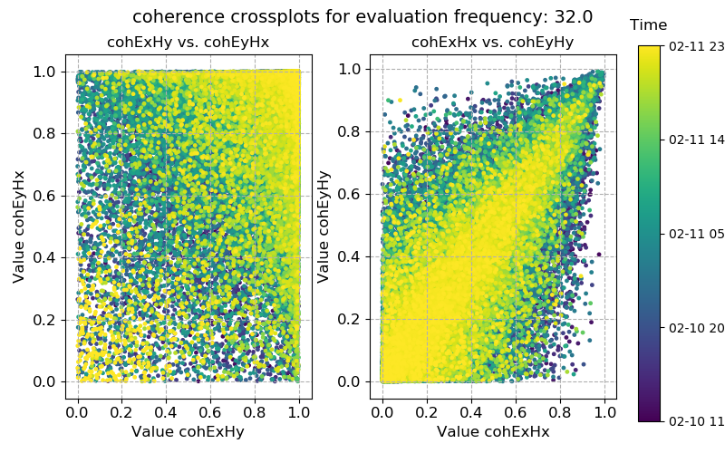
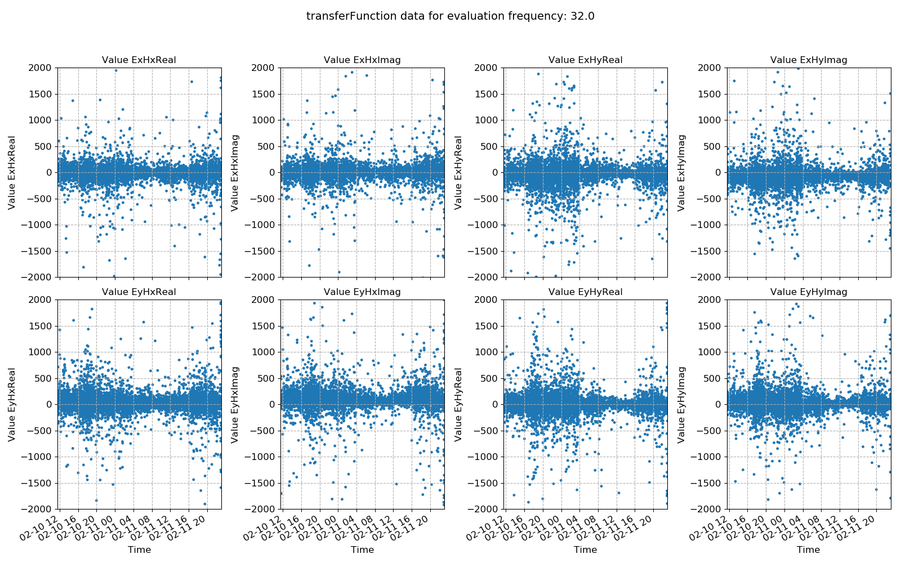
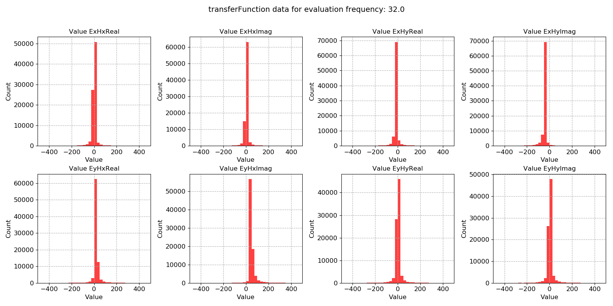
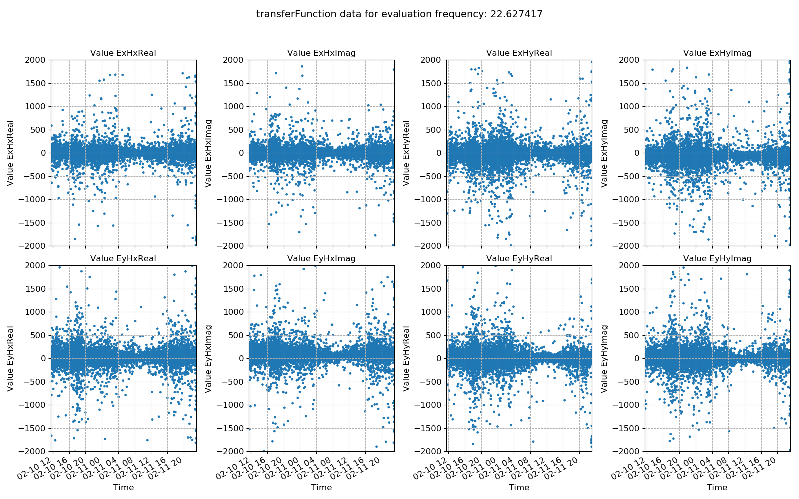

Statistics
----------

Statistics are a feature of resistics meant to provide more insight into the data and more options for masking noisy or bad time windows. There are a number of built in statistics and an intention to support custom statistics in the future. The following section covers the usage of statistics. For more information about the available statistics and their meanings, please refer to :doc:`Statistics <../features/statistics>` and :doc:`Remote statistics <../features/remote-statistics>`. 

As normal, begin with loading the project.

.. literalinclude:: ../../../examples/tutorial/usingStatistics.py
    :linenos:
    :language: python
    :lines: 1-6
    :lineno-start: 1

The next step is to get a list of the resistics built in statistics. These come in two flavours:

- Statistics that are calculated for a single site
- Statistics that incorporate a remote reference site

.. literalinclude:: ../../../examples/tutorial/usingStatistics.py
    :linenos:
    :language: python
    :lines: 8-11
    :lineno-start: 11

.. note::

    For statistics that incorporate a remote reference, please see :doc:`Remote reference statistics <../advanced/remote-reference-statistics>`.

Statistics are calculated using the :meth:`~resistics.project.projectStatistics.calculateStatistics` method of the :mod:`~resistics.project.projectStatistics` module. By default, this does not calculate all available statistics but by passing the **stats** keyword, the statistics to calculate can be specified.

.. literalinclude:: ../../../examples/tutorial/usingStatistics.py
    :linenos:
    :language: python
    :lines: 13-16
    :lineno-start: 13

The single site statistics which are calculated by default are coherence and transfer function values. There are two ways to manually specify the statistics to calculate. These are:

- By providing the **stats** keyword with a list of statistics as above
- By defining the statistics to use in a configuration file

.. note::

    Calculating statistics is quite demanding on compute. If the time series data quality is generally good, it is sufficient to calculate out only window coherence or window coherence and impedance tensor. In more complex situations, some of the other statistics may add value. For more on the different statistics available on what they mean, please see :doc:`Statistics <../features/statistics>` and :doc:`Remote statistics <../features/remote-statistics>`.

Once calculated, statistics are stored in the following location:

.. code-block:: text

    exampleProject
    ├── calData 
    ├── timeData   
    │   └── site1
    |       |── dataFolder1
    │       |── dataFolder2
    |       |──     .     
    |       |──     .
    |       |──     .
    |       └── dataFolderN     
    ├── specData
    │   └── site1
    |       |── dataFolder1
    |       |   |── dec8_5
    |       |   └── spectra
    |       |   
    │       |── dataFolder2
    |       |   |── dec8_5
    |       |   └── spectra    
    |       |──     .     
    |       |──     .
    |       |──     .
    |       └── dataFolderN
    |           |── dec8_5
    |           └── spectra        
    ├── statData
    │   └── site1
    |       |── dataFolder1
    |       |   |── dec8_5
    |       |   |   |── coherence
    |       |   |   |──     .
    |       |   |   |──     .
    |       |   |   |──     .        
    |       |   |   |── resPhase
    |       |   |   └── transferFunction            
    |       |   └── spectra
    |       |       |── coherence
    |       |       |──     .
    |       |       |──     .
    |       |       |──     .        
    |       |       |── resPhase
    |       |       └── transferFunction       
    |       |   
    │       |── dataFolder2
    |       |   |── dec8_5
    |       |   |   |── coherence
    |       |   |   |──     .
    |       |   |   |──     .
    |       |   |   |──     .        
    |       |   |   |── resPhase
    |       |   |   └── transferFunction     
    |       |   └── spectra
    |       |       |── coherence
    |       |       |──     .
    |       |       |──     .
    |       |       |──     .        
    |       |       |── resPhase
    |       |       └── transferFunction          
    |       |──     .     
    |       |──     .
    |       |──     .
    |       └── dataFolderN
    |           |── dec8_5
    |           |   |── coherence
    |           |   |──     .
    |           |   |──     .
    |           |   |──     .        
    |           |   |── resPhase
    |           |   └── transferFunction     
    |           └── spectra
    |               |── coherence
    |               |──     .
    |               |──     .
    |               |──     .        
    |               |── resPhase
    |               └── transferFunction           
    ├── maskData   
    ├── transFuncData 
    ├── images
    └── mtProj.prj

Every statistic is indexed by:

1. The site
2. The time series measurement directory
3. The spectra directory
4. The name of the statistic

When statistics are written out, they are written out with a comments file detailing the processing sequence of the data. An example comments file is shown below:

.. literalinclude:: ../../../examples/tutorial/tutorialProject/statData/site1/meas_2012-02-10_11-05-00/spectra/coherence/comments.txt
    :linenos:
    :language: text

To calculate statistics for a different spectra directory, either the **specdir** keyword can be specified in the call to :meth:`~resistics.project.projectStatistics.calculateStatistics` or the specdir can be defined in a configuration file. For more information about using configuration files, see :doc:`configuration-files`.

Statistics can be calculated again, but this time using a configuration file. The project needs to be loaded again with the configuration file in order to do this. 

.. literalinclude:: ../../../examples/tutorial/usingStatistics.py
    :linenos:
    :language: python
    :lines: 18-22
    :lineno-start: 18

Statistic data can be read in using the :meth:`~resistics.project.projectStatistics.getStatisticData` method of the :mod:`~resistics.project.projectStatistics` module. As stated earlier, statistic data is indexed by site, measurement directory, spectra directory and statistic name. These have to be provided to :meth:`~resistics.project.projectStatistics.getStatisticData`. However, if the **specdir** keyword is not provided, :meth:`~resistics.project.projectStatistics.getStatisticData` will check if **specdir** is defined in the configuration file. If not, it will revert to the default configuration (and spectra directory). Additionally, the decimation level to read in has to be specified. Below is an example.

.. literalinclude:: ../../../examples/tutorial/usingStatistics.py
    :linenos:
    :language: python
    :lines: 24-30
    :lineno-start: 24

The :meth:`~resistics.project.projectStatistics.getStatisticData` method returns a :class:`~resistics.dataObjects.statisticData.StatisticData` object. Statistic data is another data object similar to :class:`~resistics.dataObjects.projectData.ProjectData`, :class:`~resistics.dataObjects.siteData.SiteData`, :class:`~resistics.dataObjects.timeData.TimeData` or :class:`~resistics.dataObjects.spectrumData.SpectrumData`. 

There are multiple view methods in :class:`~resistics.dataObjects.statisticData.StatisticData`. These are:

- :meth:`~resistics.dataObjects.statisticData.StatisticData.view`, which plots the statistic value against time
- :meth:`~resistics.dataObjects.statisticData.StatisticData.histogram`, which plots a histogram of the statistic
- :meth:`~resistics.dataObjects.statisticData.StatisticData.crossplot`, which plots crossplots of the statistic components

An example of viewing those is shown below:

.. literalinclude:: ../../../examples/tutorial/usingStatistics.py
    :linenos:
    :language: python
    :lines: 31-36
    :lineno-start: 31

These produce the following plots:

.. figure:: ../_images/stat_statData_coherence_view.png
    :align: center
    :alt: alternate text
    :figclass: align-center

    Coherence plotted using the :meth:`~resistics.dataObjects.statisticData.StatisticData.view` method

.. figure:: ../_images/stat_statData_coherence_hist.png
    :align: center
    :alt: alternate text
    :figclass: align-center

    Coherence plotted using the :meth:`~resistics.dataObjects.statisticData.StatisticData.histogram` method

    Coherence plotted using the :meth:`~resistics.dataObjects.statisticData.StatisticData.crossplot` method

In the above case, the coherence statistic was read in. Another statistic is the transfer function calculated on a window-by-window basis. The statistic data for this can be read in and plotted in a similar way.

.. literalinclude:: ../../../examples/tutorial/usingStatistics.py
    :linenos:
    :language: python
    :lines: 38-45
    :lineno-start: 38

    Transfer function data plotted using the :meth:`~resistics.dataObjects.statisticData.StatisticData.histogram` method

    Transfer function data plotted using the :meth:`~resistics.dataObjects.statisticData.StatisticData.crossplot` method

The next example if the crossplot for the transfer function statistic. This make more intuitive sense than the coherence crossplot above, as it allows the plotting of the transfer function data on the complex plane. 

    Transfer function data plotted using the :meth:`~resistics.dataObjects.statisticData.StatisticData.crossplot` method

In all of these cases, a 0 is being passed to the plotting methods. This 0 is the evaluation frequency index for that decimation level. Changing it will plot a different evaluation frequency.

.. literalinclude:: ../../../examples/tutorial/usingStatistics.py
    :linenos:
    :language: python
    :lines: 46-47
    :lineno-start: 46

    Transfer function data using the :meth:`~resistics.dataObjects.statisticData.StatisticData.crossplot` method for a different evaluation frequency

.. note:: 

    The evaluation frequency index starts from 0 and goes to the number of evaluation frequencies per decimation level - 1. So if there are 7 evaluation frequencies per decimation level, the evaluation frequency indices will be 0, 1, 2, 3, 4, 5, 6.

The above examples were reading in statistic data for a single measurement. However, in many cases, the statistics over all the time series measurements of a certain sampling frequency in a site are of more interest. In order to plot and view these, the methods available in the :mod:`~resistics.project.projectStatistics` module will be more useful. The module :mod:`~resistics.project.projectStatistics` has two plotting methods:

- :meth:`~resistics.project.projectStatistics.viewStatistic`
- :meth:`~resistics.project.projectStatistics.viewHistogram`

These do much the same as the methods available in the class :class:`~resistics.dataObjects.statisticData.StatisticData`, however, they will bring together all the statistics in a site for measurements of a given sampling frequency. For example:

.. literalinclude:: ../../../examples/tutorial/usingStatistics.py
    :linenos:
    :language: python
    :lines: 61-73
    :lineno-start: 61

This produces the plot below. In this case, as there is only 

    Transfer function data using the :meth:`~resistics.dataObjects.statisticData.StatisticData.crossplot` method for a different evaluation frequency

And a few more examples of plotting statistics across time series measurements of a specific sampling frequency in a site.

.. literalinclude:: ../../../examples/tutorial/usingStatistics.py
    :linenos:
    :language: python
    :lines: 74-100
    :lineno-start: 74

Up until now, statistics have been used to investigate the variance of the time series data. However, they can be used to select which time windows to process. To find out how to use them to select and remove time windows, continue to the :doc:`masks` section. 

Complete example script
~~~~~~~~~~~~~~~~~~~~~~~

For the purposes of clarity, the complete example script is provided below.

.. literalinclude:: ../../../examples/tutorial/usingStatistics.py
    :linenos:
    :language: python