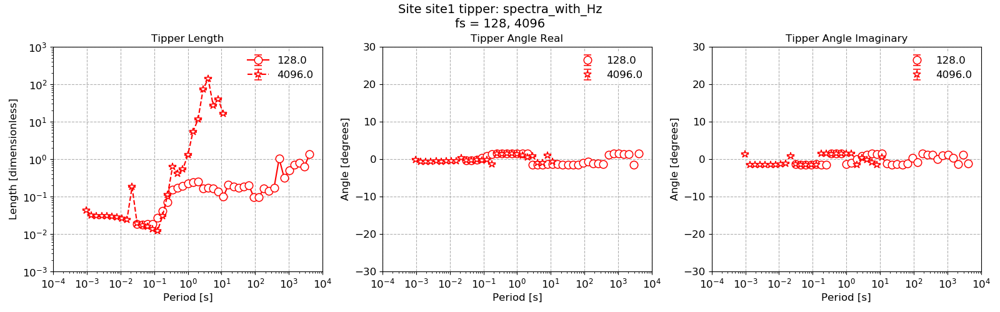
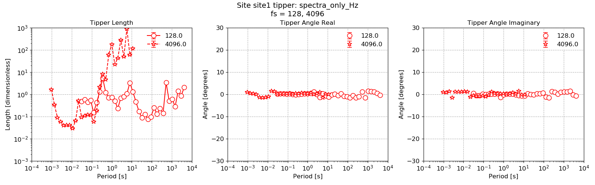

.. role:: python(code)
   :language: python

.. |Ex| replace:: E\ :sub:`x`
.. |Ey| replace:: E\ :sub:`y`
.. |Hx| replace:: H\ :sub:`x`
.. |Hy| replace:: H\ :sub:`y`
.. |Hz| replace:: H\ :sub:`z`
.. |Zxy| replace:: Z\ :sub:`xy`
.. |Zxx| replace:: Z\ :sub:`xx`
.. |Zyx| replace:: Z\ :sub:`yx`
.. |Zyy| replace:: Z\ :sub:`yy`
.. |fs| replace:: f\ :sub:`s`

Calculating the Tipper
----------------------

By default, Resistics does not calculate the components of the Tipper. This is because the default input channels are |Hx| and |Hy| and the default output channels are |Ex| and |Ey|. There are two options for calculating the tipper:

- The first is to add |Hz| as one of the output channels in the transfer function calculation
- The second is to set |Hz| as the only output channel 

These will both give different solutions are the solution to the robust regression in each case will be different. 

.. note::  Including |Hz| as one of the output channels with |Ex| and |Ey| will give a different results for |Zxy|, |Zxx|, |Zyx| and |Zyy| than when the it is excluded. This is due to changing the nature of the least-squares minimisation problem.

Continuing on from the example in the previous section, the spectra have already been calculated and it is possible to simply process the same spectra again, but this time using different input and output channels.

.. literalinclude:: ../../../examples/tutorial/simpleRunWithTipper.py
    :linenos:
    :language: python
    :lines: 1-20
    :lineno-start: 1

The tipper can be viewed using the methods provided in the :doc:`projectTransferFunction <../api/project.projectTransferFunction>` module as follows:

.. literalinclude:: ../../../examples/tutorial/simpleRunWithTipper.py
    :linenos:
    :language: python
    :lines: 22-24
    :lineno-start: 22

This produces the following plot:

    Plot of the tipper result when |Hz| is added to the output channels

As stated earlier, another way to calculate the tipper is to use |Hz| as the only output channel. An example of this is given below.

.. literalinclude:: ../../../examples/tutorial/simpleRunWithTipper.py
    :linenos:
    :language: python
    :lines: 27-30
    :lineno-start: 27

The tipper result is given in the figure. The result here is different to the result above.

This produces the following plot:

    Plot of the tipper result when |Hz| is set as the only output channel