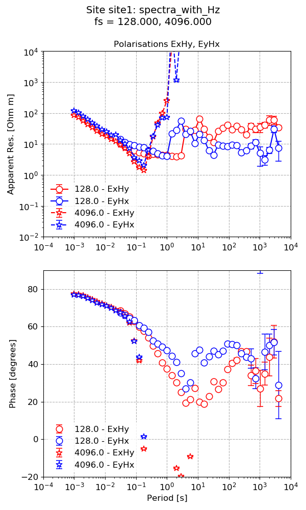

.. role:: python(code)
   :language: python

.. |Ex| replace:: E\ :sub:`x`
.. |Ey| replace:: E\ :sub:`y`
.. |Hx| replace:: H\ :sub:`x`
.. |Hy| replace:: H\ :sub:`y`
.. |Hz| replace:: H\ :sub:`z`
.. |Zxy| replace:: Z\ :sub:`xy`
.. |Zxx| replace:: Z\ :sub:`xx`
.. |Zyx| replace:: Z\ :sub:`yx`
.. |Zyy| replace:: Z\ :sub:`yy`
.. |fs| replace:: f\ :sub:`s`

Calculating the tipper
----------------------

The tipper is the transfer function between the input horizontal magnetic fields, |Hx| and |Hy|, and the output vertical magnetic field, |Hz|. It is complex-valued like the impedance tensor and describes the tipping of the magnetic field out of the horizontal plane.

By default, resistics does not calculate the components of the tipper. This is because resistics sets the default input channels as |Hx| and |Hy| and the default output channels as |Ex| and |Ey|. 

There are two options for calculating the tipper:

1. The first is to add |Hz| as one of the output channels in the transfer function calculation
2. The second is to set |Hz| as the only output channel 

The first option sets up the following linear equations to be solved in the linear regression:

.. math::
    :nowrap:

    \begin{eqnarray}
    E_x & = & Z_{xx} H_x + Z_{xy} H_y \\
    E_y & = & Z_{yx} H_x + Z_{yy} H_y \\
    H_z & = & T_x H_x + T_y H_y
    \end{eqnarray} 

The second can be understood as solving only:

.. math::

    H_z = T_x H_x + T_y H_y

These will pribably both give slightly different solutions for the tipper components as the optimal solution for the robust regression will vary between them. 

.. warning::  

    Including |Hz| as one of the output channels with |Ex| and |Ey| will likely give slightly different results for |Zxy|, |Zxx|, |Zyx| and |Zyy| than when the it is excluded. This is due to changing the nature of the robust regression.

Continuing on from the example in the previous section, the spectra have already been calculated and it is possible to simply process the same spectra again, but this time using different input and output channels. However, to avoid overwriting the previously calculated transfer function, pass :python:`postpend="with_Hz"` to :meth:`~resistics.project.projectTransferFunction.processProject`. The postpend is simply a string that is concantenated to the end of the transfer function data file.

.. literalinclude:: ../../../examples/tutorial/simpleRunWithTipper.py
    :linenos:
    :language: python
    :lines: 1-14
    :lineno-start: 1

The output transfer function data file looks like this.

.. literalinclude:: ../../../examples/tutorial/tutorialProject/transFuncData/site1/128_000/site1_fs128_000_spectra_with_Hz
    :linenos:
    :language: text

It now has some extra terms in the file compared to the one shown in the :doc:`Up and running <up-and-running>` section. These terms are the tipper terms.

The tipper can be viewed using the :meth:`~resistics.project.projectTransferFunction.viewTipper` method available in the :mod:`~resistics.project.projectTransferFunction`.

.. literalinclude:: ../../../examples/tutorial/simpleRunWithTipper.py
    :linenos:
    :language: python
    :lines: 16-19
    :lineno-start: 16

This produces the following plot:

.. figure:: ../_images/tipper_site1_spectra_with_Hz.png
    :align: center
    :alt: alternate text
    :figclass: align-center

    Plot of the tipper result when |Hz| is added to the output channels

However, including the tipper in the overall calculation may change the estimation of the components of the impedance tensor in the robust regression. The impedance tensor estimate from this process run can be viewed by:

.. literalinclude:: ../../../examples/tutorial/simpleRunWithTipper.py
    :linenos:
    :language: python
    :lines: 21-30
    :lineno-start: 21

Running with |Hz| as an output channel produces the below impedance tensor estimate, which is comparable to the one calculated in the previous section.

    Plot of the impedance tensor result when |Hz| is added to the output channels

.. figure:: ../_images/transFunction_simpleRun_onePlot_polarisations.png
    :align: center
    :alt: alternate text
    :figclass: align-center
    :width: 400    

    Plot of the impedance tensor result when |Hz| is excluded from the output channels

As stated earlier, another way to calculate the tipper is to use |Hz| as the only output channel. An example of how to do this is shown here.

.. literalinclude:: ../../../examples/tutorial/simpleRunWithTipper.py
    :linenos:
    :language: python
    :lines: 32-35
    :lineno-start: 32

The tipper result is given in the below figure. The result here is different to the result above when |Hz| is one of a set of output channels.

.. figure:: ../_images/tipper_site1_spectra_only_Hz.png
    :align: center
    :alt: alternate text
    :figclass: align-center

    Plot of the tipper result when |Hz| is set as the only output channel

Complete example script
~~~~~~~~~~~~~~~~~~~~~~~

For the purposes of clarity, the complete example script is provided below.

.. literalinclude:: ../../../examples/tutorial/simpleRunWithTipper.py
    :linenos:
    :language: python