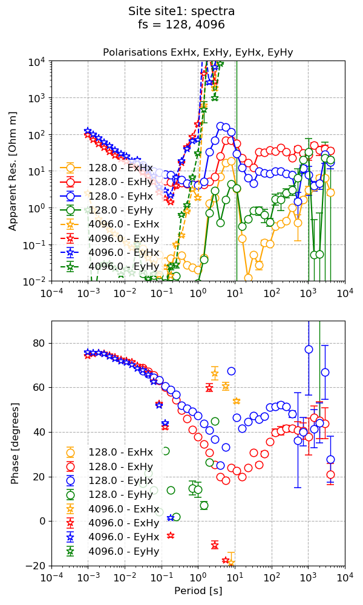
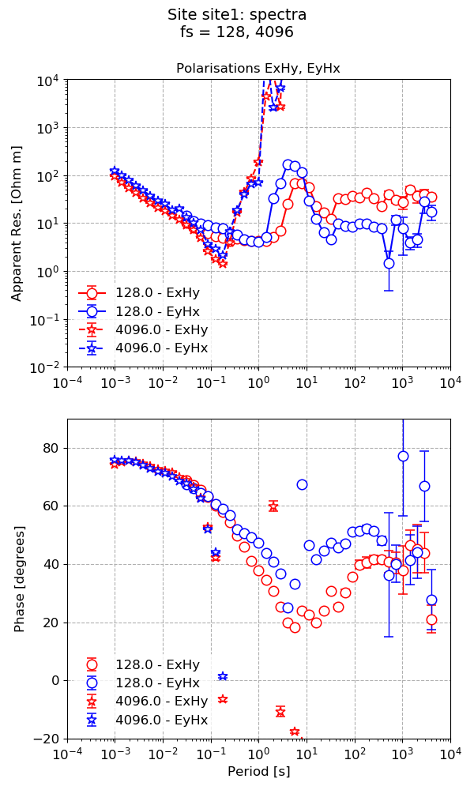
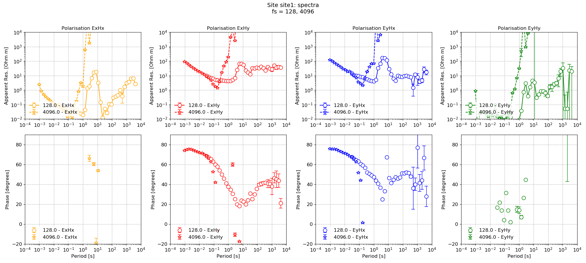

.. role:: python(code)
   :language: python

.. |Ex| replace:: E\ :sub:`x`
.. |Ey| replace:: E\ :sub:`y`
.. |Hx| replace:: H\ :sub:`x`
.. |Hy| replace:: H\ :sub:`y`
.. |Hz| replace:: H\ :sub:`z`
.. |Zxy| replace:: Z\ :sub:`xy`
.. |Zxx| replace:: Z\ :sub:`xx`
.. |Zyx| replace:: Z\ :sub:`yx`
.. |Zyy| replace:: Z\ :sub:`yy`
.. |fs| replace:: f\ :sub:`s`

Up and running
--------------

Resistics can quickly run projects with default settings by using the :mod:`~resistics.project` API. Default configuration options are detailed in :doc:`Configuration Parameters <../features/configuration/parameters>` section.

Begin by loading the project and calculating spectra. Spectra can be batch calculated using the :meth:`~resistics.project.projectSpectra.calculateSpectra` method in :mod:`~resistics.project.projecSpectra`. The are several options for calculating spectra, which are detailed in the API documentation.

.. literalinclude:: ../../../examples/tutorial/simpleRun.py
    :linenos:
    :language: python
    :lines: 1-12
    :lineno-start: 1

Spectra data files are stored in project specData directory. The folder structure is similar to the timeData folder

.. code-block:: text

    exampleProject
    ├── calData 
    ├── timeData   
    │   └── site1
    |       |── dataFolder1
    │       |── dataFolder2
    |       |──     .     
    |       |──     .
    |       |──     .
    |       └── dataFolderN     
    ├── specData
    │   └── site1
    |       |── dataFolder1
    |       |   └── spectra
    │       |── dataFolder2
    |       |   └── spectra    
    |       |──     .     
    |       |──     .
    |       |──     .
    |       └── dataFolderN
    |           └── spectra        
    ├── statData
    ├── maskData   
    ├── transFuncData 
    ├── images
    └── mtProj.prj

By default spectra are stored in a folder called spectra under the dataFolder. The reason for this will become clearer in the section covering :doc:`multiple spectra <multiple-spectra>`.

The next step is to process the spectra to estimate the impedance tensor. This is done using the :meth:`~resistics.project.projectTransferFunction.processProject` method in :mod:`~resistics.project.projectTransferFunction`. 

.. literalinclude:: ../../../examples/tutorial/simpleRun.py
    :linenos:
    :language: python
    :lines: 14-18
    :lineno-start: 14

Transfer function data is stored under the transFuncData folder as shown below. As transfer functions are calculated out for each unique sampling frequency in a site, the data is stored with respect to sampling frequencies. 

.. code-block:: text

    exampleProject
    ├── calData 
    ├── timeData   
    │   └── site1
    |       |── dataFolder1
    │       |── dataFolder2
    |       |──     .     
    |       |──     .
    |       |──     .
    |       └── dataFolderN     
    ├── specData
    │   └── site1
    |       |── dataFolder1
    |       |   └── spectra
    │       |── dataFolder2
    |       |   └── spectra    
    |       |──     .     
    |       |──     .
    |       |──     .
    |       └── dataFolderN
    |           └── spectra        
    ├── statData
    ├── maskData   
    ├── transFuncData
    │   └── site1
    |       |── sampling frequency (e.g. 128)
    │       └── sampling frequency (e.g. 4096)     
    ├── images
    └── mtProj.prj

Transfer functions are saved in an internal format. This is a minimal format currently and could possibly be amended in the future. An example transfer function data file is given below.

.. literalinclude:: ../../../examples/tutorial/tutorialProject/transFuncData/site1/128_000/site1_fs128_000_spectra
    :linenos:
    :language: text

The reason to use this rather than EDI for now is an intention to build this out further to include more information about uncertainty that can be taken further into an inversion process.

Once the components of the impedance tensor have been calculated, it is possible to visualise them using the :meth:`~resistics.project.projectTransferFunction.viewImpedance` method available in the :mod:`~resistics.project.projectTransferFunction` module.

.. literalinclude:: ../../../examples/tutorial/simpleRun.py
    :linenos:
    :language: python
    :lines: 20-23
    :lineno-start: 20

    The default plot for transfer functions

However, this plot is quite busy. One way to simplify the plot is to explicitly specify the polarisations to plot. 

.. literalinclude:: ../../../examples/tutorial/simpleRun.py
    :linenos:
    :language: python
    :lines: 25-28
    :lineno-start: 25

    Limiting the polarisations in a transfer function plot

On occasion, it can be more useful to plot each component separately. This can be done by setting :python:`oneplot = False` in the arguments.

.. literalinclude:: ../../../examples/tutorial/simpleRun.py
    :linenos:
    :language: python
    :lines: 30-31
    :lineno-start: 30

This results in the following plot.

    Polarisations of impedance tensor plotted on separate plots

Complete example script
~~~~~~~~~~~~~~~~~~~~~~~

For clarity, the complete example script is provided below.

.. literalinclude:: ../../../examples/tutorial/simpleRun.py
    :linenos:
    :language: python